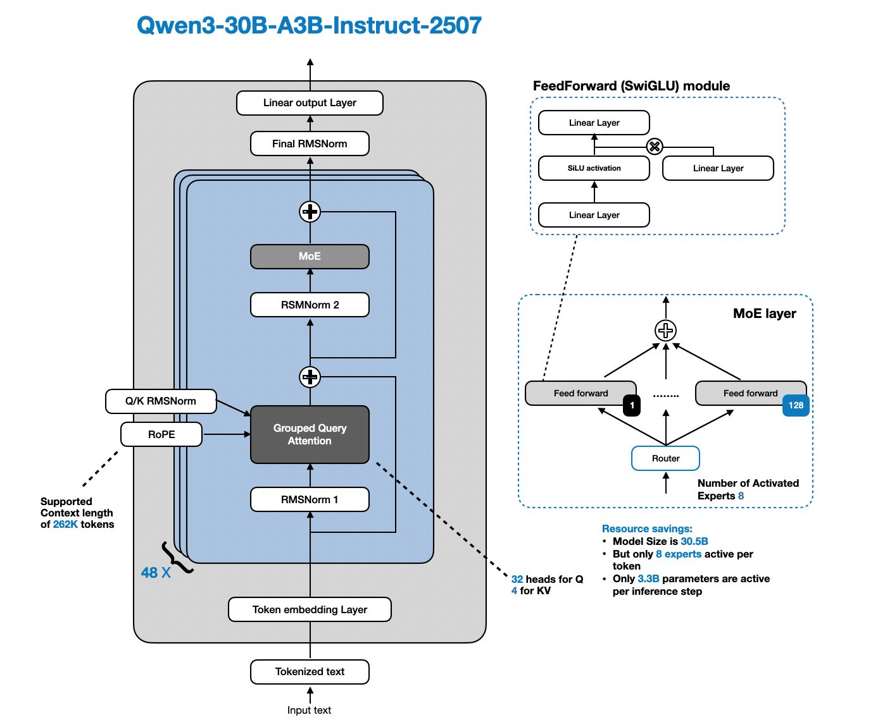

# Towards Building Sovereign Artificial Intelligence in Egypt - Gap Analysis
By Emad Naguib
May 2026
  
# Abstract

This study examines the challenge of building sovereign artificial intelligence in Egypt through a gap analysis approach, in light of the rapid transformations taking place in the field of artificial intelligence, particularly the rise of large language models and generative AI, and the resulting intensification of international competition over the development of national strategies that enhance technological capabilities and digital sovereignty. The study is grounded in the existence of a gap between Egypt’s strategic ambitions in artificial intelligence and the institutional, regulatory, data, computational, and human capacity requirements necessary to build a national AI ecosystem capable of developing and deploying AI effectively in support of development, public sector modernization, and technological autonomy.

The study aims to analyze the key determinants of building sovereign artificial intelligence in Egypt and to identify the major gaps that constrain this trajectory, with the ultimate goal of proposing a strategic framework to reduce them. To achieve this, the study adopts a qualitative methodology that combines descriptive-analytical, comparative, and case study approaches, drawing on national strategy documents, international reports, academic literature, and technical materials related to AI governance and foundation models.

The study finds that Egypt has made important progress at the strategic and institutional levels, particularly with the release of the second edition of the National Artificial Intelligence Strategy. However, the development of sovereign AI still faces substantial gaps in governance and regulation, data accessibility and stewardship, computational infrastructure, financing, skills, research and innovation capacity, and ecosystem development. The study also shows that sovereign AI in the Egyptian context should not be understood as complete technological self-sufficiency, but rather as a gradual process aimed at strengthening national control over the core layers of the AI stack, particularly data, models, deployment, language localization, and priority-sector applications. Accordingly, the study proposes a phased strategic framework based on capacity building, stronger institutional coordination, infrastructure development, ecosystem support, and the advancement of responsible AI governance.

**Keywords**

Sovereign AI - National AI Strategy - Gap Analysis - Large Language Models - Digital Sovereignty

# Section One: General Framework 

## 1-1 Introduction

The world is witnessing radical digital transformations driven by rapid technological progress commonly described as the Fourth Industrial Revolution. In recent years, there has been a major expansion in the uses of artificial intelligence, especially as its applications have extended to multiple sectors such as education, digital governance, healthcare, digital technology and others. Artificial intelligence includes several technologies, including computer vision, natural language processing (NLP), and generative AI. The emergence of large language models (LLMs) has reshaped the trajectory of technological development by benefiting from the abundance of big data and from the development of computing capacity and high-performance infrastructure, including the use of graphics processing units (GPUs) and tensor processing units (TPUs).

Artificial intelligence is also a pivotal factor in changing the rules of the game in the global economy. Studies show a positive correlation between computing power and GDP growth. A one-point increase in the Computing Index is associated with a 1.8% increase in GDP and a 3.5% increase in the digital economy (Global Computing Index, 2022). Yet the value potential of AI remains underexploited. This has led a growing number of countries to formulate national AI strategies in anticipation of the new geopolitical balance that AI may create, thereby paving the way for exploiting its potential (Papadopoulos & Charalabidis, 2020). Governments therefore develop national AI strategies to define their vision in this field, including priority areas and actions to be taken. These strategies function as guides for coordinating government policies in order to maximize the potential benefits of AI and reduce possible systemic risks (Papadopoulos & Charalabidis, 2021).

Some studies have emphasized that the pursuit of these strategies is intended to legitimize the use and application of AI in the public sector. They therefore focus on issues of national importance and stress the need to use technology in ways that fit existing political cultures, rather than the reverse (Paltieli, 2022). National AI strategies focus on the ability of AI to improve the existing political system rather than to reconsider national priorities (Cath et al., 2018; Ulnicane, 2020). Cath et al. (2018) also emphasize the need for governments to play a leadership role that directs all actors toward building an advanced AI society.

In March 2017, Canada published the first AI strategy, encouraging the adoption and development of AI, with funding of up to USD 97 million (Canadian Institute for Advanced Research, 2017). This marked the start of a global race in which major countries competed to launch national AI strategies to clarify their visions and create environments that support the growth and application of AI technologies (Papadopoulos & Charalabidis, 2020). In October 2017, the United Arab Emirates became the first country in the world to establish a Ministry of Artificial Intelligence. By February 2020, the number of countries that had issued strategies had reached 50 (El-Gohary et al., 2023). Egypt joined this group by issuing the first edition of its National AI Strategy in May 2021 and launching initiatives to raise AI awareness in education and professional development, provide technical and vocational training, and promote AI research. With the emergence of large AI models and generative AI, the path and pace of AI development changed, prompting Egypt to issue the second edition of the National AI Strategy in 2025. In 2021, the OECD AI Policy Observatory estimated that more than 200 national AI strategies and plans had been issued worldwide. This is an unprecedented historical development, as no comparable number of countries had previously issued policy documents on a single technology. It confirms that AI has become a major government priority and a new arena of international competition. The release of ChatGPT on 30 November 2022 also marked the beginning of a new global race to develop generative language models, increasing the need for massive computing resources and data. AI has thus moved beyond being merely a technological achievement to become a core pillar of national competitiveness. Despite this expansion, the foundations of AI - models, computing power, data and semiconductors - remain concentrated in the hands of a few actors. In 2024, nearly 70% of leading AI models originated in the United States, and around one quarter in China (Wood et al., 2025), raising important questions about data privacy, resilience, competitiveness and innovation.

From this context emerged the concept of sovereign artificial intelligence as a strategic orientation through which states seek to build independent national capacities in AI, ensuring control over data, digital infrastructure, and the development and deployment of models within sovereign borders. This reduces dependence on foreign platforms and algorithms, limits exposure to supply-chain disruptions and technological dependency, and supports national sovereignty (World Economic Forum, 2025). The importance of this path is linked to the increasing overlap between AI and cybersecurity and the expansion of AI applications in sensitive sectors. Securing data and maximizing control over digital infrastructure therefore becomes a strategic issue that goes beyond purely technical considerations. Countries such as the United States, China, South Korea, Germany, the UAE, India and Japan have launched sovereign AI projects and programs, using local data, talent and infrastructure to achieve greater independence from foreign technology providers and to ensure information security and data privacy. Canada allocated USD 2.4 billion to infrastructure, China launched a USD 47.5 billion semiconductor fund, France committed EUR 109 billion, India committed USD 1.25 billion, and Saudi Arabia launched a USD 100 billion initiative to build national capacities (AI Index Report, 2025).

## 1-2 Research Problem

Although Egypt has updated its vision for digital transformation and artificial intelligence through the National AI Strategy 2025-2030, it remains at an early stage in designing and operating a sovereign AI model. Despite the existence of vision documents and policy frameworks, there is a shortage of academic research and scientific and technical guidance on how Egypt can implement such a model. This includes: the technical architecture required for Arabic in general and the Egyptian dialect in particular; infrastructure requirements for sustainable operation and management of national models, including computing, storage, cloud computing and energy; ethical and legal governance frameworks for AI development; the ecosystem, local talent capacity-building plan, and emerging AI partnerships; comparative studies of sovereign AI experiences and AI strategies in other countries; and strategic considerations related to technological sovereignty and geopolitical risks.

Accordingly, the research problem is the existence of a clear gap between Egypt's orientation toward adopting AI and developing national capacities in this field, and the availability of the institutional, regulatory, data, computational, human and financing foundations required to build a sovereign AI ecosystem in Egypt that is implementable and sustainable in the Egyptian context. The importance of this gap increases in the absence of an integrated analytical assessment linking comparative international experiences with the current Egyptian situation and systematically measuring the gaps facing Egypt in governance and regulation, data availability and governance, computational infrastructure, foundation model development, financing, skills, research and innovation, the ecosystem, and language localization. These elements jointly constitute the practical basis for building sovereign AI, especially in light of the global acceleration in foundation models and generative AI. Egypt is therefore required to define realistic priorities, readiness limits and possible intervention paths that serve development goals, improve public-service efficiency, strengthen technological sovereignty and information security, maximize the benefits of the digital economy, achieve sustainable development, and improve citizens' quality of life.

## 1-3 Research Objectives

The main objective of the research is to analyze the requirements for building and managing a sovereign AI ecosystem in Egypt by theoretically grounding the concept, comparing relevant international experiences, diagnosing the current Egyptian situation, identifying the main gaps, and proposing a strategic framework to bridge them. The following sub-objectives emerge from this main objective:

1. To conceptualize sovereign AI and explain its technical, institutional, regulatory and strategic dimensions, as well as its relationship to digital sovereignty, data governance, computational infrastructure and foundation models.
2. To analyze selected national AI strategies and comparative international experiences, extracting lessons related to governance, data, infrastructure, skills, financing, ecosystems and model development.
3. To diagnose Egypt's current readiness to build sovereign AI by analyzing the relevant institutional, regulatory, technical and economic environment.
4. To identify the main gaps facing Egypt in this field, including their nature, relative priority and implications for national capacity building.
5. To propose a phased strategic framework that contributes to reducing these gaps and building a more realistic and sustainable path for developing sovereign AI in Egypt.

## 1-4 Research Significance

The research addresses a topic of substantial national and international importance. Egypt's second National AI Strategy identifies six short-term strategic objectives to drive socio-economic development, prosperity, innovation and sustainable development. Its second strategic objective, 'improving quality of life and sectoral efficiency through AI applications', includes an initiative to develop national foundation models by building Arabic national foundation models and an advanced AI system capable of processing and understanding massive amounts of linguistic data (National AI Strategy, 2025).

The research therefore seeks to provide a diagnosis of the current situation in Egypt, analyze the gap, and propose policies and recommendations to reduce it. It also provides a systematic comparative study of leading national AI strategies in relation to sovereign AI, with the aim of analyzing gaps in the Egyptian case and identifying areas requiring technical, institutional or legislative development. In this way, the research provides a reference tool for decision-makers seeking to build an effective and sustainable Egyptian model.

The scientific significance of the study lies in its focus on one of the emerging subjects in digital policy studies - sovereign AI - in the context of a developing country seeking to maximize the benefits of digital transformation while reducing the risks of technological dependency. The scarcity of studies dealing with this topic generally, and in Egypt specifically, makes the research one of the early contributions that seeks to ground the concept scientifically and apply it practically in a developing-country context. This opens new avenues for research in digital policy, governance and the digital economy.

The applied significance lies in providing an analytical tool that can help policymakers and relevant institutions rank priorities, diagnose readiness gaps, and identify the most urgent areas of intervention. This can support a more coherent and gradual national path for AI development, especially in relation to data, computing, skills, research and innovation, and regulatory structures. The findings can also support academic and institutional dialogue on realistic options for building a competitive and responsible Egyptian AI capacity.

## 1-5 Research Questions

The main research question is:
What are the principal requirements and dimensions necessary to build and manage a sovereign AI ecosystem in Egypt, what are the main gaps that constrain this path, and what strategic framework is most appropriate for reducing them?

The study seeks to answer the following sub-questions:

- What is meant by sovereign AI, and what are its technical, institutional, regulatory and strategic dimensions?
- Why are sovereign AI models needed?
- What drives states to adopt sovereign AI orientations, and what objectives do they seek to achieve?
- How have national AI strategies addressed governance, data, infrastructure, skills, financing and the innovation ecosystem?
- How do the development of large language models and the increasing requirements of computing and financing affect the possibility of building sovereign AI at the national level?
- What priority gaps face Egypt in its effort to build sovereign AI, and what are the most realistic strategic paths for reducing these gaps in line with the Egyptian context?

## 1-6 Research Scope

Temporal scope: the study covers the period from 2017 to 2026, beginning with the issuance of the first national AI strategy and continuing to the present.

Spatial scope: the study examines the experiences of selected countries in order to extract lessons relevant to Egypt in sovereign AI.

Subject scope: the research focuses on sovereign AI from a strategic and applied perspective and analyzes gaps in the Egyptian case in light of comparative international experience.

## 1-7 Research Methodology

Given the nature of the topic, the research adopts a multi-method approach combining the descriptive-analytical method and the comparative method in order to develop a comprehensive understanding of the technical, institutional and economic dimensions of sovereign AI in the Egyptian context.

The descriptive-analytical method is used to examine the theoretical framework of sovereign AI and digital sovereignty, to study the development and main determinants of national AI strategies, to describe and diagnose the current situation in Egypt, and to analyze trends, challenges, risks and opportunities associated with the development of large language models and their role in national security.

The comparative method is used to study and analyze international experiences and national AI strategies in a group of countries, and to compare them with the Egyptian context. The study relies on secondary sources, including academic literature, official national strategies, international organization reports, government documents, and relevant technical materials. This methodology is consistent with the analytical, comparative and applied nature of the thesis.

## 1.8 Previous Studies

- **The Arab Development Report 2025**, titled “*The Future of Arab Labor Markets in Light of the Green Transition and Artificial Intelligence*” examines the dynamics of labor markets in Arab countries from a structural-policy perspective. It links current structural imbalances (high unemployment, weak participation of women and youth, the dominance of informal work, and deficiencies in social protection systems) to two simultaneous transformative waves: the green transition and the rise of artificial intelligence and digital transformation. The report employs a comprehensive descriptive and analytical approach, utilizing demographic, economic, climatic, and digital data. It reviews the reality of labor markets and their institutions, the impacts of climate change and the green transition, and the levels of adoption of digital technology and artificial intelligence. The report then assesses the degree to which Arab professions and sectors are exposed to automation and digitalization, and the resulting opportunities for creating new green and digital jobs versus the risks of excluding large segments of the workforce. The report concludes with an integrated policy framework that includes structural and institutional reforms, policies for a just green transition, strategies for digital readiness, skills building, and regulating the use of artificial intelligence, with the aim of enhancing the resilience and competitiveness of Arab labor markets and achieving decent work and inclusive growth in line with the Sustainable Development Goals 2030.
- **The Arab Development Report (2024)** highlights the pivotal importance of data availability, quality, and governance as a fundamental input for formulating evidence-based public policies, monitoring the Sustainable Development Goals (SDGs), and supporting macroeconomic planning in Arab countries. The report reveals that the Arab region suffers from a significant structural data gap, manifested in the absence of approximately 60% of SDG indicators for the period 2000–2024, as well as the unavailability of more than half of these indicators across all Arab countries. This negatively impacts the efficiency of measuring and managing development performance. The report also explains that this gap is linked to the weakness of national statistical systems and Arab national accounts, resulting from structural imbalances in funding, institutional coordination, and technical and human capacities. In this context, the report discusses the impact of data limitations on macroeconomic modeling and addresses public sector data governance frameworks, alongside the growing importance of the data economy and digitalization, including big data, mobile data, social media, and artificial intelligence, as new sources of development information. The report concludes by proposing a comprehensive reform agenda based on developing statistical systems and national accounts, increasing funding, building human capital, modernizing methodologies, and strengthening regional cooperation, while warning that the continued data gap will exacerbate the digital and development gap and perpetuate patterns of dependency and structural weakness in the Arab region.
- **Dale (2025)** study concludes that full AI sovereignty—meaning complete control over data, models, chips, data centers, and supply chains—remains practically the preserve of the USA and China, while other countries can only achieve varying degrees of partial sovereignty. He demonstrates that most national initiatives, even when adopting a sovereign discourse, remain heavily dependent on foreign infrastructure, particularly GPUs and the massive cloud services dominated by US and Chinese companies. He further explains that this dependence extends beyond the technical realm to legal and geopolitical dimensions, stemming from export controls, proprietary firmware, cloud infrastructure ownership, and legislation with cross-border reach. Through his analysis of the experiences of the EU, the UK, the Gulf States, India, Southeast Asia, and Africa, Dell concludes that the most realistic path for most countries lies not in acquiring computing hardware, but in developing culturally and linguistically appropriate national models on top of foreign infrastructure. In light of this, he warns that this pattern of restricted sovereignty makes national AI strategies vulnerable to external influence and perpetuates the dominance of a limited number of companies and countries active in the global AI system.
- **Sáez de Ocáriz Borde (2025)** study offers a theoretical framework that distinguishes between multilingual AI, which often takes shape within centers of global technological dominance, and sovereign AI, which is linked to the language, culture, and national infrastructure of the target society. This distinction is based on three central concepts: cognitive sovereignty, operational sovereignty, and technical sovereignty. The study develops a hierarchical scale of AI sovereignty, ranging from complete reliance on foreign APIs to fully localized development and deployment, and supports it with two quantitative indices to measure the cultural and linguistic compatibility of models. It concludes that sovereign AI is not incompatible with multilingualism but can accommodate it, including minority languages ​​and supranational initiatives. However, it also cautions that both excessive centralization and excessive fragmentation in AI systems can lead to significant political, social, and epistemological risks.
- **Singh and Sengupta (2025)** study argues that sovereign AI should not be understood as a binary choice between complete independence and complete dependency, but rather as a spectrum of managed interdependence that allows states to balance the demands of national sovereignty with the realities of interconnected global AI infrastructures. Within this framework, the study develops an analytical model based on four interconnected pillars: data, computing infrastructure, model autonomy, and normative compatibility, along with "openness" as a control variable that determines the optimal level of external cooperation in light of its benefits and the risks of dependency. The study also translates this concept into a practical policy-making tool by modeling the allocation of public spending according to the marginal returns on sovereignty, thus providing measurable indicators for resource-constrained states. In practice, the study indicates that India possesses relative strength in data and computing, but weaknesses in model autonomy and lifecycle governance. In contrast, Saudi Arabia and the UAE represent a model of high sovereignty led by a country, based on Arab models and sovereign cloud architectures, but one that remains reliant on secure international partnerships. Therefore, the study concludes by offering a realistic policy framework that can benefit countries of the Global South in developing sovereign AI strategies that simultaneously avoid the illusions of self-sufficiency and the risks of uncontrolled dependency.
- **Maghsoudi, Mohammadi, and Bakhtiari (2025)** study reveals that the global public discourse on artificial intelligence and its relationship to the Sustainable Development Goals (SDGs) is characterized by clear disparities in priorities between developed and developing countries. SDG 9, which focuses on industry, innovation, and infrastructure, is notably dominant, followed by SDGs 16 and 13. Goals related to basic needs, such as eradicating hunger and ensuring access to clean water and sanitation, are relatively underrepresented, highlighting a gap between perceived uses of AI and more pressing development needs. The study, based on a broad analysis of X platform publications and the use of a multi-label classification model, shows that developed countries tend to frame AI in terms of improving advanced systems and ethical and regulatory governance, while developing countries focus on its role in bridging infrastructure gaps, promoting digital inclusion, and addressing inequalities, with a greater emphasis on gender issues and urban challenges. Based on this, the study proposes context-specific governance strategies, including organizational, institutional, structural and inclusive levels, making it an important contribution to aligning AI governance with the Sustainable Development Goals in a way that is more sensitive to global development disparities.
- **Zhu, Sinkkonen, and Mattlin (2025)** study demonstrates that China's pursuit of international standards in artificial intelligence is linked to placing these standards within the framework of its national innovation system and the broader context of strategic technological competition with the USA. This stems from the understanding that the ability to disseminate technology through international standards has become as important as the ability to innovate it. By analyzing Chinese policy documents and the structure of its AI innovation system, the study reveals that the Chinese model has shifted from a directly county-led protectionist approach to one where county-led strategically, while companies implement operationally, there is an increasing reliance on international standardization, market-driven initiatives, and open-source programs to disseminate Chinese technology and enhance its geopolitical influence, particularly in the Global South and through the Belt and Road Initiative. However, the study indicates that this path remains constrained by a number of challenges, including weak basic research, the limited quality of some registered innovations, difficulty in accessing advanced chips, and increasing Western caution towards China’s role in international standardization bodies, making China’s success in exporting its standards dependent on the maturity of its national artificial intelligence system and the evolution of the global geopolitical and regulatory environment.
- **Challoumis and Eriotis (2025)** study concludes that artificial intelligence can be a significant driver of growth and structural transformation in Greece, despite its small, open economy and structural vulnerabilities, if its adoption is early and focused on the most AI-intensive sectors. Through a multi-sectoral dynamic simulation, the study demonstrates that effective investment in AI could, under optimistic scenarios, significantly boost productivity, competitiveness, and GDP by 2030. However, these gains remain uneven across sectors and socially. Labor-intensive and less technologically advanced sectors face the risks of job losses, wage pressures, and widening inequality. The study also points out that weak investment, energy dependence, and limited digital infrastructure are major constraints on AI adoption in Greece. Therefore, maximizing its benefits requires targeted government intervention, including skills development, support for SMEs, digital infrastructure development, and proactive regulatory frameworks to protect workers and data. This will ensure that AI is channeled toward supporting long-term growth rather than exacerbating existing imbalances.
- **Wang (2025)** study argues that the global AI sovereign race, centered on generative AI and large language models, is reshaping both county power and digital geopolitics. This is driven by a new wave of county building aimed at enhancing coercive, extractive, delivery, and informational capabilities, although the degree and objectives of this enhancement vary depending on a country's international position, resources, and geopolitical pressures. Comparing the USA, France, Brazil, and Singapore, he demonstrates that the USA leverages AI competition to justify broad industrial policies and export controls, while France seeks European leadership with a clear regulatory and geopolitical character. Brazil's delayed and fragmented engagement limits its ability to translate its informational capabilities into broader influence, and Singapore uses AI to re-establish its position as a regional technology hub. Accordingly, he concludes that sovereign artificial intelligence, even when it intersects with seemingly decentralized technologies such as Web 3.0, remains closely linked to County logic and great power competition, reinforcing the features of US-China bipolarity with the emergence of middle powers seeking influential regional roles.
- **Pandey (2025)** study presents a comprehensive vision for driving India toward digital sovereignty in artificial intelligence by proposing a "national AI package" as a benchmark architecture for achieving strategic independence, given the global imbalance of power in this field. Using a design science research methodology and comparing international experiences, the study proposes a multi-layered architecture that links the strategic integration of AI with national priorities, national computing, chip, and cloud infrastructure, sovereign data governance, and the development of local models that are sensitive to the Indian context and its multilingualism. This architecture also includes open application interfaces (APIs) and security and legal compliance frameworks consistent with national legislation and international standards. The study's significance lies in its approach of not presenting sovereignty as an abstract political slogan, but rather as a coherent techno-institutional design that directly links AI infrastructure to national independence. It acknowledges that the success of this model remains contingent on addressing the challenges of privacy, ethics, funding, regulation, and building the necessary human capital for its effective operation.
- **Voo, Singh, and Stuart-Menteth (2025)** study demonstrates that India, the UAE, and the UK are striving, to varying degrees and through different paths, to establish themselves as emerging AI powers within an international environment dominated by US-China competition. They are doing so by building varying forms of AI dominance through relative control over the components of the "technology stack"—hardware, data, and models. The study shows that India is moving toward building a relatively low-cost, long-term domestic ecosystem based on national public computing and big language modeling initiatives, with selective external partnerships. The UAE is relying on accelerating capacity building through massive investments led by the County, its sovereign wealth funds, and its international networks. The UK is banking on its research prowess, market attractiveness, alliance networks, and leadership in AI governance. However, the study concludes that these strategies, despite their differences, remain constrained by a highly concentrated global structure in the chip and computing supply chains, making sovereignty in this field more relative and conditional than complete independence.
- **Accenture (2025)** report "*Sovereign AI: Own your AI future – From managing risk to accelerating growth. Accenture*." defines sovereign AI as the ability of a county or organization to develop, deploy, and control AI according to its own priorities and terms, through a hybrid mix of local and global components under effective local oversight and control, rather than through complete self-sufficiency. Based on extensive surveys of public and private sector leaders across multiple countries and sectors, the report indicates that the demand for sovereign AI capabilities is growing due to geopolitical tensions and escalating risks. However, the adoption of this approach remains largely driven by defensive considerations such as compliance, data security, and cybersecurity, and its primary focus remains on data and infrastructure rather than models and applications. In this context, the report proposes a “sovereignty maturity index” to measure differences between countries and sectors, and concludes that the highest levels of maturity appear in the most regulated sectors and in a number of European countries and Canada, calling for the transformation of sovereignty from a mere risk management tool to a value creation lever, by raising it to the highest leadership level, adopting multi-cloud operating models, models and agents, and establishing integrated governance and balanced partnerships with local and global providers.
- **Ziani, Rabhi, and Budas (2025)** study concludes that integrating artificial intelligence into the Moroccan healthcare system remains contingent upon the availability of a comprehensive institutional, technological, and legislative environment that moves beyond the current experimental phase towards a more mature, intersectoral national approach. Through a comparative qualitative analysis, the study distinguishes between AI in health, e-health, and digital health, revealing that despite initial initiatives and reform plans in the health sector, Morocco still faces a number of structural obstacles. These include weak digital infrastructure, fragmented databases, a shortage of specialized expertise, resistance to change, and the absence of a clear legal and ethical framework governing accountability, transparency, and algorithmic biases. Conversely, the study indicates that strengthening data sovereignty, building local research capacities, and adopting participatory, forward-looking governance are all essential enablers for the success of this transformation. Therefore, it concludes that the adoption of AI in healthcare in Morocco should be based on a national strategy that prioritizes social equity, digital sovereignty, and spatial justice as guiding principles for this process.
- **Harrison et al. (2024)** study provides an analytical and strategic framework highlighting the importance of employing AI-powered predictive analytics in enhancing national defense capabilities against cyber-physical attacks targeting critical infrastructure and military and industrial systems. The study demonstrates that traditional, reactive security tools are no longer sufficient given the increasing complexity of threats, making a shift to a proactive, predictive, and early-detection-based defense model a strategic imperative. Through simulation and testing of several machine learning architectures, the study shows that integrating these analytics contributes to reducing attack detection time, improving the monitoring of internal threats, and enhancing interagency coordination, thereby increasing the resilience of national infrastructure and reducing vulnerability. At the same time, the study emphasizes that the effectiveness of these systems remains contingent upon a governance and ethical framework that prioritizes transparency, accountability, and privacy, and balances security requirements with the protection of freedoms. Ultimately, the study concludes that AI-powered predictive analytics should be a cornerstone of modern national defense strategies in the face of rapidly evolving hybrid warfare.
- **Acemoglu (2024)** study argues that the overall economic impact of artificial intelligence (AI) in the medium term will likely be more limited than optimistic projections suggest. Its productivity gains remain constrained by its greater effectiveness on simple, measurable tasks and its lesser ability to improve complex, context-dependent tasks that rely on human judgment. He also points out that while broad exposure to AI across different groups may mitigate the potential for large-scale wage shocks, it does not necessarily reduce inequality. This is because returns on capital and higher levels of education will continue to outperform those with lower levels of education, while some less-skilled groups, particularly women, will suffer relative losses. He adds that AI may generate activities that increase measured output without improving social welfare; in fact, it may even lead to its decline. Therefore, he concludes that maximizing the economic and social benefits of this technology remains contingent on deliberate policy and institutional interventions that guide its use toward more equitable and productive paths.
- **Khashaba (2024)** review of the book "*Digital Government Excellence*" concludes that achieving digital government excellence is not solely dependent on technology, but rather fundamentally relies on a digital leadership style capable of combining strategic vision, political support, network coordination, building qualified teams, and managing change in a way that directly improves the lives of citizens and the business sector. By extracting what he calls the “Ten Digital Commandments,” the author emphasizes that an effective digital leader should prioritize the provision of rapid and tangible digital services, view digital strategy as a central leadership function rather than a marginal technical task, and place particular importance on corporate communication, digital marketing, and enhancing the professional and personal readiness of the leader and their team. Simultaneously, the review offers a critical reading of the book regarding its limited treatment of the global digital context and its relative neglect of cybersecurity, misinformation, and national privacy issues. It then connects these lessons to the Egyptian experience, asserting that the success of digital transformation in Egypt remains contingent on its ability to integrate within a broader framework of sustainable development and Egypt’s Vision 2030.
- **Alexandrov et al. (2024)** study demonstrates that extending large, English-centric language models to other, less-resourced languages ​​can be effectively achieved through continuous, guided pre-training, instruction adjustments, and model integration that minimizes the destructive problem of forgetting. In this context, the study presents the BGGPT-GEMMA-2 model as a series of bilingual models in Bulgarian and English, developed from Gemma-2 models by training them on a large, carefully selected dataset and then aligning them with translated and native Bulgarian learning packages covering conversation, learning, and safety. The study also highlights a significant methodological contribution by constructing a comprehensive Bulgarian assessment package that includes linguistic, learning, and interactive criteria. It empirically demonstrates that the improved model outperformed the Bulgarian criteria while maintaining clear competitiveness in English, and in some cases even surpassed larger multilingual models. Therefore, the study concludes that targeted adaptation of robust open models provides a practical and reproducible path to building high-quality language models for low-resource languages ​​without significant sacrifice of the model's original capabilities.
- **Headway and Kumar (2024)** study demonstrates that the national AI strategies of the UAE, Qatar, Egypt, Saudi Arabia, and Jordan primarily frame AI as a developmental and modernization tool serving grand national visions and supporting economic growth, competitiveness, and regional leadership, while legitimizing its deployment in the public sector. Through an objective analysis of these strategies, the researchers show that they converge around key narratives: AI as an engine for output and productivity, a generator of high-skilled jobs, and a tool for catching up with global competition, while simultaneously being perceived as a source of governance, ethical, and social risks, particularly concerning labor and lower-skilled groups. However, the study concludes that these strategies, despite acknowledging the risks, remain clearly biased toward a county-centric logic of growth, competitiveness, and digital modernization, rather than focusing on broader distributional and social implications.
- **Srivastava and Bullock (2024)** study argues that leading AI systems are not only redistributing power between states and corporations, but also reshaping the meaning and practice of digital sovereignty in global governance. The study proposes a conceptual framework that explains AI “rewards” through three dimensions of power: instrumental, structural, and discursive, in the realms of violence, markets, and rights. It illustrates how governments use AI for surveillance, law enforcement, and sovereign functions, while corporations employ it for market dominance, labor control, and shaping public perceptions of risk and rights. From this perspective, the study distinguishes between sovereignty as a county-centric institution and sovereignty as a practice in which public and private actors perform sovereign functions together through hybrid infrastructures. It concludes that AI does not abolish or replace the county with corporations, but rather integrates both into new relationships of cooperation and competition that reshape power and sovereignty at both the theoretical and practical levels.
- **Mügge (2024)** study argues that the EU discourse on “AI sovereignty” is not a neutral or consensual concept, but rather reflects specific policy choices that, in its current form, trump geopolitical and competitive considerations over citizen empowerment and global justice; Through a documentary analysis of European strategic texts and AI law negotiations, he shows that the EU clearly prioritizes judicial sovereignty and digital autonomy vis-à-vis the USA and China, while adopting the logic of technological racing and industrial growth through public-private partnerships, data sharing, and investment in high-performance computing. On the other hand, the dimensions of citizen sovereignty decline, social harms are reduced to individual violations subject to regulatory control, and the impact of these policies on the Global South in terms of environmental, labor, and distributive justice is marginalized. Hence, Mogg concludes that the current European model of AI sovereignty represents an emergency political choice rather than an inevitable consequence of technological development, and that other alternatives more focused on citizen control or global responsibility remain possible, if currently marginalized.
- **Karad (2024)** study argues that the concept of sovereignty in the digital age is no longer limited to territory and traditional jurisdiction, but has expanded to include strategic digital assets such as digital identity, databases, cloud infrastructure, and cross-border networks, reflecting a profound shift in the nature of power and its spheres of exercise. In this context, he proposes a three-dimensional view of sovereignty, encompassing substantive sovereignty linked to democratic power and its outcomes, territorial sovereignty extended to the digital realm, and institutional sovereignty connected to economic, social, and democratic structures. He explains that artificial intelligence can enhance County sovereignty by supporting security and public services, but it can also undermine it through automation, the complexity of accountability, and the concentration of power in the hands of transnational actors. Therefore, he concludes that protecting sovereignty in this new context requires adopting an approach based on "digital humanity," grounded in binding international standards, transparency, accountability, respect for human rights, and participatory governance involving County, the private sector, civil society, and academia.
- **Gillibrand and Draper (2023)** study argues that digital sovereignty, in its traditional form based on data localization and infrastructure control, is insufficient to address the qualitative challenges posed by contemporary artificial intelligence, particularly structural bias, lack of transparency, and the risks of infringing on intellectual property and the rule of law in legal and governmental applications. The study therefore proposes a shift towards the concept of "information sovereignty," which focuses on the source, quality, and legal and contextual relevance of information. This ensures that models are trained on data from authorized actors within the relevant legal framework and produce outputs that are consistent with the local legal culture and subject to audit, attribution, and accountability. The study also indicates that this perspective is implicitly supported by certain provisions of European AI law, especially regarding data relevance, documentation, and post-audit oversight. Ultimately, the study concludes that information sovereignty represents a more suitable regulatory framework for AI governance because it balances the requirements of innovation with the protection of fundamental rights, democratic legitimacy, and the rule of law.
- **Timmers (2022)** study argues that the relationship between artificial intelligence , sovereignty, and democracy is not a linear one based solely on reinforcement or undermining, but rather a complex relationship shaped by the interplay between technology, state institutions, and democratic legitimacy. Through case studies in European public services, he demonstrates that the use of algorithmic systems in decision-making can erode public trust and weaken the state's internal legitimacy when these systems are opaque or biased, even when implemented in seemingly reformist or administrative contexts. He further explains that the debate surrounding facial recognition and mass surveillance, along with the increasing role of AI in cybersecurity and autonomous weapons, reveals profound challenges related to accountability, the protection of fundamental rights, and the regulation of critical decisions that may be delegated to machines. He concludes that safeguarding legitimate sovereignty and the rule of law in the age of AI requires building comprehensive governance frameworks based on transparency, accountability, and democratic oversight, integrating the efforts of legislators and experts, and strengthening international cooperation to mitigate the harmful uses of technology and guide it toward the common good.
- **El-Gohary et al. (2023)** study “*Evaluating the Declared Artificial Intelligence Strategies in Arab Countries*” presents a comparative analysis of national AI strategies in four Arab countries: the UAE, Qatar, Saudi Arabia, and Egypt. Its aim is to assess their alignment with global frameworks and standards proposed by organizations such as the World Economic Forum and ESCWA. The study employs a descriptive-analytical approach and utilizes a set of criteria, including the clarity of objectives, reliance on international expertise, the identification of performance indicators, the use of strategic analysis tools (such as SWOT and PESTEL), the quality of governance and ethical considerations, and the areas of focus and targeted sectors. The findings conclude that while these strategies are ambitious and aim to leverage AI for economic and social development, they often suffer from ambiguity in objective formulation, weaknesses in monitoring and evaluation indicators, and a failure to link areas of focus to practical applications and regulatory legislation. The study recommends a comprehensive review of Arab AI strategies, enhancing their alignment with the Sustainable Development Goals, and developing clear legislative and ethical frameworks to ensure the responsible and sustainable use of these technologies.
- **The OECD report on artificial intelligence in Egypt (2023)** provides a comprehensive national assessment of the alignment of Egyptian AI policies with the OECD's 2019 AI Principles, in light of the national AI strategy and broader development goals, including Egypt's Vision 2030 and Structural Reform Program. Through gap analysis and benchmarking based on AI Policy Monitor data, the report demonstrates that Egypt has made relative progress in building governance frameworks and launching emerging research and application initiatives, most notably the Applied Innovation Center and the 2023 Egyptian Charter for Responsible AI, which serves as a tool for translating core values ​​such as equity, transparency, and accountability into the local context. However, the report also highlights several persistent structural challenges, including limited AI funding, weak computing infrastructure, skills gaps, and the slow pace of regulatory framework implementation, particularly regarding the enforcement of the Personal Data Protection Law. Therefore, the report concludes that maximizing the role of artificial intelligence in supporting sustainable economic and social development in Egypt requires more sustainable investments, clearer institutional coordination, deeper capacity building, and more effective international cooperation.
- **Al-Shoury A. (2022)** study develops a theoretical framework for state information capacity—defined as the breadth and depth of a county's knowledge of its population, territory, and activities—and argues that this capacity has become a fundamental pillar of overall county capacity, alongside coercive, financial, and administrative dimensions. Drawing on Mann, Scott, Fukuyama, and recent studies on "information capacity," the study identifies four key indicators of information capacity: regular population censuses, a central statistical agency producing high-quality official data, comprehensive land registry and property registration systems, and integrated digital infrastructure, including civil registry and interconnected national databases. The study uses Egypt as an illustrative case, tracing how post-2014 reforms—such as the 2017 digital census, the activation and strategic reorganization of the Central Agency for Public Mobilization and Statistics, the creation of the national digital data infrastructure and civil registry updates, and ongoing efforts to build a unified real estate registry and clean up subsidy/food ration databases—have enhanced Egypt’s information capacity, thereby contributing to improved international indicators of government effectiveness, e-government, AI readiness, statistical capacity, and digital inclusion.
- **Khashaba, El-Gohary, and El-Desouki (2022)** study concludes that Egypt's e-government and digital transformation experience, despite its extension since the late 1990s and some improvement in international indicators, remains largely confined to the framework of traditional e-government, without a complete and systematic transition to a digital or smart government model. Based on a documentary analysis of a range of international indicators and a survey of digital transformation experts, the study reveals that this deficiency is linked to several structural challenges, primarily weak telecommunications infrastructure, the persistent digital divide, limited regulatory frameworks, a lack of digital skills, and resistance to change within the administrative apparatus. Furthermore, the progress made in integrating government databases and digital platforms, such as the Egypt Digital Platform, has not been sufficient to bring about a qualitative shift in Egypt's competitive position. Therefore, the study recommends the necessity of adopting a comprehensive national strategy for government digital transformation, based on redesigning public services digitally, promoting investment in smart infrastructure, cloud computing and digital identity, expanding the availability of open data, completing the legislative system, and building the digital capabilities of institutions and individuals, in a way that links digital transformation to the Sustainable Development Goals and Egypt Vision 2030.
- **Shaheen and Sharaf (2021)** study concludes that digital readiness has a significant long-term positive impact on economic growth in Egypt during the period 1985–2019. This is achieved by expanding the traditional aggregate production function to include digital infrastructure indicators such as fixed and mobile telephony and broadband. Using an advanced econometric framework that includes stability tests, cointegration tests, ARDL models, error correction, and causality tests, the study demonstrates that the relationship between digital readiness and growth is not merely a correlation but a reciprocal causal relationship. This means that developing digital infrastructure contributes to driving economic growth, and that improved growth, in turn, encourages investment in information and communication technologies. The results also indicate that mobile communications and broadband are the two most influential components supporting growth. This leads the study to emphasize the need for more effective government policies to expand investment in digital infrastructure and reduce the digital divide in order to maximize the developmental returns of digital transformation in Egypt.

## 1.9 **Commentary on Previous Studies**

Recent literature on national or sovereign AI models, national AI strategies and data governance shows that the concept of sovereign AI is being redefined as a tool for digital efficiency and data security. It goes beyond a technical project to become a framework for digital sovereignty, reducing technological dependency and protecting the state's informational assets. This literature agrees that a state-owned or nationally governed LLM adapted to local language and national legal frameworks, and operating on infrastructure subject to national jurisdiction, can reduce dependence on foreign platforms, reduce the risk of sharing or leaking government data, and prevent data from being used for unintended purposes.

Regional and Egyptian literature on digital transformation also shows that data quality, availability and governance are preconditions for evidence-based policymaking and improved public-service performance. Institutional reform, national databases and modernized registries raise the state's informational capacity and directly affect indicators of e-government and digital readiness. Studies on digital readiness in Egypt show the relationship between digital infrastructure investment and growth, supporting the logic of this research that national digital capabilities, including AI, are not isolated from economic and institutional efficiency.

The reviewed studies reveal several research gaps. First, most applied literature focuses on states with high technical and financial capacities, while in-depth analysis of developing countries, especially Egypt, remains limited or descriptive. Second, many studies address data security in general terms, without explaining how design decisions for a sovereign model - data-source selection, local storage, encryption and institutional access controls - can practically change risk levels for government databases. Third, literature on public-service efficiency focuses largely on expected potential, such as reducing service time and improving user experience, without providing enough comparative case evidence before and after the use of a sovereign model in a specific government institution. These gaps justify the present study, which moves the discussion from general vision to applied analysis integrating architecture, governance and security with measurable implications for public-service efficiency and decision-making.

# Section Two: Theoretical Framework

The importance of artificial intelligence models in strategic economic, social, and security functions is growing. Therefore, countries and major organizations are reassessing their reliance on foreign AI platforms, fearing that foreign companies or governments might withhold, censor, or misuse these technologies. Generally, the term "sovereign AI" refers to initiatives that grant governments or national institutions strategic control over the AI ​​infrastructure—from hardware and data to models and deployment—ensuring that core AI functions remain under local national sovereignty.

## 2-1 Concept of Sovereign Artificial Intelligence

The pursuit of Artificial General Intelligence (AGI) and Artificial Super Intelligence (ASI) has been and remains a goal for humanity. Recent updates to foundation models such as GPT-40 (OpenAI, 2024), Claude 3.7 (Anthropic, 2025), Gemini 2.5 (DeepMind, 2025), DeepSeek-V3 (Liu et al., 2024a), Llama-4 (Meta-AI, 2025), and Qwen3 (Yang et al., 2025) have shown remarkable progress toward this goal.

These models are trained on massive datasets containing trillions of tokens across diverse domains and tasks, with the goal of effectively extracting and storing human knowledge and capabilities as parameters within the models. Furthermore, recent advancements in reasoning models, through reinforcement learning processes, enhance the scalability of these underlying models and enable them to achieve higher levels of intelligence.

Therefore, many sources define sovereign AI as the ability of a country or organization to develop, operate, host, and manage AI systems using local data, infrastructure, and expertise. The World Economic Forum notes that sovereign AI initiatives aim to "build their own AI algorithms and industries to reduce dependence on foreign technology," emphasizing that the goal is not isolation, but resilience and competitiveness, within an interconnected world of trade and innovation.

>>Sovereign AI refers to a country’s capacity to develop and deploy artificial intelligence using its own infrastructure
>>Sovereign AI: Building ecosystems for strategic resilience and impact (McKinsey - March,2026)

## 2-2 Why Do We Need Sovereign AI Models?

This section reviews practical international examples that can serve as references for AI applications based on large language models in fields such as education, e-government, agriculture and healthcare.

### 2-2-1 Education

It works with significant improvements to enhance the educational curriculum. While the field is still in its early stages, practical applications have led to models like BgGPT (a Bulgarian-trained learning model) being used in large educational institutions. These models aim to change the way artificial intelligence is used in educational organizations and integrate it into the learning process. As Fakhri Galin Tsuykov [1] (Bulgaria's Minister of Education and Science) confirmed, BgGPT can perform tasks and answer learning-related questions, similar to ChatGPT and Google Bard, thus reducing workload. A study (Alexandrov et al., 2024) found that BgGPT achieved some results when tested on school exams administered by the Ministry of Education, and in some cases, it outperformed ChatGPT and LLama.

A Greek model [2] called Meltemi was developed with the goal of being an effective tool in digital commerce. It can help with interaction, solve problems related to educational curricula, create technologies tailored to their needs, and explain simple terms and texts in textbooks. India (National Strategy for Artificial Intelligence, 2018) has distinguished itself in education as one of the leading countries seeking to leverage AI advancements. The India AI Mission (which secured up to US$1.2 billion in government investment by 2024) has become the Bharatgen project, an Indian language-focused program aiming to create profitable AI technologies in key sectors, including education. The Indus project, developed by Tech Mahindra in collaboration with NVIDIA, is also working on a pioneering program specializing in Indian language innovation, with its potential to support education being a key objective [3].

In Singapore, the Centre for AI in Education Technologies (AICET) collaborates with the Ministry of Education, whose primary mission is to develop the education system.Greece developed the Meltemi model as an effective tool for education [2]. A digital assistant can interact with students, solve problems from curricula, create exercises tailored to their needs, explain concepts and simplify textbook texts.

In India, the National Strategy for AI (2018) highlighted education as one of five sectors expected to benefit most from AI. The India AI Mission, which received the equivalent of USD 1.2 billion in government investment in 2024, developed BharatGen, an Indian language-management program designed to make AI technologies available to support innovation in key sectors, including education. Tech Mahindra's Indus project, in cooperation with NVIDIA, also aims to develop open-source language-management resources for Indian languages with potential educational uses [3].

In Singapore, the AI Centre for Educational Technologies works with the Ministry of Education to implement projects aimed at developing the education system.

### 2-2-2 E-Governance

In general, e-governance aims to simplify and improve access to government services using large-scale language models and artificial intelligence.

Albania is a leading European country in the use of large-scale language models in e-governance. As part of its digital transformation efforts, Albania launched Virtual Assistant 1.0 in December 2023, followed by Virtual Assistant 2.0 in 2024. The latest version of this assistant provides functions to automate access to certain documents and public services by covering some steps in the application process. To achieve this, the virtual assistant will be integrated into the e-Albania digital governance portal. Prime Minister Edi Rama stated that artificial intelligence will replace a significant portion of services at both the local and national levels in the future, particularly in the area of ​​public procurement, to combat corruption.

In addition, the National Agency for the Information Society (AKSHI) announced a tender worth approximately €2.6 million entitled "The Use of Artificial Intelligence in the Transfer of EU Acquisitions for European Integration." As a result of this initiative, Albania plans to develop a language model to accelerate its accession to the European Union by translating the required legal documents.

Serbia has also developed the COMtext.SR model, a text model designed to automatically analyze legal documents. This project, established at the Innovation Center of the Faculty of Electrical Engineering at the University of Belgrade, focuses on legal texts, an area not covered by existing Serbian language tools. To implement this project, the center was equipped with infrastructure partially funded by a €200 million loan from the European Investment Bank. The project also received support from the EU Pre-Accession Assistance Instrument, the Council of Europe Development Bank, and the Serbian government.

In North Macedonia, as part of its digital transformation efforts, the AI-powered digital assistant ADA was created. Based on machine learning models, it can answer the most frequently asked questions about government assistance programs offered by the Republic's government.

In the Netherlands, the Netherlands Organisation for Applied Scientific Research (TNO) conducted a study on the use of artificial intelligence in the public sector. According to their research, by 2024, the government's use of AI applications had increased more than 1.5 times compared to 2021. Of the 266 AI applications identified, 105 (39%) were used by municipalities. Additionally, 49 technologies for automatic speech and text recognition and natural language processing were identified. These applications were primarily used to anonymize confidential personal and financial data. The development of anonymization software is significantly influenced by the Open Government Act (WOO), which mandates the release of numerous official documents, some of which require anonymization before publication.

Furthermore, a virtual assistant called Codi, built on generative language models, is being developed to answer parliamentary questions. This mechanism, fundamental to Dutch democracy, allows citizens to submit questions to Parliament, which is obligated to respond. Parliament receives over 3,000 questions annually, requiring thousands of government employees to draft the responses. To improve this process, "CODI" will gather information from existing documents and past questions to provide the data needed to help government officials perform this work.

### 2-2-3 Agriculture

With the aim of leveraging language models to assist farmers in the agricultural sector.

In India, the developers of the aforementioned Bharatgen language model, which has received significant government investment, consider innovation in the agricultural sector a key objective. The development of this model aligns with India's National Artificial Intelligence Strategy, which identifies improving agricultural productivity and increasing farmers' incomes as key areas for AI application in agriculture.

In Nigeria, where agriculture is a major focus of AI applications, Crop2Cash has developed a voice chatbot called FarmAdvise. Based on a combination of language models, voice generation, and recognition, this chatbot acts as a free hotline for smallholder farmers, enabling them to access valuable information, improve their farming skills, make informed decisions about crop cultivation and livestock management, and enhance their farm productivity and profitability. This initiative is particularly important in Nigeria, where many citizens lack reliable internet access. As a final example, and in a somewhat unconventional use, the Tunisian company Instadeep has developed AgroNT, an LLM model trained on crop genomes to automate their study, helping researchers in crop improvement and agricultural research.2-3 National AI Strategies

In this section, we will examine, review, and analyze national strategies as a key tool for defining AI development goals and creating language models. We will also explore various international experiences to understand the details and patterns of language model creation, as well as the methods and scale of funding allocation for AI development and large language models (LLMs), along with other indirect investments.

### 2-2-4 Health care

In Sweden, the Halland Hospitals Group is testing the GPT-SW3 language model for medical applications. In this region, the model is being used for tasks such as summarizing medical records, predicting adverse events, encoding medical records, extracting information from unstructured text, and generating patient discharge letters.

In Kenya, the UlizaLlama (Ask the Lama) language model, developed by Jacaranda Health, is designed to provide medical advice, with a focus on supporting young mothers and pregnant women across Africa. Given the sensitive nature of this advice, the company employs human reviewers to verify and edit responses before sending them to mothers. However, the language model significantly simplifies this process.

## 2-3 National AI Strategies
In this section, we will examine, review, and analyze national strategies as a key tool for defining AI development goals and creating language models. We will also explore various international experiences to understand the details and patterns of language model creation, as well as the methods and scale of funding allocation for AI development and large language models (LLMs), along with other indirect investments.

### 2-3-1 Drivers behind National Strategies

>> AI is moving fast, and so must governments. **(OECD)**

National AI strategies are the cornerstone of sovereign AI development, particularly in the development of Large Language Models (LLMs). These strategies serve as a guiding framework for governments, establishing a clear vision, defining objectives and priorities, allocating resources, and charting the course for technological advancement in AI. They also stimulate research and innovation and outline the requirements for effectively integrating AI solutions into various aspects of daily life.

Most governments launched national AI strategies or plans during the period 2017–2020. A review of these strategies reveals significant similarities, with almost all focusing on: (1) governance (ethics, regulation, and accountability), (2) data and digital infrastructure, (3) talent and skills development, (4) the research and innovation environment, and (5) broad adoption in priority sectors (government and the economy). The main objectives and motivations behind these plans and strategies can be categorized as follows:
- **AI as a strategic industry:** Many countries have recognized the importance of AI as a vital sector for boosting economic growth, macroeconomic stability, and enhancing their international standing. We find that countries like Saudi Arabia, Israel, and Japan have developed strategies highlighting the role of artificial intelligence (AI) in accelerating economic growth and achieving a competitive advantage on the global stage. In Saudi Arabia, Vision 2030 aims to position the Kingdom as a global leader in technology. This strategy includes massive financial investments in the AI ​​sector and seeks to integrate AI into all aspects of life, particularly healthcare and urban planning. Another example is Israel, which has achieved a prominent position in the field of AI-related startups. Israel's strategy focuses on supporting this sector through investment in research and education, creating an attractive business environment, and encouraging public-private partnerships (National AI Program, 2024).
- **National Security and Independence:** National security and independence are no less important than economic development, especially with regard to the application of AI. For example, countries like China and Brazil have placed great emphasis on strategic independence in the development and application of AI, striving to reduce dependence on foreign technologies and enhance their defense capabilities. These countries are investing heavily in establishing sovereign AI platforms, developing their own algorithms, and strengthening cybersecurity to protect critical infrastructure.
- **AI Strategies and International Cooperation:** A country’s economy is closely linked to its global partners. Therefore, aligning national AI development strategies with international standards goes beyond simply meeting regulatory requirements; it opens up opportunities for economic growth, attracts foreign investment, and builds strategic alliances. For example, the Netherlands and Turkey are formulating their AI policies in line with international recommendations. The Netherlands has aligned its national AI strategy with the EU AI Act, emphasizing transparency, accountability, and the ethical use of AI. This alignment not only ensures compliance with EU regulations but also enhances the country’s attractiveness for international investment and partnerships in the AI ​​sector. Similarly, Turkey is leveraging its G20 membership and economic ties with the EU to integrate international AI standards into its national framework.

We can also say that the creation and regulation of Large Language Models (LLMs) are influenced by diverse strategic and political objectives. Several key drivers can be identified:
- **Data privacy and national sovereignty:** Countries like South Korea and Thailand emphasize the need for sovereign generative AI technologies that align with national interests and legal frameworks. Thailand aims to develop local governance systems operating within its borders to protect sensitive information and maintain compliance with local laws. In South Korea, a similar strategy enhances national security while bolstering public trust in AI systems by ensuring data processing adheres to local legal standards. This reassures citizens that their data is processed in accordance with local laws.
- **Geopolitical considerations:** These play a significant role in the development of LLMs, particularly in countries with regional or global strategic ambitions. Countries like China and Brazil view LLMs as effective tools for managing information flows, maintaining social stability, and preserving national narratives. In China, the government exercises strict control over LLMs to ensure their alignment with the political ideology. A specialized government committee evaluates these models to ensure their content supports socialist values ​​and reinforces official political messages (Shaheen, 2023). These systems are also used to amplify state-sanctioned narratives both domestically and internationally, thereby enhancing geopolitical influence and bolstering stability. Brazil is pursuing a similar approach, aiming to leverage language models for internal security while reducing reliance on foreign systems. By encouraging local innovation, Brazil seeks to strengthen its technological independence and enhance its national security.
- **Protecting Language and Cultural Identity:** The Israeli technology startup AI21 Labs, founded in 2017, has gained international recognition for its language models such as Jamba and Jurassic. Despite operating in a highly competitive global market, the company has maintained its national mission by integrating Hebrew into its language models. This effort highlights a focus on preserving cultural heritage rather than solely on financial gain. The inclusion of Hebrew was not merely a technical achievement, but a deliberate effort to promote communication in the language and ensure its relevance in modern technology. This focus on supporting local culture exemplifies the broader efforts of Israeli tech companies to balance cutting-edge innovation with local context.[4]
- **Driven Economic Growth:** Latin America and Southeast Asia demonstrate how the strategic development of local big-language models can foster economic progress, while simultaneously bridging the market gaps left by global tech companies. The Spanish-speaking population of Latin America represents a vast and largely untapped market for linguistic AI technologies. As the report "Latin America Big-Language Model Tools Market Size" indicates, by producing AI solutions tailored to local needs, regional startups are attempting to prevent tech giants from dominating this market with their Spanish-language models and reaping enormous profits (Kim, 2024). This approach not only strengthens the region's tech sector but also ensures that the solutions are culturally appropriate.

Now, long after the launch of national AI strategies and plans, it is possible to assess their progress, impact, and results at multiple levels. In many cases, countries have revisited their approaches, made changes to better achieve their original goals, reprioritized their strategies, and adjusted their overall vision. The following examples illustrate this process:
- **Radical Strategy Changes:** The practical application of initial AI initiatives in some countries yielded unsatisfactory results, leading Argentina to undergo a decisive shift in its strategic direction. Initially, early efforts focused on strict regulations and a closed data system. However, as the country's AI sector began to lag behind other Latin American nations, the government recognized the need for change. President Javier Mille thus adopted a more open data policy to attract foreign investment and drive innovation. The goal is to transform Argentina into the "fourth global AI hub" by fostering a business-friendly regulatory framework that supports global technology leaders and local companies.
- **Reorienting Strategic Goals and Priorities:** A thorough assessment of South Korea’s AI environment revealed significant shortcomings, including a scarcity of high-quality data and restrictive regulations. These factors contributed to the absence of a high-quality Korean language model, despite the country’s considerable technological strengths. To address these issues, the government adjusted its approach by increasing financial support for AI-related initiatives, encouraging the development of Korean-language datasets, and adopting a more pragmatic approach to AI development. In the area of ​​generative AI, the strategy now focuses on creating efficient small- and medium-sized models.
- **Adjusting Timelines and Success Criteria:** Turkey’s 2021 National AI Strategy aimed to position Turkey among the top 20 AI-enabled countries globally by 2024, with a focus on education, research, and infrastructure. However, the initial strategy lacked precise timelines and measurable indicators to assess progress. In response to rapid global technological advancements, Türkiye revised its AI strategy. These updates revealed a mismatch between the initial objectives and the changing reality, highlighting gaps in implementation, project delays, and a lack of measurable results. The absence of clear success criteria hindered progress tracking, underscoring the importance of transparent performance indicators for accountability.
- **Furthering on the Action Plan:** In Egypt, the first edition of the National Artificial Intelligence Strategy was released in July 2021, with a plan extending to 2025. It is structured around four pillars (AI for Government, AI for Development, Capacity Building, and International Activities) and four enablers (Governance, Data, Ecosystem, and Infrastructure). In January 2025, the second edition (2025–2030) was announced as a more ambitious version that complements the action plan and focuses on building a National Foundation Model, supporting Digital Egypt, and developing a robust AI industry across six operational pillars. This includes expanding the AI ​​Governance Package through standard and guidance documents such as the National Governance Framework Guide (2026), the Guidelines for Responsible AI (2026), and the Open Data Policy (2025).

These examples clearly demonstrate the importance and necessity of periodically reviewing national AI strategies, especially given the rapid pace of technological advancements, to address past shortcomings. The experiences of Argentina, South Korea, and Turkey highlight the importance of setting clear objectives, establishing realistic timelines, and demonstrating the flexibility to adapt to new challenges. By learning from past mistakes, drawing inspiration from successful models, adapting approaches to the local context, and prioritizing current needs, countries can effectively drive technological innovation, avoid common pitfalls, and develop their own strategies for lifelong learning.

### 2-3-2 Analysis of National Strategies

In this section, we will review, analyze, and compare different national strategies to evaluate them and assess their capacity to produce effective national big language models and government applications. Therefore, we will focus on comparing the implementation capacity of these strategies to produce three outputs:
- Building sovereign AI capabilities.
- Creating the necessary environment for developing national big language models.
- Efficiently and securely deploying AI in government and public services.

The selection of countries for comparison was based on a multi-species sample that ensured diversity in (a) level of technological maturity, (b) governance models (regulatory liberal versus developmental/directed state), and (c) institutional response to the wave of generative AI. Specifically, the sample included five models: (1) global technological powers leading the development of models and computing infrastructure (the United States and China); (2) European countries representing a model of organization, innovation, and data integration (France, Germany, the Netherlands, and Finland); (3) regional models (the UAE, Turkey, and Israel); (4) large emerging economies facing demographic/developmental challenges and rapid digital transformation (India, Brazil, and Thailand); and (5) a socio-industrial model linking artificial intelligence to resilience, crisis management, economic security, and integration into digital government (Japan and Singapore).

Therefore, we will focus on the following key elements in the comparison:

#### 2-3-2-1 Strategic Vision and National Positioning

Here we pose the question: Does the state view artificial intelligence as merely a tool to improve productivity, or as a matter of digital sovereignty, competitiveness, national security, and governmental transformation? We find that some strategies focus on “economic leadership,” but for the study sample, we find that no state views artificial intelligence as merely a “tool to raise productivity,” but rather places it within one or more of the following frameworks: (digital/technological sovereignty, national or societal security, governmental transformation and the public good, and international competitiveness).

| USA         | AI is seen as a race for global technological dominance, with direct links to national security, defense, infrastructure, the chip industry, and adoption by the federal government and the Department of Defense (Department of War).                                                                | It is not just a tool for production, but also a technological force, a source of national security, and a means of government modernization.                                                                                                     |
| ----------- | ----------------------------------------------------------------------------------------------------------------------------------------------------------------------------------------------------------------------------------------------------------------------------------------------------- | ------------------------------------------------------------------------------------------------------------------------------------------------------------------------------------------------------------------------------------------------- |
| China       | AI is advancing as the central driver of industrial and economic transformation, and the building of a smart society, with a direct impact on government management, economic security, social stability, and national defense.                                                                       | It is a broader concept than productivity; it is a state project that includes competitiveness, governance, security and defense, and control over the key aspects of the state.                                                                  |
| Egypt       | It places AI as an economic, security, health and development priority, and links it to the “Digital Egypt” project, building a sovereign model, national data governance, and raising competitiveness and international and regional influence.                                                      | It is not just a productive tool, but a national competitive issue, a core of technological sovereignty, and a governmental and sectoral transformation.                                                                                          |
| UAE         | The strategy is positioned around making the UAE a “global leader” in artificial intelligence, transitioning to AI-driven economies, transforming the government into a smart one, and improving services and public life, with a clear presence of sectoral competitiveness and regional leadership. | It is not just a production tool, but also an issue of international competitiveness, a strong governmental transformation, the building of an AI economy, and a security dimension (though not the most dominant).                               |
| Israel      | It places artificial intelligence as a national priority to maintain global leadership, combining research infrastructure, computing, skills and talent development, developing a large language model with support for Hebrew and Arabic, and empowering the public and governmental sector.         | A broader concept than productivity, it is national leadership in innovation, encompassing the development of local linguistic and technical capabilities, governance, security and defense, with a strong organizational and strategic presence. |
| France      | The strategy in its second phase focuses on offering a competitive and sovereign technology, cloud infrastructure and verifiable data, along with upgrading public services and building generative artificial intelligence capabilities.                                                             | It is not just a productive tool, but a competitive issue, for European technological dominance, and for the modernization of public services.                                                                                                    |
| Germany     | It focuses on “AI Made in Europe” and enhancing the competitiveness of Germany and Europe, with a secure and sovereign data infrastructure, proven artificial intelligence, and a clear link between AI, the public interest, and civil security.                                                     | A broader concept than productivity, it is European competitiveness for data sovereignty, reliable and secure artificial intelligence, and improved public services.                                                                              |
| Japan       | Japan’s vision is linked to the Society 5.0 initiative, national resilience to crises and disasters, Responsible/Resilient AI, industrial competitiveness, and improved public services, with a leading international dimension.                                                                      | Not just a tool for production, but also national resilience and industrial competitiveness, improved public services, and international leadership.                                                                                              |
| Turkey      | The strategy is part of the Digital Turkey project, linking artificial intelligence to socio-economic transformation and increased competitiveness, and addressing issues of privacy, national security and digital sovereignty.                                                                      | Not just a production tool, but also a competitive one, a digital sovereignty tool, and a security consideration.                                                                                                                                 |
| Singapore   | It is centered around artificial intelligence for the public good, with AI considered strategic for economic growth, risk management, building a reliable environment, and broad government adoption within the “Smart Nation” initiative.                                                            | A broader concept than productivity, leaning towards the common good, government transformation, and economic competitiveness.                                                                                                                    |
| India       | It establishes the concept of “AI for all” and technological leadership for inclusive growth, with a clear focus on health, agriculture, education, smart cities and transportation, and on the role of government in maximizing social benefit.                                                      | It is not just a production tool, but a comprehensive development, a solution to public problems, and a service and sectoral transformation.                                                                                                      |
| Brazil      | It focuses on competitiveness and productivity, but also includes the application of artificial intelligence in public authority, improving public services and public safety, and building governance and ethical frameworks.                                                                        | It clearly leans towards productivity, government modernization, and public security.                                                                                                                                                             |
| Thailand    | It combines economic growth and increased productivity, improved quality of life, expanded access to government services, reduced gaps in education and health, and national security and safety.                                                                                                     | It is not just a tool for production, but also economic development, government services, social impact, security and safety.                                                                                                                     |
| Netherlands | It focuses on seizing economic and social opportunities while protecting the public interest, values ​​and fundamental rights, improving government performance in public tasks, and ensuring trust and safety.                                                                                       | A broader value-based and societal concept than productivity, government transformation, public interest, trust and safety.                                                                                                                       |
| Finland     | Artificial intelligence is integrated within a broader national digital strategy, with a focus on skills, secure and sustainable digital infrastructure, business transformation, digitization of public services, and high-performance computing for the public good.                                | It is not just a production tool, but it is closer to digital transformation and building public capabilities.                                                                                                                                    |

In most modern strategies, artificial intelligence (AI) is no longer presented merely as a tool for improving productivity, but rather as a strategic infrastructure for the state. Therefore, we can distinguish four main schools of thought:
**(1) The School of National Hegemony and Power:**
Here, AI becomes an integral part of national power, competitiveness, security, and international influence. This school includes the United States and China, and to an increasing extent, Egypt and Israel, and to a lesser extent, the UAE and Turkey.
**(2) The School of European Technological Sovereignty:**
The focus here is on digital sovereignty and data, reliability, promoting European values, and increasing competitiveness. This school includes France and Germany, and to some extent, the Netherlands.
**(3) The School of Public Good and Government Transformation:**
The focus here is on AI as a tool for improving public services, increasing state efficiency, and addressing societal problems within a trustworthy and ethical framework. This school includes Singapore, Finland, Thailand, and, to a lesser extent, Brazil.
**(4) The School of Inclusive Development and Sectoral Empowerment:**
The focus here is on leveraging AI for development and inclusivity, national resilience, and crisis management. This school includes India and Japan.

#### 2-3-2-2 Institutional Governance and Leadership Mechanism

Corporate governance and leadership mechanisms are among the most crucial elements in explaining the disparities between different strategies. A strategy's success depends not only on the quality of its vision or the availability of resources, but also, and perhaps more importantly, on who leads its implementation, the clarity of the distribution of roles, who controls funding and makes decisions, and the existence of an effective coordination mechanism between ministries and agencies. Therefore, we will attempt to answer the question: Is there a national body or central coordinator? And is there coordination with ministries, the private sector, and universities?

The comparison reveals four main patterns: (1) A national council or central body leading the strategy and monitoring its implementation. (2) A national coordinator and joint ministerial committees. (3) Shared or distributed leadership within the government. (4) An incomplete institutional structure. This reflects the state's philosophy (centralization versus decentralization) regarding the corporate governance of artificial intelligence.

| Egypt       | National Council for Artificial Intelligence                                                                                                               | It is responsible for preparing, approving, and governing the implementation of the strategy, and implementation is carried out in conjunction with the relevant ministries and with input from independent experts and the private sector.                                                                                                                                                                                          |
| ----------- | ---------------------------------------------------------------------------------------------------------------------------------------------------------- | ------------------------------------------------------------------------------------------------------------------------------------------------------------------------------------------------------------------------------------------------------------------------------------------------------------------------------------------------------------------------------------------------------------------------------------ |
| UAE         | The political and institutional leadership of the Minister of State for Artificial Intelligence, with an executive role for the AI and Blockchain Council. | The Artificial Intelligence and Blockchain Council oversees implementation and includes representatives from both the federal and local levels. The strategy also calls for the creation of networks that bring together researchers, industry experts, and policymakers.                                                                                                                                                            |
| Thailand    | National AI Committee.                                                                                                                                     | Chaired by the Prime Minister, and its secretariat includes subcommittees and working groups. The governance mechanism also encompasses the public sector, the business sector, regulators, technology developers, and funding bodies.                                                                                                                                                                                               |
| France      | The National Coordinator for Artificial Intelligence (under the authority of the Prime Minister), with a link to the General Secretariat for Investment.   | There is a clearly defined national coordinator, along with a strategic committee and a steering committee comprising eight ministries, which meet monthly. France also relies on relevant departments and artificial intelligence research centers, as well as a strategic committee that includes representatives from government, industry, and unions.                                                                           |
| Isreal      | Director of National Policies                                                                                                                              | The program is led by the Director of National Policies and a Scientific Advisory Committee, with coordinated efforts between government agencies, the public and private sectors, the academic community and civil society, with participatory pilot/regulatory frameworks.                                                                                                                                                         |
| USA         | A multi-centre federal command, coordinated by the Chief Artificial Intelligence Officers Council (CAIOC).                                                 | The interagency coordination model, led by the Chief Artificial Intelligence Officers Council (CAIOC), is the primary arena for interagency coordination.                                                                                                                                                                                                                                                                            |
| Turkey      | Corporate leadership is shared between the Digital Transformation Presidency and the Ministry of Industry and Technology.                                  | Coordination is centralized. The strategy emphasizes that governance aims at administrative and technical coordination between institutions, and that the strategy was prepared with the participation of ministries, the private sector, universities, and non-governmental organizations.                                                                                                                                          |
| Germany     | The federal government is the direct leader of the strategy.                                                                                               | Centralized government leadership, and a broad coordination model with the academic, business and civil society communities, and platforms such as “Plattform Lernende Systeme”, in addition to the involvement of states, universities and centers of excellence.                                                                                                                                                                   |
| Netherlands | Led by the government                                                                                                                                      | There is a central monitoring mechanism through the National Digital Transformation Council, but implementation is distributed among ministries. The government also collaborates with the “Dutch AI Coalition”, which brings together companies, government agencies, and knowledge and education institutions.                                                                                                                     |
| Finland     | Government coordinator and ministerial group                                                                                                               | There is a central government digital coordinator. There is also a ministerial working group on digitalization and the data economy, and a government network for sharing experiences and best practices in the use of artificial intelligence, with partnerships between the public and private sectors and researchers.                                                                                                            |
| Singapore   | Led by the government                                                                                                                                      | The strategy is presented as a Whole-of-Nation Movement. That is, Singapore adopts an orchestration model rather than a separate council.                                                                                                                                                                                                                                                                                            |
| Japan       | Led by the Japanese government                                                                                                                             | The government identifies itself as an overall coordinator, and emphasizes that unified efforts between the public and private sectors are essential, and that private companies are a key player, with research and development networks in collaboration with universities and public research institutes.                                                                                                                         |
| India       | National Institute of Transforming India (NITI Aayog)                                                                                                      | The strategy tends to propose more implementation structures. It emphasizes that success requires long-term institutional collaboration between government, industry, and academia, and proposes a PPP partnership model.                                                                                                                                                                                                            |
| Brazil      | Ministry of Science, Technology, and Innovation.                                                                                                           | The strategy recommends defining or establishing a public-private governance structure similar to a chamber of industry. It also highlights the roles of FINEP (Financiadora de Estudos e Projetos) under MCTI and the Center for AI in facilitating public-private partnerships.                                                                                                                                                    |
| China       | The State Council is the supreme leadership, with the Ministry of Science and Technology playing a key executive role.                                     | A top-down hierarchical central model. The strategy stipulates the creation of an “Promotion Office for the Implementation of the Next Generation Artificial Intelligence Development Plan” within the Ministry of Science and Technology to facilitate implementation, the creation of an AI Strategy Advisory Committee, and regular coordination between universities, research institutes, companies, and military institutions. |

The comparison results indicate that the most mature countries in this dimension are not only those that have established a national council or clear leadership body, but also those that have successfully transformed governance into an operational system. This system includes mechanisms for regular coordination among bodies and institutions, formal integration mechanisms for the private sector and universities, and a link between policymakers, implementation, and monitoring. Therefore, we can say that clear institutional leadership, effective coordination, and a deep partnership between the state and the academic and productive sectors are key indicators of a strategy's ability to move from the level of a political document to that of a viable and scalable implementation program.

#### 2-3-2-3  Regulatory and Ethical Framework

The regulatory and ethical framework is a key interpretive element when evaluating national AI strategies, as it reveals a country's ability to build an institutional environment that balances fostering innovation with managing risks and protecting rights. The comparison shows that the countries under study fall into two main categories: (1) One category has developed operational frameworks based on clear principles such as transparency, accountability, and reliability, utilizing tools like sectoral regulation, a risk-based approach, regulatory experimentation, and safety and trust standards. This is evident in cases such as Israel, Germany, France, the Netherlands, and Singapore. (2) The other category is closer to the stage of declaring principles and building frameworks, where ethics, privacy, and data governance are presented as strategic priorities, but with varying degrees of transformation into fully-fledged institutions and implementation tools.

| Country     | Ethics, privacy, transparency, and accountability                                                                                                                                                                                                                                                                                                                     | Sectoral governance and risk management                                                                                                                                                                                                                                                                                      | Can LLMs be deployed within government and sensitive sectors?                                                                                                                                                                                                                       |
| ----------- | --------------------------------------------------------------------------------------------------------------------------------------------------------------------------------------------------------------------------------------------------------------------------------------------------------------------------------------------------------------------- | ---------------------------------------------------------------------------------------------------------------------------------------------------------------------------------------------------------------------------------------------------------------------------------------------------------------------------- | ----------------------------------------------------------------------------------------------------------------------------------------------------------------------------------------------------------------------------------------------------------------------------------- |
| Isreal      | One of the most prominent models: Responsible innovation explicitly focuses on human-centeredness, equality and non-discrimination, reliability, security and safety, accountability, transparency and explainability. It also adopts a progressive and flexible organizational structure.                                                                            | It has a risk-based approach, sector-specific regulation, “soft regulation” tools, regulatory experimentation, and multilateral collaboration, while empowering sector regulators. It also supports privacy through privacy-conscious data-sharing technologies.                                                             | Yes, the strategy combines risk-based regulation, interpretation, privacy, and public sector adoption. It is one of the environments best suited for deploying large language models in government, with stronger controls on sensitive uses.                                       |
| Turkey      | It presents very detailed principles: proportionality, safety and security, fairness, privacy, transparency and explainability, and responsibility and accountability. It also stipulates the auditability of data sources and the effects of automated decisions.                                                                                                    | The regulatory framework is strong, but the text focuses more on general principles than detailed sectoral implementation tools. Risk management is clearly present through requirements for continuous risk analysis and harm prevention.                                                                                   | Yes, but with caution: the strategy allows, in principle, for widespread deployment, but its use in health and justice depends on the extent to which these principles are translated into sectoral regulations and implementation procedures.                                      |
| Netherlands | A strong focus on trust, human rights, legal and ethical frameworks, auditing, transparency, explanation, and accountability, directly linked to GDPR and national laws. There is also a public sector transparency lab.                                                                                                                                              | One of the strongest models of a sectoral approach: justice, security, health, defense, and data. it clearly states the European adoption of AI applications in justice, and legal responsibility, proportionality, and safeguards against arbitrary use.                                                                    | Yes, but within a “trust first” model, This means that deployment is possible in government, health and justice, but only under strong interpretive and legal frameworks, with particular sensitivity to the applications of justice and public oversight.                          |
| Singapore   | It fosters a trustworthy environment, emphasizing that artificial intelligence must be developed and deployed in a safe, reliable, and responsible manner, with corporate governance and security frameworks, and organizational flexibility based on experiential learning. It also places significant emphasis on bias, accuracy, reliability, and value alignment. | Very strong in managing risks and privacy operations across Privacy-Enhancing Technologies (PETs), regulatory sandboxes, and a data-sharing assessment framework that takes into account the “public interest”.                                                                                                              | Yes, to a very high degree, especially in government, health and public services, because the strategy was originally designed to enable public uses while protecting trust and safety.                                                                                             |
| Germany     | The German framework is centered around safe, reliable, human-centered AI that serves the public good, with “Ethics by Design” and “Sustainability by Design.” The strategy also links legal certainty, trust, and the protection of fundamental rights.                                                                                                              | Risk management is provided through a high-quality infrastructure, reliable AI research, civil security, and an appropriate organizational approach as needed.                                                                                                                                                               | Yes, but under the trusted “AI Made in Europe” philosophy - suitable for government, health and education, with higher requirements in high-risk systems.                                                                                                                           |
| France      | In its second phase, France is focusing on reliable digital solutions, AI safety institutes, and mitigating the risks of advanced models. The strategy has also been expanded beyond 2023 to include generative AI.                                                                                                                                                   | Strong in safety and assessment. Its presence in the International Network of AI Safety Institutes enhances its maturity in advanced risk assessment, and it also has sectoral initiatives in public administration, justice, language and data.                                                                             | Yes, to a high degree, especially with generative models and public sectors, but through a safety/sovereignty/reliability framework rather than a detailed ethical charter.                                                                                                         |
| Egypt       | The new strategy is strong in terms of its modular design: it calls for a center for responsible AI, an Egyptian charter for responsible AI, and an AI law, and explicitly mentions privacy, fairness, transparency, and attribution of responsibility, in addition to protecting rights and reducing bias.                                                           | It includes a clear vision for risk management, system risk classification, actor capability assessment, data governance, privacy, and security, but much of it is still in the development phase rather than a fully operational system. It also links AI to large language models and priority sectors.                    | Yes, in terms of strategic direction, especially in health, education and government services, but the safe deployment of large models in sensitive sectors will depend on the completeness of the law, the charter, the responsible AI center and practical compliance mechanisms. |
| UAE         | It emphasizes responsible artificial intelligence, effective governance, the importance of a legal environment that supports innovation, and privacy protection through a secure data architecture.                                                                                                                                                                   | Relatively strong in government infrastructure, data, and testing, it links governance with practical experience and government applications, demonstrating an awareness of cybersecurity risks and reliance on interconnected software and systems. Examples include handling sensitive health data in secure environments. | Yes, especially in government, services and health, but the trust framework is still closer to “government + data + governance review” than to a complete ethical-regulatory system.                                                                                                |
| China       | It introduces ethics, legal rules, responsibility, and accountability, with an emphasis on safety, privacy, transparency in monitoring, and punishment for data misuse, privacy violations, and unethical behavior.                                                                                                                                                   | An assessment and safety system, early warning, and a two-tiered monitoring structure, with sectoral policies tailored to education, health, insurance, and social services. However, it tends toward a safety, control, and centralized regulation approach more than individual rights approach, as in European models.    | Yes, absolutely - the strategy is explicit in expanding into the public and sensitive sectors, but according to a model that focuses more on national security, management and control than liberal rights-based transparency.                                                      |
| USA         | This plan is not so much a “public ethics” document as it is a security, assessment, and control plan. it focuses on interpretation and control, risk assessments of advanced models, deepfakes in the legal system, and response to cyber incidents.                                                                                                                 | It is very strong in assessing security and technical risks, especially for “Frontier Models”, but relatively weaker in matters of privacy, fairness and social transparency.                                                                                                                                                | Yes, very much so, especially in government, defense and sensitive sectors, but under the lens of national security, control and evaluation, not under a comprehensive, balanced ethical framework.                                                                                 |
| India       | The strategy explicitly discusses justice, accountability, transparency, privacy and security, and proposes ethics boards, legal data protection frameworks, sectoral regulation, and standards for anonymity and design privacy.                                                                                                                                     | It sounds intellectually and conceptually, but its nature is closer to a vision/discussion paper than a fully-fledged organizational and executive framework. Nevertheless, it demonstrates advancements in its awareness of bias, accountability, data markets, and self-assessment tools for privacy.                      | Yes, in terms of direction and proposed policies, especially in government and public services, but deploying LLMs in sensitive sectors requires turning these perceptions into binding rules and a more mature supervisory and operational structure.                              |
| Thailand    | It openly acknowledges a weakness in the adoption of AI ethics, and a lack of law and regulation, and then makes “social, ethical, legal and regulatory readiness” its primary strategy.                                                                                                                                                                              | There is a clear intention to enact legislation and ethical standards, but the process is still underway. Many sectors are targeted, including government, health, and education, but regulatory safeguards are still being established.                                                                                     | Strategically feasible but not mature enough for a wide and safe deployment of LLMs in sensitive sectors without further development of the legal and governance framework.                                                                                                         |
| Brazil      | Adopts OECD principles, ethics and responsible use, and refers to regulatory sandboxes, public government, and public safety.                                                                                                                                                                                                                                         | There is organizational awareness, but it does not provide a detailed risk and operational structure.                                                                                                                                                                                                                        | Yes, in terms of direction, but less mature in terms of detailed controls for deploying large models in highly sensitive sectors.                                                                                                                                                   |
| Japan       | Focuses on responsible AI and resilience AI, and on interpreting and education in protecting privacy, cybersecurity, reliability and high quality of systems.                                                                                                                                                                                                         | Strong in linking artificial intelligence with resilience, security and privacy, but less detailed in “sectoral legal accountability”.                                                                                                                                                                                       | Yes, especially in health, education and public infrastructure, because the strategy mentions telemedicine, AI-assisted diagnosis and personalized education, with a strong emphasis on privacy and security.                                                                       |

In general, we can say that the overall assessment of strategy maturity is very high for the group of countries (Israel, Turkey, the Netherlands, and Singapore), high for the group of countries (Germany, France, the United States, China, and Japan), and average for the group of countries (the UAE, India, Thailand, and Brazil). As for Egypt, we find that it is high in terms of design but average in terms of executive readiness.

#### 2-3-2-4 National Data and Data Governance

One of the most important points of comparison is the importance of data in building artificial intelligence models. In this section, we will focus on the availability of government data, access and sharing policies, quality and privacy standards, and whether the data is available in the local language.

| Country     | Government Data Availability                                                                                                 | Accessibility and Participation Policies                                                                                                                                                         | Quality and privacy                                                                                                                                                                           | Local language data                                                                                                                                                            |
| ----------- | ---------------------------------------------------------------------------------------------------------------------------- | ------------------------------------------------------------------------------------------------------------------------------------------------------------------------------------------------ | --------------------------------------------------------------------------------------------------------------------------------------------------------------------------------------------- | ------------------------------------------------------------------------------------------------------------------------------------------------------------------------------ |
| Egypt       | “Data availability and sharing” sets an explicit goal, and treats government data as a national asset.                       | An open data portal and data exchange platform for secure and controlled sharing, with incentives for data sharing from the government, universities, and the private sector.                    | Governance, quality indicators, periodic audits, interoperability and integration, with privacy protection and compliance.                                                                    | An initiative to build a national Arabic sectoral dataset that includes medicine, education and priority sectors, with continuous cleaning, labeling, validation and updating. |
| Isreal      | Sees access to comprehensive and quality-assured data as a challenge and a prerequisite for progress.                        | Focuses on secure sharing platforms and privacy-centric technologies to expand access to data.                                                                                                   | Combining data quality assurance with privacy considerations.                                                                                                                                 | Investment in the NLP model through local data, tools, and models.                                                                                                             |
| France      | There is an inter-ministerial framework for data, open government access, and gradual access to data and judicial decisions. | Digital Republic Act, open data policies, and public and sectoral data initiatives.                                                                                                              | Linking data, management, algorithms, and cloud sovereignty with clear management frameworks.                                                                                                 | Supports big databases in French and participates in The Alliance for Language Technologies (ALT-EDIC).                                                                        |
| Germany     | Focuses on making “previously inaccessible data” available, and on expanding the responsible use of data.                    | Data space policies, and the push towards a healthy European data space.                                                                                                                         | It emphasizes making data available in parallel with protecting data, and links it to trust and digital sovereignty.                                                                          | Unclear                                                                                                                                                                        |
| Netherlands | The government has thousands of open data sets through the National Data Registry, in addition to sector portals.            | A clear philosophy: voluntary sharing where possible, mandatory when necessary, with individuals and companies retaining control over their data. Sector-specific sharing agreements also exist. | One of the best in terms of quality standards: accuracy, completeness, reliability, representativeness, timeliness, and use of FAIR principles, with a review of the risk of bias.            | Unclear                                                                                                                                                                        |
| Singapore   | It is based on selective government-led opening aimed at the public good.                                                    | Proposes “data concierge” an internal government mechanism to facilitate access to public data, and government mediation to conclude sharing agreements and collect new data as needed.          | It builds capabilities in data management, and supports artificial data, federated learning, and encryption.                                                                                  | Unclear                                                                                                                                                                        |
| Finland     | It links artificial intelligence to a broader digital strategy for the public sector.                                        | Focuses on "Cloud First" policy, data economy and digital transformation programs.                                                                                                               | Strong in security and data protection within cloud environments.                                                                                                                             | Unclear                                                                                                                                                                        |
| UAE         | It views data as a key driver for experimentation and smart government.                                                      | The strategy talks explicitly about data sharing and the need for a single data structure that facilitates research and development, and cites virtual data libraries as a reference.            | Privacy is ensured through secure infrastructure and an explicit link to consumer protection and sensitive data.                                                                              | Unclear                                                                                                                                                                        |
| Turkey      | “Facilitating access to high-quality data” is one of the six priorities.                                                     | It gives clear priority to access and quality (without details).                                                                                                                                 | Focus on high-quality data and technical infrastructure.                                                                                                                                      | Unclear                                                                                                                                                                        |
| Thailand    | It refers to the creation of a national platform for advanced data analytics and management.                                 | It is more structurally focused than a detailed governance approach.                                                                                                                             | Unclear                                                                                                                                                                                       | Unclear                                                                                                                                                                        |
| Japan       | It has clear practical examples in government/sectoral data such as WAGRI, food platforms and traceability chains.           | It talks about linking data platforms internally and internationally, creating a "data economic zone" and interoperability with international platforms.                                         | Privacy and cybersecurity are integrated into the concept of responsible AI and resilience AI artificial intelligence, with an emphasis on the role of education in protecting personal data. | Unclear                                                                                                                                                                        |
| India       | It treats data as a market and as an economic resource.                                                                      | Proposes a national AI market with three modules: a data market, a data annotation market, and a deployable models market.                                                                       | Conceptual focus on traceability, access controls, privacy, anonymity, and compliance.                                                                                                        | Unclear                                                                                                                                                                        |
| China       | The availability of big data sources is a national advantage.                                                                | It calls for improved data protection and sharing policies, pilot programs for sharing public statistics, and commercial use of public data.                                                     | There is a platform for assessing the core data and safety of artificial intelligence, and a system for standards, privacy and tracking, within a central/sovereign domain.                   | The NLP model is mentioned as one of the strategic techniques.                                                                                                                 |
| USA         | Focuses on Federal data access and opening up the secure use of restricted data.                                             | There is a call to reduce barriers between federal data repositories, create a platform for the NSDS project, and develop scientific datasets.                                                   | Strong in security, governance, and legal transparency for government use.                                                                                                                    | Unclear                                                                                                                                                                        |
| Brazil      | Believes that the public administration possesses a large amount of data.                                                    | The strategy mentions open government data as an important tool.                                                                                                                                 | Privacy and data protection are present as a general requirement.                                                                                                                             | Unclear                                                                                                                                                                        |

The comparison reveals that the differences between countries lie in their data governance models, leading to four key examples:

- **A comprehensive governance model with a focus on local languages:** This model includes Egypt, Israel, and France.
- **A responsible participation model with high quality standards:** This model includes Germany, the Netherlands, and Singapore.
- **A platform model:** This model includes India and Thailand.
- **A scale and centralized structure model:** This model includes China.

#### 2-3-2-5 Computational Infrastructure

Another key point of ​​comparison, given the importance of computing infrastructure in building and running AI models, is the computing capacity of countries. This includes supercomputing (HPC), cloud computing, data centers, GPU/HPC accessibility, and the ability to host models locally.

It's crucial to distinguish between what strategies claim about computing infrastructure and the actual capacity on the ground. Therefore, this section focuses on analyzing what the strategies themselves declare.

| Country     | Supercomputing                                                                                                                                                                                                                                                 | Cloud computing                                                                                                                                                                                     | Data Centers                                                                                                                                                                                               | GPU/HPC Availability                                                                                                                                                                    | Hosting Local Models                                                                                                                                                               |
| ----------- | -------------------------------------------------------------------------------------------------------------------------------------------------------------------------------------------------------------------------------------------------------------- | --------------------------------------------------------------------------------------------------------------------------------------------------------------------------------------------------- | ---------------------------------------------------------------------------------------------------------------------------------------------------------------------------------------------------------- | --------------------------------------------------------------------------------------------------------------------------------------------------------------------------------------- | ---------------------------------------------------------------------------------------------------------------------------------------------------------------------------------- |
| USA         | The United States is a leader in computing hardware performance, supporting access to large-scale computing for academics and startups and improving the "computing funding market." It also focuses on infrastructure permits and highly secure data centers. | Very strong, but more so in terms of market approach and industrial alliances than a government-backed “national cloud”.                                                                            | Very strong, the plan explicitly calls for accelerating the creation of data centers and building highly secure data centers for military and intelligence use.                                            | Very high, the problem the plan acknowledges is not the lack of computing, but rather the availability of financial and contractual access to it for universities and small businesses. | Very high, support for open source is also due to the fact that governments and sensitive sectors cannot send their data to closed-source providers, which promotes local hosting. |
| China       | Very Strong, it talks about supercomputing, smart computing chips and systems, and "efficient computing infrastructure," and links that to national innovation platforms and chip industries.                                                                  | There is an integrated national digital infrastructure and government networks and platforms at the state level.                                                                                    | It is strong, although the strategy does not elaborate, but it proposes a highly efficient national infrastructure, networks, and distributed energy.                                                      | Very high, the plan is explicit in building an effective national computing infrastructure and in developing smart chips and systems.                                                   | High, The general trend is based on integrated national infrastructure and local control of the computing layer.                                                                   |
| France      | Very Strong, Phase 1 involved deploying the Jean Zay supercomputer, and Phase 2 includes enhancing general computing, hosting a European exascale supercomputer, and extending Jean Zay to meet generative AI needs.                                           | Very strong, it has a national cloud computing strategy, the PEPR Cloud program, and is pushing for integrated sovereign solutions that combine cloud computing, data, and artificial intelligence. | Very strong, attracted 6B EUR of private investment for data centers in 2024.                                                                                                                              | Very high, there is a real expansion of supercomputing and improved access for startups.                                                                                                | Very high, the focus on digital sovereignty and a trusted cloud means a high capacity to host models locally or in Europe.                                                         |
| Germany     | Strong, The strategy mentions upgrading the superstructure and increasing computing capabilities.                                                                                                                                                              | Strong,  it links European competitiveness to data and sovereign structure.                                                                                                                         | Unclear.                                                                                                                                                                                                   | Strong, the trend is clearly towards increasing computing power to serve centers of excellence and application systems.                                                                 | Strong, Local hosting is possible within the “AI Made in Europe” concept.                                                                                                          |
| Finland     | Very Strong, LUMI supercomputer is hosted in the CSC's data center in Kiajani, and HPC also connects to the National Quantum Computing Program and LUMI-Q. LUMI was also used to train the largest Finnish language model.                                     | Strong, relies on an updated “Cloud First” policy at the central government level.                                                                                                                  | Strong, LUMI’s presence in the CSC data center is very important                                                                                                                                           | High, There is access geared towards the public good, research and innovation, with a significant funding commitment for expansion.                                                     | High in research and general innovation, clearly capable of local hosting of national research and models.                                                                         |
| Isreal      | Very Strong, it sets a clear goal of securing access to advanced and scalable computing resources, and creating an AI HPC lab.                                                                                                                                 | Strong, Advanced research and computing infrastructure.                                                                                                                                             | Unclear.                                                                                                                                                                                                   | Very high, because it directly addresses the barrier to GPU/HPC access for universities and startups.                                                                                   | High, especially with the focus on local Hebrew and Arabic language capabilities, which presupposes local operating and adaptation environments.                                   |
| Egypt       | Very strong (at the design level), the document makes computing infrastructure a standalone pillar, proposes an initiative for national data centers, makes GPU resources available, provides supercomputers, and assesses computing needs for five years.     | Strong: Egypt has a cloud-first strategy, partnerships with global service providers, and improved cloud infrastructure, services and applications.                                                 | Very strong (in terms of scripting) - there is a state-of-the-art local data center, with partnership programs with giant computing companies, and the sustainability of its data centers and solar power. | High in vision: The strategy calls for GPU availability and long-term contracts with manufacturers.                                                                                     | Very high - because the strategy emphasizes keeping data within borders, investing in local infrastructure, and hosting LLMs locally for priority sectors.                         |
| Singapore   | Moderate                                                                                                                                                                                                                                                       | Strong: The strategy treats cloud computing as one of the ten enablers.                                                                                                                             | Unclear.                                                                                                                                                                                                   | Unclear.                                                                                                                                                                                | Strong: The country is very suitable for operational hosting.                                                                                                                      |
| UAE         | Moderate: The strategy emphasizes the need for supporting infrastructure and artificial intelligence data architecture.                                                                                                                                        | Strong: The goal is to build a secure and suitable architecture for testing and attracting companies, with support for cloud/data/AI integration.                                                   | Good, there is a vision for a unified AI data architecture and secure hosting environments.                                                                                                                | Unclear.                                                                                                                                                                                | Good, Local hosting is strongly supported by focusing on secure architecture, local testing, and storing sensitive data.                                                           |
| India       | Very Strong (in vision), the strategy proposes AIRAWAT as a 100 petaflop AI architecture, with high-throughput supercomputing, multi-petabyte storage, and training and inference software.                                                                    | Good, it talks about cloud management and multi-tenant access, but within a research/national structure rather than a comprehensive sovereign cloud strategy.                                       | The proposed computing cluster assumes large national hosting centers.                                                                                                                                     | Very strong (in design), AIRAWAT primarily aims to empower researchers, startups and national sectors.                                                                                  | High in perception, especially for models of Indian languages.                                                                                                                     |
| Thailand    | Moderate, includes the development of a high-performance computing architecture, and a second phase in which HPC Service is implemented.                                                                                                                       | Moderate, it has a national AI services platform and an AI marketplace.                                                                                                                             | Unclear.                                                                                                                                                                                                   | Moderate: there is an HPC service and national platforms, but without detailing the size of the resources.                                                                              | Moderate: local hosting is possible via AI service/HPC service.                                                                                                                    |
| Turkey      | Moderate: strategy makes infrastructure one of the three core competencies, and indicates the need for secure and scalable technological infrastructure.                                                                                                       | Unclear.                                                                                                                                                                                            | Unclear.                                                                                                                                                                                                   | There is recognition of the importance of the technological infrastructure and access to it.                                                                                            | Moderate, focused on technological independence and "Digital Turkey"                                                                                                               |
| Netherlands | Moderate:  it emphasizes the need for access to computing power, but the strategy tends to focus more on connectivity and data exchange than on national capabilities.                                                                                         | Good, Digital architecture and smart connectivity are very advanced, 5G and connectivity are important elements.                                                                                    | Unclear.                                                                                                                                                                                                   | Moderate, access to computing is important and mentioned, but not ambitiously.                                                                                                          | Good for running and deploying applications, but less so for "training massive national models".                                                                                   |
| Japan       | Moderate: strategy links artificial intelligence to digital infrastructure.                                                                                                                                                                                    | Moderate: part of the overall transformation, not a detailed focus.                                                                                                                                 | Unclear.                                                                                                                                                                                                   | Unclear.                                                                                                                                                                                | Unclear.                                                                                                                                                                           |
| Brazil      | Moderate:  The strategy acknowledges the importance of computing capabilities but does not build a detailed plan around them.                                                                                                                                  | Moderate: deals with the digital environment as part of a general transformation, not as an independent national computing architecture.                                                            | Unclear.                                                                                                                                                                                                   | Unclear.                                                                                                                                                                                | Moderate: in government use and services                                                                                                                                           |

The comparison reveals that there is a group of countries that possess a strong computer infrastructure (United States - China - France - Israel - India), a group of countries that focus on connectivity and communication (Netherlands - Singapore - Japan), and a group of countries that are still in the process of building their infrastructure (Egypt - Thailand - Turkey - Brazil).

#### 2-3-2-6 Capacity to Develop Foundation Models

This section will focus on the capacity to develop national foundation models and whether strategies explicitly stipulate the development of a foundation model or local language resources. Therefore, three levels must be distinguished:

Level 1: Strategies that explicitly stipulate the development of a core model or local language resources.
Level 2: No foundation model exists, but local NLP capabilities are present.
Level 3: The strategy generally focuses on artificial intelligence without explicitly stipulating a foundation model or local language resources.

| Country     | Does the strategy stipulate a national foundational model or NLP capabilities?                                                                                                                                 | Does it focus on the national language/ dialects/ specialized data?                                                                                                        | Are there any tools, datasets, or models geared towards local languages?                                                                                                       |
| ----------- | -------------------------------------------------------------------------------------------------------------------------------------------------------------------------------------------------------------- | -------------------------------------------------------------------------------------------------------------------------------------------------------------------------- | ------------------------------------------------------------------------------------------------------------------------------------------------------------------------------ |
| Egypt       | Yes, very clearly - the strategy calls for a national foundational model, the development of a national LLM and its sectoral use.                                                                              | Yes, there is an explicit focus on the use of Arabic within the sectors, and on specialized Arabic datasets for health, education and others.                              | Yes, the strategy talks about building datasets, fine-tuning of LLMs in Arabic, and experimental sector uses.                                                                  |
| Isreal      | Yes, from a local NLP perspective, but not explicitly as a national foundational model. The strategy places local language processing capabilities as a key element.                                           | Yes, strongly - a clear focus on processing natural Hebrew and Arabic language.                                                                                            | Yes, explicitly mention the datasets, models, and specialized tools for Hebrew and Arabic.                                                                                     |
| France      | Partially, the strategy does not show a specific national foundational model, but there is clear support for generative AI and building a sovereign model, with extensive training data banks.                 | Yes, France has launched an initiative to build large databases for the French language, which is a very important indicator of interest in national linguistic resources. | Yes, partially - there are extensive French databases and participation in ALT-EDIC, but it does not mention one specific French national model.                               |
| India       | Partially/Proposally - There is no declared national foundational model in the strategy, but it proposes a project to develop a sophisticated natural language processing infrastructure for Indian languages. | Yes, clearly - there is explicit talk of native language NLP for diverse Indian languages, and building a large corpora for applications designed for the Indian context.  | Partially, there is a call to build a large corpora and fund Indian language datasets, but the strategy does not present ready-made models or a complete national LLM project. |
| Finalnd     | Partially, a national foundational model is not shown, but the strategy indicates the use of generative artificial intelligence based on Finnish language models within government work.                       | Yes, the interest here is more about Finnish models and supporting generative innovation than about being an independent sovereign axis.                                   | Yes, partially - there is a direct reference to Finnish language models, but without detail.                                                                                   |
| Singapore   | Yes, partially - the strategy speaks of the foundational model as one of the areas of excellence, but it does not declare a national sovereign model or a national linguistic model.                           | Relatively limited - there is no explicit priority for a “national language”, but local language applications such as Malay text-to-speech are emerging.                   | Partially - there are local applications/systems such as TTS for Malay, but there is no declared program to build a national corpora or national linguistic LLM.               |
| China       | Partially, the plan includes NLP technology within the national foundation technologies, but it predates the current wave of LLMs and does not name a national foundational model.                             | Implicitly yes, because NLP falls under the “key generic technology system”, but without specific details for dialects or local language resources.                        | Partially, there are national innovation platforms and NLP technologies, but without detail.                                                                                   |
| USA         | Not as a national model, the plan talks about leading artificial intelligence and foundational models in multiple fields.                                                                                      | Very weak, “national language” or dialects do not appear as a strategic issue, given that English is not a local gap for them.                                             | Unclear.                                                                                                                                                                       |
| Germany     | Unclear.                                                                                                                                                                                                       | Moderate: There is a reference to research in language and text within broad scientific capabilities, but not as an independent national language policy.                  | Unclear.                                                                                                                                                                       |
| Netherlands | Unclear.                                                                                                                                                                                                       | Moderate: The Netherlands is strong in research in language, text, video and sound, but this does not equal a national program for the Dutch language.                     | Unclear.                                                                                                                                                                       |
| Turkey      | Unclear.                                                                                                                                                                                                       | Only implicitly - the strategy talks about data, structure, and technological independence, but does not present a specific local language program.                        | Unclear.                                                                                                                                                                       |
| Japan       | Unclear.                                                                                                                                                                                                       | Weak, focuses more on resilience AI and responsible artificial intelligence.                                                                                               | Unclear.                                                                                                                                                                       |
| Brazil      | Unclear.                                                                                                                                                                                                       | Weak, greater focus on governance, the public sector, and research and development.                                                                                        | Unclear.                                                                                                                                                                       |
| UAE         | Unclear.                                                                                                                                                                                                       | Limited, focus on attracting talent, smart government, and priority sectors.                                                                                               | Unclear.                                                                                                                                                                       |
| Thailand    | Unclear.                                                                                                                                                                                                       | Limited, focus on infrastructure, education, government use and sectors, but not on the Thai language.                                                                     | Unclear.                                                                                                                                                                       |

We find that Egypt is considered one of the clearest models in the sample in terms of linking the national foundational model, the Arabic language, and sectoral data, followed by Israel, France, and India, which are considered strong models in local language resources but without announcing a national model.

#### 2-3-2-7 Human Capital and Skills

In this section, we examine the strategies that have been affected by university education policies, scholarships, vocational training, rehabilitation, and attracting experts from abroad.

| Country     | University education policies                                                                                                                                                                            | Grants and Fellowships                                                                                                | Vocational/Applied Training                                                                                                                                                                                              | Rehabilitation and vocational transition                                                                                                                                                | Attracting experts from abroad                                              |
| ----------- | -------------------------------------------------------------------------------------------------------------------------------------------------------------------------------------------------------- | --------------------------------------------------------------------------------------------------------------------- | ------------------------------------------------------------------------------------------------------------------------------------------------------------------------------------------------------------------------ | --------------------------------------------------------------------------------------------------------------------------------------------------------------------------------------- | --------------------------------------------------------------------------- |
| Egypt       | Very strong: AI talents as an independent pillar, student research and development labs, teacher development, innovation centers                                                                         | Strong: refers to grants, internships, research fellowships, and scholarships.                                        | Strong: Hackathons, Innovation Hubs, Industry Links                                                                                                                                                                      | Strong: TVET program and expanding community use                                                                                                                                        | Strong: International Academic Alliances, Exchange and Cooperation          |
| UAE         | Strong: Universities, researchers, and the National Virtual AI Institute                                                                                                                                 | Strong: Scholarships, Summer Courses, and Secondments                                                                 | Very strong: Public AI Training, Government Training, Project-Based Learning, and Vocational Training.                                                                                                                   | Strong: Career advice + transition support for groups vulnerable to automation                                                                                                          | Very strong: top AI talent, Key Thinkers, attracting global academics       |
| India       | Very strong: COREs and ICTAIs, MOOCs, university and research expansion                                                                                                                                  | Very strong: National AI fellowships, PhD grants, and faculty members.                                                | Strong: National Certificates and Skills Standards                                                                                                                                                                       | Very Strong: Rehabilitation with incentives, grants, and new job development                                                                                                            | Strong: Attracting researchers from foreign universities                    |
| France      | Very strong; the AMI-CMA program covers all levels of education from secondary to doctoral, and aims to train 400,000 trainees annually by 2030.                                                         | Strong: Funded Tracks and AMI-CMA                                                                                     | Powerful: Dual pathways such as AI+health and AI+industry                                                                                                                                                                | Strong: Labor AI for career transition                                                                                                                                                  | Strong: ChooseFrance initiative and talent attraction                       |
| Germany     | Very strong: expanding funding for young researchers, developing AI in university curricula, improving the conditions of AI professors, and linking this to the states (Länder).                         | Strong: DAAD, young researcher funding programs, and initiatives to increase the attractiveness of academic pathways. | Very strong: a new gateway to AI-powered continuing professional education, and INVITE projects for continuing training.                                                                                                 | Strong; the strategy links AI to the National Skills Strategy, and focuses on skills development and continuing training in companies and the public sector.                            | Moderate: Attracting expertise is present.                                  |
| Netherlands | Strong: it realigns higher education and VET with the labor market, addresses admission pressures in AI programs, and connects universities with businesses.                                             | Moderate: Institutional investment more than individual grants allocated                                              | Very strong: a clear focus on vocational and higher education, aligning vocational education with the labor market, and traineeships programs.                                                                           | Very strong; the STAP program has a budget exceeding €200 million for training and development, in addition to lifelong learning programs and budgets for small and medium enterprises. | Strong: Attracting foreign talent is explicitly stated.                     |
| Singapore   | Very strong: it builds AI Creators, AI Practitioners and AI Users, and connects the university and research to global networks.                                                                          | Moderate: There are joint grant calls and potential international PhD programs.                                       | Very strong: Its goal is to increase the number of practitioners capable of building and deploying AI at scale, with pilot initiatives such as AI Trailblazers connecting businesses and government with advanced tools. | Strong: building a broad base of AI Users within companies and workforces to increase productivity and confidence in use.                                                               | Very strong: attracting top-tier researchers and engineers                  |
| Isreal      | Strong: the strategy considers the talent pipeline a critical factor, and indicates that enrollment in advanced degrees has not kept pace with demand, so it prioritizes expanding education and skills. | Moderate: More academic and research funding than detailed grants                                                     | Strong: focused on cultivation, enhancement, and diversification of AI talent across academia and industry.                                                                                                              | Moderate: there is a clear awareness of the skills gap, but a detailed mass rehabilitation policy does not appear in the available extracts.                                            | Strong: International cooperation and an attractive environment             |
| Finland     | Strong: through FCAI, AI Hub Tampere, and extensive funding for AI and RDI research.                                                                                                                     | Moderate: Funding is more institutional than clearly defined individual grants.                                       | Moderate to strong: Business Finland's programs support businesses and practical innovation, especially in generative AI.                                                                                                | Moderate: it focuses more on innovation ecosystems and supporting businesses than on large-scale national rehabilitation.                                                               | Moderate: Talent attraction is present but not a strong, independent focus. |
| Thailand    | Good: Strategy 3 is dedicated to increasing human capacity and improving AI education, with a goal of 30,000 talent in 6 years.                                                                          | Strong: there are AI Scholarship programs, and a second phase called Higher Education Scholarship in AI.              | Strong: includes AI Training in stages, and reskill/upskill/new skill for the academic and professional sector.                                                                                                          | Present clearly but with less detail                                                                                                                                                    | Strong: Collaboration with experts and researchers from abroad              |
| China       | Very strong: it stipulates setting up AI discipline and building high-level innovation teams.                                                                                                            | Moderate: Public funding is more clear than individual grants                                                         | Strong: AI+ training model and links to industry and academia                                                                                                                                                            | Moderate: the strategy recalls the structural transformation of the economy and employment.                                                                                             | Yes, it states “make more efforts to bring in high-level AI talents”.       |
| USA         | Moderate: The plan focuses more on the AI ​​infrastructure workforce.                                                                                                                                    | Moderate                                                                                                              | Moderate: focus on Train a Skilled Workforce for AI Infrastructure, rather than on broader community AI skills.                                                                                                          | Present clearly but with less detail                                                                                                                                                    | Unclear                                                                     |
| Japan       | Moderate:  Emphasizes developing human resources for the AI ​​era and raising AI literacy.                                                                                                               | Unclear                                                                                                               | Moderate                                                                                                                                                                                                                 | Moderate                                                                                                                                                                                | Moderate: Attracting human resources from abroad is mentioned               |
| Brazil      | Moderate: It calls for master's and doctoral programs, research centers, and training for local and foreign talent.                                                                                      | Moderate: mentioned academic funding programs and scholarships as a target focus.                                     | Moderate                                                                                                                                                                                                                 | Relatively strong: The strategy clearly discusses the rehabilitation and continuing education of workers.                                                                               | Moderate                                                                    |
| Turkey      | Good: A clear priority for training AI experts and increasing job opportunities                                                                                                                          | Unclear                                                                                                               | Moderate                                                                                                                                                                                                                 | Moderate                                                                                                                                                                                | Unclear                                                                     |

At this point, we can say that the most mature strategies are not those that “teach artificial intelligence” only, but those that build a complete “human capital chain” that starts from school or university, goes through grants and research, and extends to vocational training, rehabilitation and attracting international experts.

#### 2-3-2-8 Scientific Research, Innovation and Technology Transfer

In this section, we compare countries in scientific research, innovation and technology transfer from two angles: (1) The research capabilities (centers of excellence, national laboratories, research funding), and (2) The transformation into economy (university-industry links, business incubators and accelerators, and startup funding).

| Country     | Centers of Excellence / National Laboratories                                                                                                                                                                    | Research funding                                                                                                                                                                        | Linking University and Industry                                                                                                                                                      | Incubators / Accelerators                                                                                                 | Startup funding                                                                                                                                |
| ----------- | ---------------------------------------------------------------------------------------------------------------------------------------------------------------------------------------------------------------- | --------------------------------------------------------------------------------------------------------------------------------------------------------------------------------------- | ------------------------------------------------------------------------------------------------------------------------------------------------------------------------------------ | ------------------------------------------------------------------------------------------------------------------------- | ---------------------------------------------------------------------------------------------------------------------------------------------- |
| Egypt       | Very strong: the strategy calls for industry-funded AI research labs and national industrial-academic research platforms, with the goal of making Egypt a leading global center for AI research.                 | Good to strong: research grants and funding opportunities to increase the number of researchers, with an investment environment and support for advanced technology.                    | Very strong: there is a formal cooperation framework, a national cooperation platform, memoranda of understanding with AI companies and the formation of a joint steering committee. | Strong: the strategy explicitly states AI incubators and accelerators.                                                    | Very strong: AI-based startup fund, low-interest loans, National AI Entrepreneurship Fund, and co-investment opportunities with VC firms.      |
| France      | Very strong: Phase One has created a network of multidisciplinary AI research institutes, chairs of excellence, PhD programs, and centers such as PariSanté Campus.                                              | Very strong: towards 4B EUR public investments in AI within France 2030, with programs such as PEPR IA and Programme d’excellence pour la recherche.                                    | Strong: coordination is carried out through the CNIA and ministerial committees, with a clear link between research, health, industry, and the public sector.                        | Good: there are 16 EDIHs and local and regional networks, and incubators such as Alliance Numérique in the public sector. | Good to strong: one of the official watchdog metrics is the number of AI startups and investment in AI.                                        |
| Germany     | Very strong: it supports research structures and centers of excellence in artificial intelligence and the National AI Research Consortium, with sectoral applications and innovation centers for various fields. | Very strong: it increased funding from 3B EUR to 5B EUR by 2025, with long-term funding for research and computing infrastructure.                                                      | Very strong: an explicit focus on linkage structures to apply research findings in the economy, especially SMEs, and applied universities as an engine of innovation.                | Moderate: stronger in "ecosystems" and "application centers" than traditional incubators.                                 | Good: the strategy explicitly mentions enhancing the dynamics of startups.                                                                     |
| India       | Very Strong: it proposes a dual architecture of COREs for basic research and ICTAIs for applied research and conversion.                                                                                         | Good: it proposes structured funding for research and links innovation to the government and the private sector, but it is more of a “roadmap” than a fully funded implementation plan. | Very strong: it emphasizes collaboration between industry, academia, business bodies, and VC, and serves as an AI gateway for collaboration and joint ventures.                      | Strong: explicitly calls for the creation of incubation hubs for AI entrepreneurs.                                        | Strong: Venture capital funds dedicated to AI startups are proposed in collaboration with state governments.                                   |
| Singapore   | Very strong: the strategy calls for AI centers of excellence within companies, and for sectoral centers of excellence, while pushing research to the product and the market.                                     | Good to strong: the government uses targeted grants and computing/talent resources to drive innovation in ready sectors.                                                                | Very Strong: NAIS 2.0 is originally built on Industry + Government + Research as a leadership system for innovation.                                                                 | Strong: initiatives like AI Trailblazers practically form a sandbox/accelerator for prototyping and applications.         | Moderate: support comes more through grants, incentives, and heavy government demand than through VC funds.                                    |
| Isreal      | Very strong: the strategy makes research and development infrastructure one of the three pillars, and allocates funding for high-risk, high-return research, with HPC lab and testing environments.              | Very strong: government funding of 1B NIS is mentioned in two installments so far.                                                                                                      | Very strong:  based on multistakeholder cooperation between government, the private sector and academia, with funds and regulatory experimentation.                                  | Moderate:  The innovation environment and sandboxes are very strong.                                                      | Strong: there is investment in private sector innovations based on AI, and it is noted that there are about 2,200 Israeli AI companies.        |
| Netherlands | Good to strong: based on world-class research, TNO, and partnerships with NWO, VSNU, applied institutes, and defense and industrial knowledge centers.                                                           | Good: the state invests in research programs and benefits strongly from European programs and funding from Horizon Europe and Digital Europe.                                           | Very strong: this is one of the strongest models in PPP between government, businesses, knowledge, and sectoral alliances via the Dutch AI Coalition.                                | Good: there are regional smart industry hubs, data value hubs, SBIR tenders and hackathons.                               | Strong: there are innovation funds, a seed capital program, the Dutch Enterprise Initiative, and international links for startups.             |
| UAE         | Strong: The National Virtual Institute of Artificial Intelligence and the AI ​​Network bring together researchers, industry experts, and policymakers.                                                           | Good: direct funding for proofs of concept, and funding for research and companies through the Mohammed bin Rashid Innovation Fund.                                                     | Strong: it builds innovation on networks that bring together government, the private sector and researchers, and on solving real sectoral problems.                                  | Very strong: includes Applied AI Accelerator with incubator funds, mentoring and sharing of knowledge.                    | Very strong: the Mohammed bin Rashid Innovation Fund worth AED 2B, incentives for foreign companies, and support for building local companies. |
| Thailand    | Moderate : focusing on 100 R&D prototypes in 6 years and developing AI core technology/platforms rather than establishing specific centers of excellence.                                                        | Moderate: The financial and social objective is defined (48 B Baht impact), but the overall budget was still pending approval when the plan was prepared.                               | Good: there are networks of experts, collaboration with foreign experts, and technology development programs for strategic sectors.                                                  | Good: the plan explicitly includes AI Startup, the AI ​​marketplace and business innovation sandboxes.                    | Moderate to good: encourages "new entrepreneurs" and establishes startup mechanisms                                                            |
| Brazil      | Good: The strategy emphasizes applied technology centers, establishing 8 research centers for industrial AI applications.                                                                                        | Moderate: the goal is sustainable investment in research and development.                                                                                                               | Good: it stipulates a collaborative environment between public entities, private entities, industry, and research centers.                                                           | Moderate                                                                                                                  | Moderate: there is a trend towards encouraging entrepreneurs.                                                                                  |

#### 2-3-2-9 Ecosystem

In this section, we examine the maturity of the market and industrial policy around artificial intelligence. We explore whether there is sustainable public funding, incentives for startups, international partnerships, attracting foreign direct investment, and whether venture capital emerges as an intended tool and not just a side effect.

| Country     | Sustainable public finance                                                                                                                                                                               | Incentives for startups                                                                                                                                                 | International partnerships                                                                                                                | Attracting foreign direct investment                                                                                                                            | Venture capital / Investment funds                                                                                                                                 |
| ----------- | -------------------------------------------------------------------------------------------------------------------------------------------------------------------------------------------------------- | ----------------------------------------------------------------------------------------------------------------------------------------------------------------------- | ----------------------------------------------------------------------------------------------------------------------------------------- | --------------------------------------------------------------------------------------------------------------------------------------------------------------- | ------------------------------------------------------------------------------------------------------------------------------------------------------------------ |
| Egypt       | Strong: The strategy includes national funds and financing directed towards the entrepreneurial and innovation ecosystem.                                                                                | Very strong: incubators, accelerators, and a fund for AI startups.                                                                                                      | Strong: academic, industrial and international partnerships within formal alliances.                                                      | Good to strong: the environment is designed to attract investment through partnerships with global companies, the cloud ecosystem, and infrastructure.          | Very clear: there are explicit references to co-investment with venture capital firms and national entrepreneurial funds.                                          |
| UAE         | The strategy outlines a combination of funding, knowledge, and strategic support for building the ecosystem. It also mentions the Sheikh Mohammed bin Rashid Innovation Grant worth AED 2 billion.       | Very strong: applied AI accelerators, incubator funding, and mentorship.                                                                                                | Very strong: it explicitly encourages partnerships between Emirati and international companies for technology transfer.                   | Very strong: there is an AI incentive program for foreign companies and a direct objective to raise FDI and attract regional offices for global companies.      | Strong: not just public funding but an environment designed to reduce the risks of private investment in new products.                                             |
| France      | Very strong: the first phase of the strategy reached EUR 1.85B, then investments expanded within France 2030.                                                                                            | Very good: the AI ​​Booster program funds 50% to 80% of the eligible costs to accelerate AI adoption, especially at companies.                                          | Very strong: European partnerships, the EDIHs structure, TEFs and EuroHPC initiatives.                                                    | Strong: attracting investments in cloud, data and data centers within France 2030.                                                                              | Moderate to good: there is support for small and medium-sized enterprises and commercial adoption.                                                                 |
| Germany     | Very strong: the government has increased its commitment from 3B EUR to 5B EUR by 2025.                                                                                                                  | Good: The strategy uses government procurement and public demand to support startups and SMEs.                                                                          | Strong: Building European networks, application hubs and AI ecosystems with international appeal.                                         | Moderate: Attracting investment is present within the competitive European environment.                                                                         | Moderate: startup support is present, but VC is not a prominent standalone focus.                                                                                  |
| Netherlands | Good: Innovation funding and government and European programs support the ecosystem.                                                                                                                     | Strong: Innovation Credits, Seed Capital Scheme and Dutch Venture Initiative.                                                                                           | Very strong: the strategy is based on PPPs and broad alliances within the Dutch AI Coalition.                                             | Good: a strong business climate and international networks for startups.                                                                                        | Clearly, there is initial funding and growth capital that are clearly stated.                                                                                      |
| Israel      | Very strong: there is a clear government funding commitment in two tranches, totaling 1B NIS to date.                                                                                                    | Good: the entrepreneurial environment is very strong implicitly, even if the strategy does not use the language of “incubator fund” with the same intensity as the UAE. | Very strong: the strategy is built on multistakeholder cooperation between the government, the private sector and academia.               | Good: Attracting investment is not mentioned independently, but the innovative environment and global leadership are clear attractions.                         | Strong, The density of existing AI companies reflects a high level of maturity in private finance.                                                                 |
| India       | Good: public funding is available as proposals and enabling tools, but the strategy is closer to a blueprint than a ready-made detailed funding program.                                                 | Strong: The NAIM platform is designed to reduce entry costs for startups and new developers.                                                                            | Very Strong: the strategy is built on collaboration between government, academia, industry, and VCs.                                      | Moderate                                                                                                                                                        | Strong: The strategy discusses the role of VCs and mitigating risks through a regulated marketplace for data and models.                                           |
| Singapore   | Strong: The government uses grants and government-directed requests to create the market.                                                                                                                | Good: programs like AI Trailblazers perform the function of adoption accelerators.                                                                                      | Very strong: the partnership between industry/ government/ research, a structural element of the strategy.                                | Strong: Singapore presents itself as a reliable and preferred location for development and publishing, which supports attracting investment.                    | It is not a prominent focus.                                                                                                                                       |
| Thailand    | Moderate: The strategy states that the overall budget is still under discussion and approval.                                                                                                            | Good: the strategy targets Tech startups / SMEs / Digital Business and mentions sandboxes.                                                                              | There is cooperation with foreign experts and joint development mechanisms.                                                               | A complete and detailed program is not shown.                                                                                                                   | Supporting entrepreneurship.                                                                                                                                       |
| Brazil      | Moderate: acknowledges the challenges of the business environment and innovation, and notes that investment in the business environment and technological infrastructure is one of the major challenges. | Moderate:  there are initiatives to support technological entrepreneurship, but financial incentives are less detailed.                                                 | Strong: It emphasizes international partnerships, joint ventures between universities, and collaborative platforms with BRICS and others. | Moderate: indicates the importance of attracting companies that develop research and innovation, but the tools are less specific.                               | It is not a prominent focus.                                                                                                                                       |
| USA         | In this particular plan, the focus is greater on removing regulatory constraints, building infrastructure, and enabling the private sector to take the lead.                                             | Good: the whole logic of the plan is pro-innovation and private sector-led, but it does not focus on a direct government “startup incentive program”.                   | Very Strong: there is a clear international dimension to the export of US AI to allies and partners.                                      | Very strong: the attraction here comes from the size of the market, the infrastructure and the technological leadership, not from a specific incentive program. | It is not a prominent focus,  because in the American case, VC is not usually a strategic subject created by the state, but a market that exists in its own right. |
| China       | Very strong: the plan is based on huge national investment and the construction of new complexes, platforms and industries.                                                                              | Good: It supports “artificial intelligence institutions”, industrial parks and innovation spaces.                                                                       | Strong: tends towards local partnerships between local governments, universities, and technology companies.                               | Moderate: Attracting foreign investment is not an obvious focus.                                                                                                | The financing here is closer to the state model.                                                                                                                   |
| Finland     | Good: Institutional funding for research and innovation is strongly present, but the text is less explicit on “industrial ecosystem funding”.                                                            | Moderate: Business support is available through Business Finland, but startup incentives are not structured as a standalone package.                                    | Strong: linked to European networks and extensive RDI partnerships.                                                                       | Good: the northern environment and European connection are an attraction, but there is no clear FDI campaign.                                                   | It is not a prominent focus.                                                                                                                                       |
| Turkey      |                                                                                                                                                                                                          |                                                                                                                                                                         |                                                                                                                                           |                                                                                                                                                                 |                                                                                                                                                                    |
| Japan       |                                                                                                                                                                                                          |                                                                                                                                                                         |                                                                                                                                           |                                                                                                                                                                 |                                                                                                                                                                    |

The comparison reveals that there is a crucial distinction between three modes: (1) The state-funder and facilitator mode, (2) the market/platform/ partnership model, and (3) the strategy model, which acknowledge the need for funding but whose tools remains less detailed.

#### 2-3-2-10 AI Applications

In this section, we review the applications of artificial intelligence in the government sector, and we try to answer the questions: Are there clearly targeted government sectors? Are there use cases in health, education, the judiciary, transportation, agriculture, taxes, and digital services? Is the goal to improve service, reduce costs, support decision-making, or predict risks?

| Country     | Are government sectors being targeted?                                                      | Examples of uses explicitly mentioned                                                                                                                                                                                                                                                                                                                                                                                                        | Does the judiciary/ taxes/ digital services appear?                                                                                                                                                                                                                                                                                                                    | Goal                                                                                                                  |
| ----------- | ------------------------------------------------------------------------------------------- | -------------------------------------------------------------------------------------------------------------------------------------------------------------------------------------------------------------------------------------------------------------------------------------------------------------------------------------------------------------------------------------------------------------------------------------------- | ---------------------------------------------------------------------------------------------------------------------------------------------------------------------------------------------------------------------------------------------------------------------------------------------------------------------------------------------------------------------- | --------------------------------------------------------------------------------------------------------------------- |
| Egypt       | Yes, very clearly                                                                           | **Health:** Tumor screening and diagnostic tools, personalized medicine, and predictive models from health records. **Education:** Curriculum content generation and a personal virtual tutor.**Transportation and services:** Digital transformation, emergency response, and public opinion analysis. **Agriculture:** Pest forecasting, a virtual agricultural advisor, crop improvement, mapping and productivity, and water management. | Yes, clearly. The judiciary is facilitated through "virtual legal aid," case classification, transcription of hearings, legal research and drafting, and litigation assessment. Government digital services are also present, along with the tracking of land registry and national resources. Taxation is implicitly mentioned in economic and monetary policymaking. | Decision support + risk prediction + service improvement + accelerated digital transformation                         |
| UAE         | Yes                                                                                         | **Health:** Genomics, tuberculosis diagnosis from X-rays, prediction of genetic disease risk. **Transportation:** Smart scheduling, smart traffic, driver fatigue and exhaustion, air traffic and baggage management. **Agriculture and Energy:** Energy management and supply and demand forecasting. **Digital Services:** Chatbots and smart government services.                                                                         | Yes, Taxes, fines, and regulatory compliance are explicitly listed among the services that should be migrated to integrated digital platforms. The judiciary is not detailed. Government digital services are a central focus.                                                                                                                                         | Improved service + reduced costs and bureaucracy + risk prediction + improved quality of life                         |
| Thailand    | Yes, sectorally                                                                             | **Health**: Medical AI. **Education**: Behavioral and cognitive education. **Agriculture:** Digital agriculture and targeted crop allocation. **Transportation**: Logistics, transportation, and AI for electric vehicles. **Government Services:** AI for government services. **Finance**: Financial AI and AI for audit. **Security**: AI for public surveillance.                                                                        | Yes, partially: taxes are not explicit, but AI is involved in auditing. The judiciary is not visible. Digital government services are visible.                                                                                                                                                                                                                         | Improved access to services + Bridging education and health gaps + Increased productivity + Security and surveillance |
| Germany     | Yes, but in a more "sectoral packages" approach than a unified list of government services. | **Health:** Funding digital innovation to improve patient-centered care. **Transportation:** Smart mobility, autonomous driving, and logistics. **Agriculture:** Digital pilot fields and the use of AI in agriculture. **Environment and Energy:** AI and Big Data lab for environmental tracking and energy applications. **Policing:** Strategy implementation in policing and public administration systems security.                    | The judiciary and taxation are not prominent. Public services are present, but the focus is stronger on health, mobility, the environment, and administrative security.                                                                                                                                                                                                | Increased efficiency + Decision support + Sustainability + Safety and security + Waste reduction                      |
| France      | Yes                                                                                         | **Public sector:** Albert LLM is testing within departments to improve the quality of public services. **Transport:** PRISSMA focuses on safety and security in autonomous mobility. **Agriculture:** An agritech strategy with AI projects. **Justice and Administration:** Sectoral data and management initiatives exist, including those related to justice administration.                                                              | Yes partially, the judiciary is present from an administrative and data perspective, taxes are not visible. Digital public services are very clear.                                                                                                                                                                                                                    | Improving public service + modernizing management + ensuring safety in transportation + digital transformation        |
| Netherlands | Yes                                                                                         | Police: Research and applications for police tasks. Justice: AI design principles in the legal field. Health: Handbook and Big Data/AI in health. Agriculture: Data architecture for agriculture. Local government: Chatbots and algorithm experiments, and poverty/early poverty prevention.                                                                                                                                                | Yes, the judiciary/law is visible, and local digital services are visible. Taxes are not visible.                                                                                                                                                                                                                                                                      | Service improvement + proactive and early prevention + decision support + transparency and ethics                     |
| Singapore   | Yes                                                                                         | National priority sectors include healthcare, education and workforce, trust and safety, public service delivery, transportation and logistics, and biomedical sciences. AI Trailblazers aims to generate 100 generative use cases in 100 days across both the public and private sectors.                                                                                                                                                   | Government digital services are very clear. The judiciary and taxes are not explicitly mentioned.                                                                                                                                                                                                                                                                      | Improve service + Enhance social impact + Accelerate practical innovation + Support productivity                      |
| India       | Yes, and clearly across five areas of focus.                                                | "The five areas are: health, agriculture, education, smart cities, and smart infrastructure and transportation. Examples include: predicting school dropout rates, allocating teacher distribution, smart correction, smart cities, lighting, water management, complaints via chatbots, crowd management, public safety, and urban forecasting."                                                                                            | The judiciary and taxation are not prominently featured. Digital services, local administration, and smart cities are clearly present.                                                                                                                                                                                                                                 | Improved service + Decision support + Forecasting + Reduced administrative costs in cities and services               |
| Isreal      | Yes                                                                                         | It includes health, education, mobility, employment and environmental sustainability, with dedicated funding and technical assistance to government units and guidance in trust and risk management. It also mentions the automation of routine tasks and the improvement of personalized services and speed of access.                                                                                                                      | Judiciary and taxes are not visible. Government services and data-driven decisions are very present.                                                                                                                                                                                                                                                                   | Improved service + Increased efficiency + Support for data-driven decision-making + Reduced administrative burden     |
| China       | Yes, very clearly                                                                           | Smart education, smart medicine and healthcare, smart elderly care, smart justice, smart cities, smart transportation, smart environmental protection, and smart public services. The strategy also addresses social governance and public security.                                                                                                                                                                                         | Yes, The judiciary is clearly visible (intelligent court). Taxes are not visible. Digital public services and social governance are very prominent.                                                                                                                                                                                                                    | Improved service + social governance + public safety + large-scale expansion of applications                          |
| Japan       | Yes, but at the level of “domains” rather than lists of detailed implementation uses        | Health, healthcare, and nursing, agriculture; smart cities, telemedicine, AI-powered diagnostics, personalized education, disaster forecasting, energy and climate. It also emphasizes improving the quality of public services and reducing the financial burden.                                                                                                                                                                           | The legal system and taxation are unclear. Public services exist in a general sense.                                                                                                                                                                                                                                                                                   | Improved service + Reduced financial burden + Risk and disaster prediction + Support for resilience                   |
| Finland     | Yes, but in less detail.                                                                    | **Health:** SOTE and HealthHub Finland. **Government:** Using generative AI within government, and AuroraAI to improve access to public services. **Transport:** Automating road transport. **Agriculture and Forestry:** AI solutions for agricultural data. **Legislation:** Supporting legislative work with Finnish language models.                                                                                                     | The judiciary and taxation are not visible. Public services, administration, and legislation are present.                                                                                                                                                                                                                                                              | Improving access to services + Supporting government and legislative work + Sustainability and mobility               |
| Turkey      |                                                                                             |                                                                                                                                                                                                                                                                                                                                                                                                                                              |                                                                                                                                                                                                                                                                                                                                                                        |                                                                                                                       |
| USA         |                                                                                             |                                                                                                                                                                                                                                                                                                                                                                                                                                              |                                                                                                                                                                                                                                                                                                                                                                        |                                                                                                                       |
| Brazil      |                                                                                             |                                                                                                                                                                                                                                                                                                                                                                                                                                              |                                                                                                                                                                                                                                                                                                                                                                        |                                                                                                                       |

We can find that most strategies don’t limit the goal to simply “improving service” but rather combine four main approaches:
 (1) Improving service quality and accessibility.
(2) Reducing costs, bureaucracy, and administrative burden.
(3) Supporting data-driven governmental, judicial, and medical decision-making.
(4) Risk prediction and early warning (predicting diseases, pests, disasters, crowds, crime, and road safety).

Accordingly, we can measure how mature a strategy is in its public sector applications by three factors:
(1) Clearly identifying targeted government sectors
(2) Stating concrete use cases, not just general slogans
(3) Linking the application to the expected administrative or social outcome (improving service, reducing costs, supporting decision-making, or predicting risks).

#### 2-3-2-11  **Integration with Government Digital Transformation**

In this section, we review the integration between artificial intelligence strategies and government digital transformation plans, and we try to measure the extent of the existence of unified platforms, interoperability, digital records, the quality of government data, and service architecture that actually allows for the integration of artificial intelligence.

| Country     | Unified platforms                                                                                                                                                                                               | Interoperability                                                                                                                                                                           | Digital Records/ Assets                                                                                                                       | Government data quality                                                                                                                    | AI-enabled Government service architecture                                                                                                                    |
| ----------- | --------------------------------------------------------------------------------------------------------------------------------------------------------------------------------------------------------------- | ------------------------------------------------------------------------------------------------------------------------------------------------------------------------------------------ | --------------------------------------------------------------------------------------------------------------------------------------------- | ------------------------------------------------------------------------------------------------------------------------------------------ | ------------------------------------------------------------------------------------------------------------------------------------------------------------- |
| Egypt       | Very high,  The strategy calls for an open data portal as a unified national entry point, a centralized data-sharing platform, and a data integration platform.                                                 | Very high, There is explicit text on data integrity, interoperability, and the development of standardized data specifications and standards.                                              | High,  Government data is linked to sectoral priorities, open public assets, and an advanced local data center.                               | Very high, There is a data quality management program, quality indicators, and periodic reviews.                                           | Very high, The strategy builds a “data layer + cloud + data centers + standards” that allows AI to be incorporated into government services and sectors.      |
| Singapore   | High, It has a clear Whole-of-Government structure, and SNDGO is part of the implementation mechanisms, with initiatives such as AI Trailblazers directly involving government agencies.                        | High, The strategy is built on Compute + Data + Trusted Environment as a common enabling layer, with a clear focus on making data available and managing it at a governmental level.       | Moderate, The focus is less on the “record” in the traditional sense and more on the smart public digital infrastructure.                     | High, Singapore is very strong in governance, trusted environment, PETs and regulation of data use across government.                      | Very high, Because it directly links artificial intelligence to Public Service Delivery within Smart Nation Priorities, and not just as separate experiences. |
| USA         | Very high, The plan creates an AI procurement toolbox to unify procurement across the federal government, with an AI Use Case Inventory and an advanced technology transfer and capability sharing program.     | Very high, CAIOC is the primary coordination platform, and is linked to the Chief Data Officer Council, Chief Information Officer Council, and others.                                     | Moderate, The focus here is less on “national registries” and more on unifying governance, procurement and capabilities across agencies.      | High, The plan emphasizes compliance with privacy laws, data management, and transparency across agencies.                                 | Very high, Because it moves from individual use cases to a federal enterprise architecture that allows AI to be deployed across organizations.                |
| France      | High, it has a data management framework between ministries, and public and sectoral initiatives within the public administration, justice, and citizen relations with the state.                               | High, having an inter-ministerial framework for data management means a high level of maturity in institutional connectivity.                                                              | High, it relies on national archives and large public sector databases.                                                                       | High, the data governance framework is a key part of the strategy, with clear orientations towards cloud sovereignty and trusted services. | Very high, because the strategy links AI to accelerating the country's digital transformation and to reliable public services.                                |
| Netherlands | Moderate to high, It is not as centralized as Singapore or Egypt, but it has an extensive government data registry and practical sectoral agreements.                                                           | High, It relies heavily on data exchange agreements and sectoral interfaces such as iShare, JoinData and MedMij.                                                                           | High, there is the government data registry and thousands of government datasets.                                                             | Very high, it focuses on FAIR, accuracy, representation, reliability, and timeliness.                                                      | High, The government is deploying AI in public tasks, but through a network-sector model rather than a single central platform.                               |
| Finland     | Moderate, there is a digital compass, and a digital office for digital government coordination.                                                                                                                 | High, The existence of a joint coordination group between departments for digital transformation indicates the maturity of the link between ministries and digital services.               | Moderate, the focus is stronger on the overall digital infrastructure than on name-unit records.                                              | Good, the cloud-first policy and improved government digital investment support data quality and usage.                                    | High, because AI is integrated within the digitization of public services and is not a separate project from it.                                              |
| UAE         | Moderate, the strategy supports a unified AI data architecture, linking it to smart government and accelerating services.                                                                                       | Moderate, There is a clear trend toward connection.                                                                                                                                        | Moderate, Examples of health, tax, and social data are shown, but the structure of the records is not very detailed.                          | Good, privacy, governance, and secure data are an essential part of the vision.                                                            | High, because the strategy directly links AI to integrated government services, fines, taxes, and compliance.                                                 |
| Thailand    | High, it explicitly states the National Platform for Advanced Data Analytics and Management, the National Artificial Intelligence Services Platform, and the Artificial Intelligence Marketplace.               | Moderate to high, The existence of a national AI platform and service indicates a good connectivity infrastructure.                                                                        | Moderate                                                                                                                                      | Moderate: Quality is not a key focus.                                                                                                      | High, because “AI for Government Services” is a clear part of the first phase of implementation.                                                              |
| India       | Moderate, “unified government platform” model does not appear at the state level, but rather uses within smart cities, services, and public grievances.                                                         | Moderate, the connection comes through city data, services, and smart monitoring, rather than comprehensive intergovernmental operating frameworks.                                        | Moderate, Smart cities generate many digital assets, but the strategy does not present a comprehensive, unified government record.            | Moderate, Data quality and governance are important, but they tend to favor the market and platforms over unified government management.   | Moderate, AI is integrated within smart city services, delivery, and complaint handling, but not on top of a fully unified digital government layer.          |
| Germany     | Moderate, there is clear progress in health, governance, and sovereign data, but not with a single unified government platform.                                                                                 | Moderate to high, initiatives such as the Medical Informatics Initiative and digital health progress hubs mean strong inter-sectoral connectivity.                                         | Moderate, records exist sectorally, particularly in health, but the document does not present a unified government record at the state level. | High in specific sectors such as health, because of targeted funding for standardized, high-quality data.                                  | Good in large sectors, and less visible as a unified government services system.                                                                              |
| Brazil      | Moderate, the strategy talks about digital government, hubs, labs, and open data, but is less specific about a unified platform.                                                                                | Moderate, there is a call for councils, networks and communities across government, but it is still closer to collaborative governance than a fully-fledged interoperability architecture. | Moderate, it relies on a large pool of public administration data, but without mentioning a clear unified national register.                  | Moderate, the strategy links government data to improved decision-making and efficiency.                                                   | Moderate, suitable for pushing AI into public services, but the digital government architecture is less detailed.                                             |
| Japan       | Moderate, it discusses platforms, public sector data and APIs, and digital twin systems.                                                                                                                        | High, The use of APIs and unified learning indicates an awareness of interoperability with privacy protection.                                                                             | Moderate, the records are not a detailed focus in the extracted text.                                                                         | Good, Responsible AI, privacy, and security are part of the platform's architecture.                                                       | High, AI can be integrated across platforms and APIs.                                                                                                         |
| China       | High, from the perspective of the state and platforms - it has data sharing and protection policies and experiences in sharing public statistics, with expansion into smart cities, the judiciary and services. | High, but within a centralized, sovereign logic managed by the state, rather than a logic of open, multi-actor fronts.                                                                     | Moderate to high, Public databases, platforms, and big data infrastructure exist, but the details of the records are less transparent.        | High, due to the assessment and safety platforms and data infrastructure.                                                                  | Very high, because AI is integrated into smart cities, smart medicine, smart justice, and public services.                                                    |
| Israel      |                                                                                                                                                                                                                 |                                                                                                                                                                                            |                                                                                                                                               |                                                                                                                                            |                                                                                                                                                               |
| Turkey      |                                                                                                                                                                                                                 |                                                                                                                                                                                            |                                                                                                                                               |                                                                                                                                            |                                                                                                                                                               |

#### 2-3-2-12 Economic and Social Impact

In this section, we review the economic and social impact and performance indicators based on the strategy documents, and compare whether the strategy includes KPIs or measurable objectives (number of competencies, companies, applications, publications, economic return, sector contribution, or adoption rates).

| Country     | KPIs                                                           | Examples of indicators or targets                                                                                                                                                                                                                                                                                                                                                                         |
| ----------- | -------------------------------------------------------------- | --------------------------------------------------------------------------------------------------------------------------------------------------------------------------------------------------------------------------------------------------------------------------------------------------------------------------------------------------------------------------------------------------------- |
| Egypt       | Yes, very clearly                                              | The ICT sector's contribution to GDP is projected to reach 7.7% by 2030, with 26% of marginalized groups benefiting from AI tools, 36% of the public gaining access to AI products within five years, 30,000 AI specialists, over 250 successful AI companies, and an increase in publications to 6,000 annually. Official KPIs and projected results after one, three, and five years are also included. |
| Thailand    | Yes, very clearly                                              | Raising the government’s AI readiness ranking to the Top 50 globally, increasing investment in digital infrastructure by 10% annually, creating 30,000 talents within 6 years, developing 100 research prototypes, achieving an economic and social impact worth 48 billion baht by 2027, and increasing the number of AI users to 600 within 6 years.                                                    |
| France      | Yes                                                            | It uses explicit KPIs such as the number of startups, the size of investment in AI, the number of publications and patents, and sectoral adoption rates. Skills programs also aim to train 400,000 people annually by 2030.                                                                                                                                                                               |
| UAE         | Yes                                                            | The primary economic objective is to achieve an additional AED 335 billion in growth, equivalent to a 26% increase in GDP, as estimated. Operational objectives also include improving the efficiency of government services, training one-third of STEM graduates annually (approximately 2,000 students), and training 100% of senior government leaders in AI.                                         |
| Germany     | partially                                                      | No set of digital goals is shown, but there is a system of monitoring indicators that includes: the use of AI in the economy, higher education and teaching, the number of publications, and society’s perception of artificial intelligence, with additional indicators being developed via the AI ​​Observatory.                                                                                        |
| Singapore   | partially                                                      | The strategy outlines 15 actions over 3–5 years, resembling a time-bound implementation plan rather than a comprehensive national quantitative KPI dashboard. A more numerical example is the AI ​​Trailblazers initiative, which targeted 100 use cases in 100 days.                                                                                                                                     |
| Netherlands | partially                                                      | The plan includes 11 objectives and three tracks, but it appears more like a policy and procedure framework than a set of broad national digital targets such as the number of companies or the sector's contribution to GDP. Contextual indicators, such as the fact that 86% of companies expect AI to have a significant impact on their sector, suggest otherwise.                                    |
| Finland     | partially                                                      | There are measurable budgets and projects such as EUR 250M for FCAI, and EUR 20M to support testing, experimentation and SMEs, but no unified package of quantitative national targets for AI itself is shown.                                                                                                                                                                                            |
| Israel      | partially                                                      | The strategy contains important quantitative elements such as 1B NIS funding, the presence of about 2,200 Israeli AI-based companies, and a global ranking in the top ten, but it does not present clear quantitative indicators.                                                                                                                                                                         |
| China       | Yes, but in a phased approach rather than detailed indicators. | The plan sets goals in three phases: 2020 for technology and application to reach a globally advanced level, 2025 for AI to become a major driver of industrial upgrading and economic restructuring, and 2030 for China to become a global center for AI innovation. It also links this to the improvement of the smart economy and smart society.                                                       |
| Japan       | Relatively limited                                             | The strategy is based on strategic goals and key objectives such as artificial intelligence for national resilience and Japan's leadership in industrial and societal application, but it does not present clear quantitative indicators.                                                                                                                                                                 |
| India       | Relatively limited                                             | The strategy includes strong economic projections and justifications, and establishes institutional structures and areas of focus, but it does not present clear quantitative indicators. It is more akin to a foundational strategy paper.                                                                                                                                                               |
| USA         | Relatively limited                                             | The current US plan is an action plan, guided by policies and implementation procedures, rather than a comprehensive national quantitative indicators document. It includes operational goals, programs, and government approval, but does not present clear quantitative indicators.                                                                                                                     |
| Brazil      | Relatively limited                                             | The document focuses on goals, themes, and general policies, as well as challenges and opportunities, but it does not present clear quantitative indicators.                                                                                                                                                                                                                                              |
| Turkey      | It only includes goals and objectives                          | The strategy includes goals, metrics, and objectives within a dedicated section, but the numbers themselves are not shown clearly enough.                                                                                                                                                                                                                                                                 |

#### 2-3-2-13 Sovereign Dimension and National Security

This section examines the dimensions of sovereignty, national security, and the extent of technological independence of states, as reflected in strategic texts. It explores questions such as: Does the state rely solely on closed, foreign models? Or does it build local/regional capabilities? Does it prioritize local hosting, the protection of sensitive data, open or open-source models, and computing supply chains?

| Country     | Does the state rely solely on closed, foreign models?                                                                                                                                                                                       | Local hosting and protection of sensitive data                                                                                                                  | The stance on open-source models                                                                                  | Computer supply chains and technological independence                                                                                                                 |
| ----------- | ------------------------------------------------------------------------------------------------------------------------------------------------------------------------------------------------------------------------------------------- | --------------------------------------------------------------------------------------------------------------------------------------------------------------- | ----------------------------------------------------------------------------------------------------------------- | --------------------------------------------------------------------------------------------------------------------------------------------------------------------- |
| Egypt       | Building explicit local capacity. The strategy mentioned a national foundational model and a national LLM, rather than simply adopting externally.                                                                                          | Very high: There is a local data center, a cloud-first strategy, GPU and supercomputer availability, and governance for local and sensitive data.               | Partly: Openness is more evident in open data licenses than in the open models themselves.                        | The strategy includes hardware contracts, partnerships with giant computing companies, and a local data center.                                                       |
| USA         | Don't rely solely on closed-source models. The plan explicitly supports open-source models, seeing them as important for both the government and the private sector because sensitive data cannot be sent to closed-source model providers. | Very high, it calls for high-security AI data centers for defense and intelligence data, and classified compute environments.                                   | Very explicit in supporting open-source and open-weight as having both innovative and geopolitical value.         | The plan calls for reviving the semiconductor industry on American soil and for imposing export controls on computing and chips.                                      |
| China       | Develop a clear national capability. The goal is to become a global innovation hub for artificial intelligence, and to build national NLP platforms, chips, and systems.                                                                    | High, there is a core AI data platform, safety assessment, and a centralized state logic in the data and architecture.                                          | Yes, partially. It stipulates an open-source AI software and hardware platform, but within a sovereign framework. | A clear focus on chips, smart computing systems, platforms, and national infrastructure.                                                                              |
| France      | Building sovereign/European capability. The second phase focuses on offering a competitive and sovereign technological offering, rather than relying solely on external solutions.                                                          | Very high, reliable cloud services, cloud sovereignty, national databases and public uses, with AI linked to the country's digital transformation.              | Yes, partially. Via Digital Commons for Generative AI,                                                            | It supports computing, sovereign cloud, and French/European hosting and evaluation capabilities.                                                                      |
| Germany     | It leans more towards a sovereign European capability than a closed national model. The idea of ​​AI Made in Europe and a secure, sovereign, centralized data infrastructure.                                                               | High, focuses on sovereign data and its protection while expanding computing capabilities and trusted environments.                                             | Closer to organized openness within European standards.                                                           | Expanding supercomputers, increasing computing power, and focusing on data chains and European computing.                                                             |
| Israel      | Develop a clear local capability, especially in NLP, and do not accept being satisfied with weak, general global models in local languages.                                                                                                 | High, focuses on privacy-focused artificial intelligence and secure data-sharing platforms, with sensitive governmental and sectoral uses.                      | Adopts a flexible, innovative, and experimental environment.                                                      | The plan directly addresses the GPU shortage and establishes an AI HPC laboratory to reduce innovation constraints.                                                   |
| Japan       | It does not declare an explicit national founding model, but it seeks reliable quality AI and an advanced national research architecture.                                                                                                   | High, It emphasizes data protection, standardized learning, data quality, and building a trust architecture.                                                    | Unclear                                                                                                           | It is concerned with the security of the electronic/physical supply chain and describes it as a necessity.                                                            |
| India       | Building local capacity. It does not explicitly declare a national LLM, but proposes AIRAWAT and the development of Indian datasets and a national AI platform.                                                                             | Moderate, tends towards a trusted decentralized marketplace rather than aggregating data in a central repository, due to issues of control, trust, and privacy. | Closer to the logic of an open market for data, models, and solutions.                                            | High in the perception. AIRAWAT and national computing, but technological independence in the document is still closer to Blueprint.                                  |
| UAE         | It does not prompt an explicit national model. The strategy is closer to building local and experimental capacity with a strong openness to global partners.                                                                                | High, It discusses single AI data infrastructure and secure data infrastructure for handling privacy and sensitive data.                                        | Unclear                                                                                                           | It aims to become a testing ground for artificial intelligence through infrastructure, data, and partnerships, but reliance on global companies is part of the model. |
| Turkey      | It clearly leans towards digital sovereignty. It links AI to Digital Turkey, the National Technology Initiative, and the localization of biotechnology.                                                                                     | High from the perspective of data sovereignty and secure data exchange.                                                                                         | It stipulates open standards and interoperability.                                                                | High in principle. Focuses on economic and technological independence.                                                                                                |
| Singapore   | Does not embrace the "closed national model" discourse. It leans towards a reliable local capacity with global partnerships.                                                                                                                | High, it emphasizes that Singapore should host the necessary infrastructure and build a reliable environment, with data concierge and cross-border data flows.  | Unclear                                                                                                           | Moderate to high, it's not a chip-dominance strategy, but it builds reliable hosting and deployment capabilities.                                                     |
| Netherlands | It does not push for a closed nationalist model. It tends toward an open, European, and cooperative approach with PPPs.                                                                                                                     | Relatively high in protecting public values ​​and data, but not with an explicit “national hosting of models” discourse.                                        | Closer to organized openness within European standards.                                                           | Moderate, It has a strong infrastructure, European cooperation, supercomputers, and an interest in investment.                                                        |
| Finland     | It does not promote a closed national model. It builds Finnish/European capability through LUMI, cloud, semiconductors, and quantum technology.                                                                                             | High, cloud-first with security and data protection in cloud environments.                                                                                      | Unclear                                                                                                           | High, interest in LUMI, quantum, and Chips from the North indicates a clear awareness of the computing supply chain.                                                  |
| Thailand    | There is no clear trend toward a national foundational model - the focus is on building AI service platforms and HPC services rather than building a sovereign model.                                                                       | Moderate, the national infrastructure is improving, but local hosting of sensitive data is not detailed.                                                        | Unclear                                                                                                           | Moderate, GDCC AI Marketplace and HPC Service are available.                                                                                                          |
| Brazil      | Relatively weaker in this area. The strategy is closer to government adoption, digital transformation, and public innovation than to building a sovereign model or a clear local hosting structure.                                         | Moderate, It talks about data, computing capabilities and governance, but without a strong focus on local hosting or data localization.                         | Unclear                                                                                                           | Weak                                                                                                                                                                  |

The comparison revels that countries can be divided into four categories:

1. **Explicitly Sovereign and Strong** (USA - China - Egypt - France - Germany - Turkey)
   These countries directly link AI to:

- National security or the national economy
- Local cloud/hosting
- Sensitive data
- Computing and chips
  And do not rely solely on closed foreign solutions

2. **Strong local capabilities but without an explicit “national sovereign model” discourse** (Israel - Japan - Finland)
   These countries are very concerned with:

- Sensitive data
- Security and trust
- Local computing
- Sometimes local language
  But they don’t always frame this as a “closed national versus foreign” model.

3. **Pragmatic/Reliable Sovereignty Over Hard Sovereignty** (Singapore - UAE - Netherlands - Thailand)
   These countries focus on:

- Trust
- Hosting
- Reliable Infrastructure
- International Partnerships
  But they are less inclined towards the rhetoric of “complete technological independence” or a “closed national model.”

4. **Ambitious but still less decisive local capabilities** (India - Brazil)

- India has a promising local project for computing, data, and decentralized markets, but sovereignty here is still closer to blueprint.
- Brazil remains less explicit in terms of technological sovereignty compared to the other countries in this sample.

#### 2-3-2-14 Flexibility and Updatability

In this section, we examine the flexibility and adaptability of strategies and plans in the face of rapid developments, and whether these strategies have responded to the wave of generative artificial intelligence (GenAI) and large language models.

| Country     | Is the strategy fixed or subject to review?                                                                                                                                                                                                    | Has it responded to the GenAI LLMs wave?                                                                                                                                                                                 |
| ----------- | ---------------------------------------------------------------------------------------------------------------------------------------------------------------------------------------------------------------------------------------------- | ------------------------------------------------------------------------------------------------------------------------------------------------------------------------------------------------------------------------ |
| Egypt       | Clearly revisable - Second version released 2025–2030                                                                                                                                                                                          | Yes, and very explicitly. The second version directly links to the emergence of AI large models at the end of 2022 and generative AI in 2023, and builds upon them the national foundational model and the uses of LLMs. |
| France      | Clearly revisable - it moved from Phase 1 2018–2022 to Phase 2 2022–2025, and adapted over time.                                                                                                                                               | Yes, and quite explicitly - special measures were added in 2023 in response to the rapid development of generative intelligence, with an independent Commission on Generative Intelligence.                              |
| Singapore   | Clearly revisable - NAIS 2.0 has been launched, stating that it will continuously revise the 15 acts over 3–5 years in response to rapid developments.                                                                                         | Yes, very clearly - the second version was built after the rise of GenAI, and explicitly mentions the risks and inexplicability of LLMs.                                                                                 |
| Israel      | Clearly flexible - the strategy explicitly states that it is developing a long-term strategy in a rapidly evolving world, while maintaining flexibility in the face of rapid technological and organizational shifts.                          | Yes, implicitly - the 2024 program itself came after the rise of GenAI, and addresses a rapidly changing environment.                                                                                                    |
| Finland     | Reviewable - Digital Compass builds on previous AI strategies, and the government plans to integrate AI into subsequent updates.                                                                                                               | Yes, partially - the document indicates a strong focus on applied artificial intelligence research, including generative artificial intelligence.                                                                        |
| Turkey      | Theoretically flexible - the document describes itself as exploratory because it is the first strategy and because artificial intelligence is evolving rapidly, and its references are considered "living and constantly evolving references". | No - the document predates the current GenAI/LLMs wave, and does not explicitly deal with it.                                                                                                                            |
| Thailand    | Moderately flexible - the plan is based on Phase 1 (2022–2023) and Phase 2 (2024–2027), giving it an adaptable phased structure.                                                                                                               | Weak - does not show an explicit response to GenAI/LLMs, although the two phases theoretically allow for modification.                                                                                                   |
| USA         | It is not so much a “periodic strategy” as it is a short-term implementation plan - this gives it high operational flexibility but less visibility as a long-term strategic review mechanism.                                                  | Yes, strongly - the 2025 plan explicitly addresses frontier language models and expanding their use within federal agencies.                                                                                             |
| China       | Moderately flexible - the plan is built on three phases up to 2030, which gives it phased adaptability, but it is still a relatively stable long-term document.                                                                                | Not explicitly - the document predates the GenAI/LLMs wave, and talks about NLP, platforms and general technological intelligence, not about modern LLMs.                                                                |
| Japan       | Relatively updatable - it moved from AI Strategy 2019 to AI Strategy 2022 “to fit the current situation”.                                                                                                                                      | Not directly – the 2022 update was primarily driven by the pandemic, disasters, and national resilience, not by a wave of GenAI/LLMs.                                                                                    |
| India       | More like a fixed founding document - the text itself describes it as a Strategy Paper for launching an ambitious program, not as an updated version after successive revisions.                                                               | No - the document predates the current GenAI/LLMs wave, and does not explicitly deal with it.                                                                                                                            |
| UAE         | It tends towards relative stability - the 2031 document is far-reaching and ambitious, but it does not show an explicit periodic review mechanism.                                                                                             | No, the document predates the current GenAI/LLMs wave, and does not explicitly deal with it.                                                                                                                             |
| Brazil      | Closer to stability - the strategy emphasizes that public policy must be monitored, evaluated and adjusted as technological development accelerates.                                                                                           | No, the document predates the current GenAI/LLMs wave, and does not explicitly deal with it.                                                                                                                             |
| Netherlands | Relatively flexible - the plan is presented as an agenda that is updated annually within the Dutch digital transformation strategy.                                                                                                            | No, it is stronger in governance and trust than its stated response to LLMs.                                                                                                                                             |
| Germany     |                                                                                                                                                                                                                                                |                                                                                                                                                                                                                          |
|             |                                                                                                                                                                                                                                                |                                                                                                                                                                                                                          |

#### 2-3-2-15 Priority Sectors

In this section, we review the priority sectors that have been addressed by the various strategies.

|                             | 
Egypt 
 | 
France 
 | 
Germany
 | 
Turkey 
 | 
India 
 | 
Singapore 
 | 
Netherlands 
 | 
Japan 
 | 
Thailand 
 | 
UAE 
 | 
USA 
 | 
China 
 | 
Finland 
 | 
Israel 
 | 
Brazil 
 |
| --------------------------- | ------------------------------------------------------------------------------- | -------------------------------------------------------------------------------- | -------------------------------------------------------------------------------- | -------------------------------------------------------------------------------- | ------------------------------------------------------------------------------- | ----------------------------------------------------------------------------------- | ------------------------------------------------------------------------------------- | ------------------------------------------------------------------------------- | ---------------------------------------------------------------------------------- | ----------------------------------------------------------------------------- | ----------------------------------------------------------------------------- | ------------------------------------------------------------------------------- | --------------------------------------------------------------------------------- | -------------------------------------------------------------------------------- | -------------------------------------------------------------------------------- |
| Food and Agricultural       | [x]                                                                             |                                                                                  | [x]                                                                              | [x]                                                                              | [x]                                                                             |                                                                                     | [x]                                                                                   | [x]                                                                             | [x]                                                                                |                                                                               | [x]                                                                           | [x]                                                                             |                                                                                   | [x]                                                                              | [x]                                                                              |
| Cybersecurity               |                                                                                 |                                                                                  |                                                                                  | [x]                                                                              |                                                                                 | [x]                                                                                 |                                                                                       | [x]                                                                             |                                                                                    |                                                                               |                                                                               |                                                                                 |                                                                                   |                                                                                  | [x]                                                                              |
| Defense and Security        |                                                                                 | [x]                                                                              | [x]                                                                              | [x]                                                                              |                                                                                 | [x]                                                                                 |                                                                                       |                                                                                 | [x]                                                                                | [x]                                                                           | [x]                                                                           | [x]                                                                             |                                                                                   |                                                                                  | [x]                                                                              |
| Education                   | [x]                                                                             |                                                                                  |                                                                                  | [x]                                                                              | [x]                                                                             | [x]                                                                                 |                                                                                       | [x]                                                                             | [x]                                                                                |                                                                               | [x]                                                                           |                                                                                 |                                                                                   | [x]                                                                              | [x]                                                                              |
| Energy                      |                                                                                 |                                                                                  |                                                                                  |                                                                                  |                                                                                 |                                                                                     | [x]                                                                                   |                                                                                 | [x]                                                                                | [x]                                                                           | [x]                                                                           | [x]                                                                             | [x]                                                                               | [x]                                                                              |                                                                                  |
| Environment                 |                                                                                 | [x]                                                                              | [x]                                                                              |                                                                                  |                                                                                 |                                                                                     | [x]                                                                                   |                                                                                 | [x]                                                                                |                                                                               | [x]                                                                           |                                                                                 |                                                                                   | [x]                                                                              |                                                                                  |
| Finance                     |                                                                                 |                                                                                  |                                                                                  |                                                                                  |                                                                                 | [x]                                                                                 |                                                                                       |                                                                                 | [x]                                                                                |                                                                               |                                                                               |                                                                                 |                                                                                   |                                                                                  |                                                                                  |
| Health care                 | [x]                                                                             | [x]                                                                              | [x]                                                                              | [x]                                                                              | [x]                                                                             | [x]                                                                                 | [x]                                                                                   | [x]                                                                             | [x]                                                                                | [x]                                                                           | [x]                                                                           | [x]                                                                             | [x]                                                                               | [x]                                                                              | [x]                                                                              |
| Manufacturing               |                                                                                 |                                                                                  | [x]                                                                              | [x]                                                                              |                                                                                 |                                                                                     |                                                                                       | [x]                                                                             | [x]                                                                                |                                                                               | [x]                                                                           |                                                                                 |                                                                                   | [x]                                                                              | [x]                                                                              |
| Mobility and Transportation | [x]                                                                             | [x]                                                                              | [x]                                                                              | [x]                                                                              | [x]                                                                             | [x]                                                                                 | [x]                                                                                   | [x]                                                                             | [x]                                                                                | [x]                                                                           | [x]                                                                           | [x]                                                                             | [x]                                                                               | [x]                                                                              |                                                                                  |
| Productivity                |                                                                                 |                                                                                  |                                                                                  | [x]                                                                              |                                                                                 |                                                                                     |                                                                                       | [x]                                                                             |                                                                                    |                                                                               |                                                                               |                                                                                 | [x]                                                                               |                                                                                  |                                                                                  |
| Public Adminstration        | [x]                                                                             | [x]                                                                              |                                                                                  | [x]                                                                              |                                                                                 | [x]                                                                                 |                                                                                       | [x]                                                                             | [x]                                                                                |                                                                               |                                                                               |                                                                                 | [x]                                                                               | [x]                                                                              | [x]                                                                              |
| Oceans and Seas/ Marine     |                                                                                 |                                                                                  |                                                                                  |                                                                                  |                                                                                 |                                                                                     |                                                                                       | [x]                                                                             |                                                                                    |                                                                               |                                                                               |                                                                                 |                                                                                   |                                                                                  |                                                                                  |
| Smart Cities/ Construction  |                                                                                 |                                                                                  |                                                                                  | [x]                                                                              |                                                                                 |                                                                                     |                                                                                       |                                                                                 |                                                                                    | [x]                                                                           |                                                                               |                                                                                 |                                                                                   | [x]                                                                              | [x]                                                                              |
| Aerospace/ Space            |                                                                                 |                                                                                  |                                                                                  |                                                                                  |                                                                                 |                                                                                     |                                                                                       |                                                                                 |                                                                                    |                                                                               | [x]                                                                           |                                                                                 |                                                                                   |                                                                                  |                                                                                  |
| Telecommunications and IT   |                                                                                 |                                                                                  |                                                                                  | [x]                                                                              |                                                                                 | [x]                                                                                 |                                                                                       |                                                                                 |                                                                                    |                                                                               | [x]                                                                           |                                                                                 |                                                                                   |                                                                                  |                                                                                  |

## 2-4 Governments' readiness for artificial intelligence

Looking at the Government AI Readiness Index 2025 report, we find that Egypt ranks 52nd, with a total of 59.1 points, despite achieving perfect scores in both the Policy Vision and Policy Commitment indices—a feat unmatched by any other country in the top ten. This reflects a clear vision and strong commitment. However, limited capabilities have a significant impact. The Computing Capacity index is the lowest among the countries in the sample, at only 7.91 points. Similarly, the Enabling Technical Infrastructure and Data Quality indices are also the lowest, at 63.53 and 71.68 points, respectively. Furthermore, the Government Digital Policy index is low, scoring only 63 points despite the perfect score for vision and commitment. This highlights the need to translate this vision into actionable government policies

|                                   | 
Egypt 
 | 
USA 
 | 
France
 | 
Netherlands 
 | 
Germany 
 | 
Singapore 
 | 
China 
 | 
Japan 
 | 
Israel 
 | 
Finland 
 | 
UAE 
 | 
Brazil 
 | 
India 
 | 
Thailand 
 | 
Turkey 
 |
| --------------------------------- | ------------------------------------------------------------------------------- | ----------------------------------------------------------------------------- | ------------------------------------------------------------------------------- | ------------------------------------------------------------------------------------- | --------------------------------------------------------------------------------- | ----------------------------------------------------------------------------------- | ------------------------------------------------------------------------------- | ------------------------------------------------------------------------------- | -------------------------------------------------------------------------------- | --------------------------------------------------------------------------------- | ----------------------------------------------------------------------------- | -------------------------------------------------------------------------------- | ------------------------------------------------------------------------------- | ---------------------------------------------------------------------------------- | -------------------------------------------------------------------------------- |
| Policy Vision                     | 100                                                                             | 100                                                                           | 100                                                                             | 80                                                                                    | 80                                                                                | 100                                                                                 | 100                                                                             | 100                                                                             | 80                                                                               | 70                                                                                | 70                                                                            | 70                                                                               | 90                                                                              | 70                                                                                 | 80                                                                               |
| Policy Comittment                 | 100                                                                             | 87.5                                                                          | 62.5                                                                            | 100                                                                                   | 87.5                                                                              | 75                                                                                  | 87.5                                                                            | 50                                                                              | 100                                                                              | 87.5                                                                              | 75                                                                            | 100                                                                              | 100                                                                             | 100                                                                                | 75                                                                               |
| Computer Capacity                 | 7.91                                                                            | 90.92                                                                         | 51.11                                                                           | 39.17                                                                                 | 56.98                                                                             | 41.99                                                                               | 88.66                                                                           | 50.49                                                                           | 21.14                                                                            | 19.27                                                                             | 40.49                                                                         | 38.57                                                                            | 48.5                                                                            | 21.34                                                                              | 13.29                                                                            |
| Enabling Technical Infrastructure | 63.53                                                                           | 89.61                                                                         | 84.43                                                                           | 81.49                                                                                 | 68.09                                                                             | 86.39                                                                               | 69.2                                                                            | 75.98                                                                           | 79.17                                                                            | 72.79                                                                             | 86.75                                                                         | 69.67                                                                            | 65.28                                                                           | 70.85                                                                              | 70.07                                                                            |
| Data Quality                      | 71.68                                                                           | 94.77                                                                         | 93.26                                                                           | 88.87                                                                                 | 94.76                                                                             | 955.01                                                                              | 85.21                                                                           | 85.38                                                                           | 87.8                                                                             | 92.83                                                                             | 94.06                                                                         | 78.27                                                                            | 76.15                                                                           | 76.96                                                                              | 74.92                                                                            |
| Governance Princibles             | 75                                                                              | 75                                                                            | 100                                                                             | 100                                                                                   | 100                                                                               | 75                                                                                  | 100                                                                             | 75                                                                              | 100                                                                              | 87.5                                                                              | 75                                                                            | 75                                                                               | 62.5                                                                            | 75                                                                                 | 75                                                                               |
| Regulatory Compliance             | 60                                                                              | 90                                                                            | 80                                                                              | 88.38                                                                                 | 82.35                                                                             | 881.6                                                                               | 82.28                                                                           | 85.92                                                                           | 80.76                                                                            | 80.89                                                                             | 70                                                                            | 96.63                                                                            | 65.56                                                                           | 65.88                                                                              | 61.37                                                                            |
| Government Digital Policy         | 63                                                                              | 87.9                                                                          | 98.26                                                                           | 90                                                                                    | 80.18                                                                             | 93.92                                                                               | 41.65                                                                           | 71.86                                                                           | 65.87                                                                            | 74.3                                                                              | 96.63                                                                         | 97.91                                                                            | 71.19                                                                           | 77.69                                                                              | 57.12                                                                            |
| E-Government Delivery             | 71.5                                                                            | 97.84                                                                         | 96.1                                                                            | 98.03                                                                                 | 85.6                                                                              | 91.08                                                                               | 56.39                                                                           | 73.57                                                                           | 75.35                                                                            | 89.24                                                                             | 97.91                                                                         | 97.66                                                                            | 86.96                                                                           | 94.03                                                                              | 98.06                                                                            |
| Human Capital                     | 59.86                                                                           | 74.56                                                                         | 81.07                                                                           | 78.49                                                                                 | 75.54                                                                             | 85.17                                                                               | 81.43                                                                           | 81.69                                                                           | 68.31                                                                            | 79.96                                                                             | 71.72                                                                         | 46.54                                                                            | 58.83                                                                           | 68.01                                                                              | 74.52                                                                            |
| AI Sector Maturity                | 29.87                                                                           | 100                                                                           | 56.88                                                                           | 46.51                                                                                 | 53.38                                                                             | 44.31                                                                               | 67.29                                                                           | 50.8                                                                            | 45.54                                                                            | 42.21                                                                             | 38.61                                                                         | 37.15                                                                            | 47.14                                                                           | 36.24                                                                              | 12.69                                                                            |
| AI Technology Diffusion           | 59.25                                                                           | 58.96                                                                         | 70.44                                                                           | 67.82                                                                                 | 74.01                                                                             | 69.59                                                                               | 77.74                                                                           | 71                                                                              | 86.51                                                                            | 73.78                                                                             | 67.95                                                                         | 59.17                                                                            | 61.15                                                                           | 58.94                                                                              | 60.89                                                                            |
| Societal Transition               | 38.94                                                                           | 56.55                                                                         | 77.26                                                                           | 66.55                                                                                 | 63.41                                                                             | 52.85                                                                               | 54.69                                                                           | 61.5                                                                            | 55.96                                                                            | 90.67                                                                             | 52.98                                                                         | 52.42                                                                            | 35.58                                                                           | 41.36                                                                              | 44.53                                                                            |
| Safety and Security               | 83.33                                                                           | 100                                                                           | 100                                                                             | 66.67                                                                                 | 83.33                                                                             | 100                                                                                 | 100                                                                             | 100                                                                             | 66.67                                                                            | 33.33                                                                             | 33.33                                                                         | 83.33                                                                            | 83.33                                                                           | 33.33                                                                              | 50                                                                               |
| Total                             | 59.1                                                                            | 88.36                                                                         | 80.81                                                                           | 77.18                                                                                 | 76.78                                                                             | 76.42                                                                               | 76.27                                                                           | 72.24                                                                           | 71.32                                                                            | 70.3                                                                              | 69.86                                                                         | 69.55                                                                            | 66.55                                                                           | 63.22                                                                              | 58.91                                                                            |
| Rank                              | 52                                                                              | 1                                                                             | 2                                                                               | 4                                                                                     | 6                                                                                 | 7                                                                                   | 8                                                                               | 14                                                                              | 16                                                                               | 18                                                                                | 19                                                                            | 22                                                                               | 27                                                                              | 34                                                                                 | 53                                                                               |

Source: Governmental AI Readiness Index 2025. (Oxford Insights)

## 2-5 Developing Large Language Models

Developing a large language model (LLM) is a complex and resource-intensive process, requiring the integration of multiple components. This process consists of the following basic steps:

- **Data:** Data forms the backbone of any large language model. This data, which includes massive sets of text from various fields, must be carefully organized and pre-processed. Processing such enormous amounts—from terabytes to petabytes—requires sophisticated data paths, significant computing resources, and ample time for preparation and training.
- **Computational Power:** Small models can be run using standard graphics processors, but building large language models requires the use of supercomputers or cloud platforms such as AWS, Google Cloud, or Azure. These platforms provide GPUs and Tensor Accelerators capable of processing billions of parameters. However, training these models is a lengthy and expensive process, involving significant hardware and energy expenditures.
- **Human Resources:** Building a large language model requires a highly qualified team. Data engineers manage the data preparation process, machine learning specialists build the model architectures, and developers implement the software. This process relies on a synergy of expertise, often based on collaboration between academic researchers and experienced technology professionals to bridge the gap between theoretical innovation and practical application.
- **Financial Investments:** In addition to the cost of high-performance computing resources, significant funding is required for data mining, salaries, and other upfront expenses. Building a model of this scale requires investments of tens of millions of dollars, underscoring the substantial capital nature of these efforts.
- **Additional Tools:** Essential tools, such as hashing, simplify raw text by breaking it down into tokens—units that can be words, parts of words, or characters. This hashing process ensures that the model can access the text for training. A well-designed hashing tool not only ensures accuracy but also improves performance by reducing the number of tokens, directly lowering computing requirements and costs.

### 2-5-1 Developing Language Models

Developing large language models requires high-quality data, adequate computing power, specialized technical expertise, and sufficient funding. The process includes collecting and cleaning linguistic data, selecting the architecture and encoding mechanisms, followed by pre-training, fine-tuning, evaluation, and safety testing before deployment. Therefore, the development of these models is closely linked to a supportive institutional and financial environment.

The Japanese experience with the LLM-Fugaku model stands out as a clear example. Its development relied on an advanced computing architecture and a supportive national policy that allocated resources to building a model that serves the Japanese language and its national context. In this context, two main paths can be distinguished: (1) building a model from scratch, which is a costly and resource-intensive approach; and (2) adapting an existing model through continued training or fine-tuning, a more realistic path for many countries. This latter option appears more consistent with the Egyptian strategy, which focuses on preparing data for priority sectors and selecting and adapting appropriate models to serve national needs.

### 2.5.2 State-Funded Models

Governments play a crucial role in supporting the development of large-scale language models when viewed as a strategic architecture impacting development, digital sovereignty, cybersecurity, and competitiveness. In this context, the state's role extends beyond direct funding to include providing computing infrastructure, data access, supporting universities and research centers, fostering partnerships, and mitigating the risks associated with long-term investments. International experience indicates that this role takes various forms. In some cases, governments allocate direct budgets for developing a national model and its associated infrastructure, while in others, funding is channeled through research institutions or broader national AI programs.

In this regard, some comparative models demonstrate a clear governmental commitment to developing national or quasi-national models, as seen in Brazil, the Netherlands, and Singapore, where such projects have been supported within national strategies or through state-funded institutions. This pattern reveals that developing large-scale models in national contexts is not merely a research activity, but a long-term sovereign investment in local knowledge, infrastructure, language, and capabilities. This financing model is also more important in cases where the local private sector alone is unable to bear the cost of development or the high investment risk.

### 3.5.2 Models Developed Through Private Sector Initiatives

Alongside the state, the private sector is a key player in developing large-scale AI models, particularly in environments with advanced technology markets, venture capital funding, and companies capable of affording the high costs of training and deployment. Large companies have led this path globally by developing models such as GPT, Cloud, Gemini, Llama, Qwen, and DeepSeek, leveraging their abundant capital, rapid innovation capabilities, and access to large-scale cloud and computing infrastructure. This path is characterized by greater flexibility and faster development, but it can also lead to market concentration and deepen technological dependence for countries lacking national alternatives or the capacity for local adaptation.

The relationship between the private sector and sovereign AI projects varies from country to country. In some cases, the private sector operates within a national framework supported by the state through computing, data, regulation, or research partnerships. In others, it develops more independently and competitively, with a limited direct government role. For developing countries, the fundamental question is not whether development should be led by the state or the private sector alone, but rather how to design a hybrid model that combines state leadership in infrastructure, governance, and prioritization with the private sector's flexibility in innovation, implementation, and scaling.

It is clear here that developing big language models is a crucial path in building sovereign AI, but it is not a single, uniform path for all countries. Some countries rely on direct government investment in models and infrastructure, others on national research institutions, while in still others, private sector companies lead this path. Furthermore, the choice between building from scratch, local adaptation, and sectoral development depends on the size of national resources, the level of institutional maturity, and the nature of strategic priorities. Therefore, the true significance of this discussion lies not only in explaining how to develop models, but also in demonstrating that big language models have become a central element in the equation of technological sovereignty, and that countries differ in how they seek to acquire or control them to varying degrees. This provides a crucial entry point for understanding the Egyptian case later on.

## 2-6 Funding

Funding is a key determinant of building national AI capabilities, particularly in developing large language models and the infrastructure necessary for training, operating, and adapting them. The costs in this field extend beyond the model itself to include high-performance computing, data processing, software development, talent acquisition, research and development support, and funding for sectoral and pilot applications. Therefore, a country's ability to forge a more sovereign path in AI is largely dependent on its capacity to mobilize sustainable financial resources and allocate them according to clear priorities. The Egyptian strategy itself indicates that the surge in investment in generative AI has become a key element in reshaping the global AI market, with this sector alone attracting approximately $25.2 billion in 2023, reflecting the level of financial competition required to enter this field.

International experience reveals that AI funding often takes a hybrid form, combining direct government funding, private sector investments, grants, or research partnerships. In France, the first phase of the National Artificial Intelligence Strategy (AI) was budgeted at €1.85 billion for the period 2018–2022. An additional €1 billion was allocated to AI initiatives in the second phase (2022–2025), with similar investments in sectoral applications. The government then pledged an additional €2 billion before the end of the plan, bringing total public investment in AI to approximately €4 billion. France has also incorporated AI into its broader €54 billion France 2030 plan, reflecting the integration of AI funding into a wider industrial and technological strategy.

In Israel, the government's role is clearly demonstrated through a national program funded with approximately NIS 1 billion to date, distributed in two main installments: the first for NIS 517 million and the second for NIS 500 million. This funding is directed towards research, infrastructure, skills, computing, data, and local language processing. This case illustrates that government funding is not limited to financing a single model or project, but rather aims to build an integrated innovation ecosystem that reduces barriers for universities, startups, and researchers.

In contrast, some countries are adopting a gradual approach that focuses on increasing investment in enablers rather than announcing a massive, unified budget for the model itself. In Thailand, the national strategy stipulates a 10% annual increase in investment in digital infrastructure to support the development of artificial intelligence in both the public and private sectors, targeting an economic and social impact of at least 48 billion baht by 2027, in addition to developing 100 research prototypes within six years and increasing the number of entities using AI innovations to 600. This approach reflects the fact that some countries prefer to gradually fund infrastructure, research, and sectoral deployment, even if they do not announce a final overall budget from the outset.

In the German case, planned spending to support AI has been increased from €3 billion to €5 billion by 2025, reflecting a long-term vision of funding AI as a fundamental component of national competitiveness, research, and institutional infrastructure. As older experiences, such as the Indian case, demonstrate, funding can be distributed across basic and applied research, Industry 4.0 projects, and smart services, meaning that national AI funding structures are often multi-channel rather than single-source.

In parallel, the private sector remains a major source of funding, especially in environments with large technology companies, venture capital, and a large application market. However, relying exclusively on the private sector is of limited benefit for countries seeking to build sovereign AI, as market logic may direct funding toward faster-return commercial applications, rather than necessarily toward infrastructure, local languages, or priority government uses. Therefore, comparative experiences show that the state plays a pivotal role in bearing the costs of high-risk or long-term infrastructure, while the private sector contributes to accelerating innovation, application, and commercialization.

In light of this, the key issue is not just the size of the funding, but designing a sustainable funding structure that balances state, private sector, and research partnerships, and links investment in computing, data, research and development, skills, and applications. For Egypt, building a realistic path toward sovereign AI does not necessarily require funding a massive model from scratch in the initial phase. Rather, it requires gradual and targeted funding to build the computing infrastructure, prepare national data, support research and development, and adapt models to national priorities and priority sectors. Therefore, funding in this context is not merely an operational element, but a strategic tool that determines the extent to which the state can move from relying on off-the-shelf solutions to building more independent and sustainable national capabilities.

# Section Three : The Applied Framework

This section aims to apply the analytical framework derived from Section Two to the Egyptian context, in order to assess Egypt's readiness to build sovereign artificial intelligence. To achieve this, we will analyze and diagnose the current situation in Egypt based on its legislative and regulatory structure, employing a SWOT analysis (Strengths, Weaknesses, Opportunities, and Threats) and PESTEL analysis. We will also examine the challenges of using Arabic in large language models and AI applications. Following this, we will analyze the gaps in governance, regulation, computing, infrastructure, the ecosystem, data governance, and technology.

## 3-1 Analysis of the current situation in Egypt

### 3-1-1 Legislative and Regulatory Framework

- Personal Data Protection Law No. 151 of 2020, which includes guidelines for the collection, processing, storage, and transfer of personal and sensitive data.
- Cybercrime and Information Technology Crimes Law No. 175 of 2018, which represents the governing framework for cybercrime legislation in Egypt and penalizes various forms of predefined cybercrimes.
- Consumer Protection Law No. 181 of 2018, which protects consumers from unfair business practices, including e-commerce.
- Telecommunications Regulation Law No. 10 of 2023, which regulates digital communications and sets guidelines for the secure transfer of data.
- Financial Technology Use Regulation and Development Law No. 5 of 2022, which explicitly provides for the use of artificial intelligence in processing consumer data.
- Electronic Signature Regulation Law No. 25 of 2004
- Intellectual Property Rights Protection Law No. 178 of 2020

### 3-1-2 SWOT Analysis

Strengths:
A strategic framework with clear pillars and quantifiable objectives;
A published governance package for generative and trustworthy artificial intelligence;
The launch of a national language model and related government applications;
Infrastructured information and communication technologies;
An increasing number of public colleges specializing in computer science, information technology, and artificial intelligence;
Increased investment in information and communication technologies;
Egypt's regional standing, population size, and existing human and educational capital upon which to build.

Weaknesses:
A significant quantitative gap in data and infrastructure and the technology sector;
Lack of clarity regarding multi-year funding for computing/data/models in open documents;
Weak research infrastructure;
Inadequate research and education in artificial intelligence;
Inadequate physical infrastructure of universities and research institutions;
Brain drain;
Partial reliance on external foundational models when building models;
Operational gap between guidelines and institutional enforcement;
Lack of highly qualified professionals;
Insufficient availability and quality of data

Opportunities:
Immense potential to enhance government effectiveness using artificial intelligence.
Leveraging European AI factories (EuroHPC) models as a benchmark and drawing on the experiences of the Netherlands and Singapore to build local models with legal data.
Building sovereign public sector (GovTech) layers to maximize impact.
Empowering the Arabic language as a regional competitive advantage with existing Arabic models.
Growing international interest in responsible AI.
Expanding regional opportunities in Africa and the Arab world.
Increasing demand for local digital services.
Egypt's regional leadership in the field of AI and its applications.

Challenges:
Geopolitical competition pressures supply chains (semiconductors/accelerators), impacting computing plans.
Risks of deepfakes, misuse, and erosion of trust.
The risk of long-term reliance on external providers of models or cloud solutions without clear sovereignty contracts.
Brain drain.
Geopolitical challenges and regional instability.
High computing costs.
Reliance on a foreign base model for building the national model.

### 3.1.3 Challenges Facing Arabic in Artificial Intelligence

The Arabic language presents a unique and multifaceted challenge to artificial intelligence, carrying profound cultural and spiritual significance. Despite being spoken by over 400 million people, its digital footprint is extremely small compared to its global reach.

- **A severe data shortage:** Arabic represents approximately 0.5% of internet content, posing a significant obstacle to the quantity and quality of data available for training language models. This shortage is particularly evident in STEM fields (science, technology, engineering, and mathematics), where Arabic digital content is extremely scarce.
- **Dialectal diversity:** Arabic encompasses Modern Standard Arabic (MSA), Modern Standard Arabic (MSA), and numerous regional dialects that vary considerably in vocabulary, meaning, grammar, and pronunciation, making them difficult to understand. These dialects dominate everyday speech and social media, and the lack of standardized spelling rules further complicates data collection, cleaning, and modeling.
- **Morphological richness:** Arabic is characterized by its morphological richness, with hundreds of verbal forms including prefixes, suffixes, and other elements. This presents challenges in word segmentation, tokenization, data sparsity, and model generalization—challenges that are not as significant for European languages ​​of Latin origin.
- **Cultural and religious sensitivity:** Arabic is the language of identity for over two billion Muslims worldwide. Supporting Arabic in artificial intelligence requires not only technical adaptation but also consideration of cultural and anthropological sensitivities, particularly regarding topics related to religious principles, regional values, and social norms.

### 3-1-4 PESTEL Analysis

**Political:** The stability of the political system, a clear political vision, the existence of a National Council for Artificial Intelligence, and the second edition of the National Strategy for Artificial Intelligence with its quantitative targets and implementation pillars, along with the issuance of national governance frameworks, reflect a political priority for governance and trust. Geopolitical instability also impacts energy flows and supply chains.

**Economic:** The strategy aims to increase the contribution of the communications and digitalization sector to the economy to 7.7% by 2030, with a target of growing startups (250+) and building a workforce of (30,000). This places artificial intelligence within a competitive growth policy, but funding remains insufficiently tailored to ensure sustainability. In the Egyptian context, this dimension is particularly sensitive due to financing constraints, the negative impact of economic crises and high inflation rates on the sustainability of funding, foreign currency challenges, and the high cost of importing infrastructure components or leasing advanced computing services. Therefore, any national approach in this area remains contingent on the state's ability to efficiently allocate funding, incentivize the private sector and venture capital, and prioritize sectors with socioeconomic returns.

**Social:** The focus of national governance documents on human responsibility, preventing misuse, and transparency/disclosure addresses issues of public trust, bias, and deepfakes—crucial social elements for the successful adoption of AI in public services. However, societal acceptance of smart applications is influenced by factors such as trust, privacy, fairness, and fear of job displacement. This dimension is particularly important in a country with a large population and significant educational and skill disparities, where technology production alone is insufficient without accompanying policies for retraining, raising awareness, expanding access, and mitigating digital inequalities.

**Technological:** Directing the strategy toward a “national foundation model” represents a symbolic technological leap, but the launch of the Karnak model and reliance on an external Chinese “foundation model” (Qwen) highlights a challenge that necessitates moving from “adapting a model” to “developing an independent sovereign foundation.” Environmental: The available Egyptian documents do not provide figures on the energy consumption and carbon footprint of computing, which opens the door to a policy of “more efficient models” that are more appropriate to the realities of energy and cost.

**Legal:** The existence of an open data policy as a transitional phase—until the issuance of a data governance law—indicates that the legislative framework for data is incomplete. In contrast, the governance documents issued in 2026 provide operational guidelines but are not a substitute for a binding law for high-risk artificial intelligence. The challenge lies not only in the existence of a general framework but also in its ability to translate into practical and enforceable rules, and to strike an effective balance between protection and development, and between encouragement and regulation. Furthermore, sovereign AI raises complex issues related to data governance, intellectual property, accountability, transparency, and risk assessment—areas that require increasing institutional maturity over time.

## 3-2 Gap Analysis

In general, we can say that Egypt's updated strategy presents a natural framework for a policy model with clear priorities linked to the strategy's pillars (governance, technology, data, infrastructure, ecosystem, and talent). Therefore, we will analyze the gap in these six pillars.

**The Governance and Regulatory Gap:** This gap is represented by the relative discrepancy between the existence of the strategic framework and the degree of executive institutionalization and cross-sectoral coordination. Egypt has made significant progress in developing a clear strategic discourse and has made governance a primary focus of its strategy, reflecting an official awareness of the importance of ethical and regulatory frameworks. However, sovereign AI requires more than this. It needs a more precise definition of institutional roles, monitoring and evaluation mechanisms, flexible operational frameworks, regulatory pilot areas, and business models that allow for the integration of ministries, agencies, the private sector, and universities. Thus, the gap here is not one of absence, but rather a gap in maturity, implementation, and integration.

**The Computing and Infrastructure Gap:** This gap becomes evident when considering the requirements of the core models and large-scale applications. Advanced artificial intelligence, particularly large-scale linguistic models, requires advanced computing power, a scalable cloud, sustainable operating costs, and access to specialized hardware and services. The Egyptian strategy includes this axis among its six key elements, demonstrating its recognition of its centrality. However, the real challenge lies in the fact that the computing gap reflects not only a lack of current resources but also a structural dependence on external infrastructure, services, and technologies. Therefore, building sovereign AI in Egypt requires a pragmatic approach to computing, based on a phased approach, directing investment toward priorities, and perhaps relying on hybrid models that combine national capabilities with regional and international cooperation, without falling into complete dependence that would deprive the state of its ability to effectively control the trajectory.

**The Ecosystem Gap:** The Egyptian strategy explicitly acknowledges the importance of building a healthy ecosystem that supports startups, SMEs, innovation, and venture capital. This acknowledgment is crucial because sovereign AI is not built by the state alone, but rather through a network of actors including companies, laboratories, incubators, universities, accelerators, institutional users, and funding sources. However, the gap in this area remains significant, given the high risks of investing in artificial intelligence, the long return horizon, the need for early-stage and growth funding, and the need for local institutional demand to create a market for solutions. Therefore, the weakness of the ecosystem is not only reflected in the number of companies or investments, but also in the fragile link between research and funding, funding and the market, and the market and regional or international expansion.

**Data Governance Gap:** Data is at the heart of the Egyptian gap. The Egyptian strategy explicitly recognizes that data is the primary fuel for artificial intelligence and places data availability, sharing, and governance among its core objectives. However, translating this recognition into practical reality remains a complex challenge. Building sovereign AI requires high-quality, structured, usable data relevant to priority sectors, governed by clear regulations regarding ownership, sharing, protection, updating, and lifecycle management. The challenge is even more acute in the linguistic sphere, where there is a pressing need for reliable, diverse, and comprehensive Arabic and Egyptian data, encompassing text, audio, government transactions, and the educational, health, and economic sectors. Therefore, the gap in this area is not merely technical, but also institutional and organizational.

**The Research and Innovation Gap:** Despite ambitious goals to double scientific publications and enhance Egypt's regional role as a hub for research collaboration, the primary gap in this area concerns the ability of scientific research to translate into applicable innovation. While many developing countries can improve their quantitative research indicators to varying degrees, the true value of sovereign AI lies in its capacity to transform research into evidence-based platforms, models, components, services, companies, and policies. In the Egyptian context, the challenge appears to stem from limited institutional coordination between universities, the private sector, and government entities, and from weak mechanisms for transferring knowledge from the laboratory to the market or to public administration. Thus, the research and innovation gap represents a crucial intermediary point between the talent, funding, and ecosystem gaps.

**Technology gap:** The strategy referred to building a national basic model, which was already announced in (February 2026), and therefore we will dedicate the next section to studying and analyzing this model.

## 3.3 Karnak Model Evaluation

As announced by the Egyptian Ministry of Communications, the Karnak model is a national Egyptian program for large language models, aiming to provide an independent AI infrastructure for Arabic and English language applications in both the public and private sectors. Karnak was developed by the Applied Innovation Center of the Ministry of Communications and Information Technology and announced at the Comprehensive AI Summit for the Middle East and Africa in Cairo in February 2026.

The Karnak model is based on the Qwen3-30B-A3B-Instruct-2507 architecture, which is an Expert Mix Model (MoE) from Alibaba, China, and is part of the Qwen3 family. It does not rely on thinking mode. The model contains 30.5 billion operators, but only 3.3 billion are active per token. It aims to approach the capabilities of large models while significantly reducing the computing power per token compared to dense 30B models.

The official model card states that the model is a decoder-only transformer, consisting of 48 layers, with GQA (32 Q heads, 4 KV heads), 128 experts with top-level guidance for eight experts, and a context size of 262,144. It is specifically designed to not issue <think>...</think> inference blocks (disconnected lines that do not depend on the thinking mode).

The researcher believes the reasons for the popularity of Qwen3 models are as follows:

1. They are open-source and easy for developers to use, without any additional restrictions beyond the terms of the original license.
2. Their performance can be described as good. For example, at the time of writing, the open-weight 235B-Instruct model ranks eighth on the LMArena platform, tied with the Claude Opus 4 model. The only other open-weight models that outperform it are DeepSeek 3.1 (three times larger) and Kimi K2 (four times larger).
3. Various model sizes are available, including seven dense models: 0.6 billion, 1.7 billion, 4 billion, 8 billion, 14 billion, and 32 billion. There are also two medium-sized models: 30 billion (A3 billion) and 235 billion (A22 billion). Expert Mix Models (MoEs) with a size of 480 billion parameters are also included.

The Qwen3-30B-A3B-Instruct-2507 model falls under the "non-thinking model" category and is an updated version of the Qwen3-30B-A3B model, featuring the following key improvements:

- Improved general abilities, including following instructions, logical reasoning, text comprehension, mathematics, science, programming, and tool use.
- Significantly increased coverage of specialized knowledge across multiple languages.
- Better alignment with user preferences in self-directed and open-ended tasks, enabling more useful responses and higher-quality text production.
- Enhanced long-context understanding capabilities (256KB context).

### 3-3-1 Architecture

Qwen3 models are decoder-only transformer-based models. MoE variants share the same basic architecture as dense Qwen3 models, using Grouped Query Attention (GQA), SwiGLU, RoPE, and RMSNorm prenormalization, with the addition of QK-Norm and the removal of QKV bias compared to previous Qwen2 designs.

Specifically for MoE, Qwen3 uses a total of 128 experts, with 8 experts enabled per token. It employs fine-grained expert segmentation, does not include shared experts, and uses global-batch load balancing loss to encourage expert specialization.

### 3-3-2 Safety Reports

As for Qwen's safety reports, they are relatively few with regard to the essential elements of this particular test. The Promptfoo security assessment indicates an average success rate of 66.0% across 39 categories, and a success rate of 62.22% in the "False Information (Hallucination)" category, suggesting a significant residual risk with regard to system intrusions/text injection, and information validation under adversarial prompting.

### 3-3-3 Structural facts of the (official) form card

| Type       | Causal language model                                                 |
| ---------- | --------------------------------------------------------------------- |
| Parameters | 30.5 billion total, 3.3 billion activated, 29.9 billion unincluded    |
| Layers     | 48                                                                    |
| Attention  | GQA 32 Q heads / 4 KV heads                                           |
| Experts    | Total 128- Active 8                                                   |
| Context    | 262,144                                                               |
| Behavior   | non-thinking-only, no `<think></think>` <think></think> output blocks |

The settings details (from the config.json file) for the Qwen3-30B-A3B-Instruct-2507 model and the Karnak model are as follows:

|                                       | **Qwen3-30B-A3B-Instruct-2507** | **Karnak**            |
| ------------------------------------- | ------------------------------- | --------------------- |
| architectures:                        | "Qwen3MoeForCausalLM"           | "Qwen3MoeForCausalLM" |
| attention_bias                        | FALSE                           | FALSE                 |
| attention_dropout                     | 0.0                             | 0.0                   |
| bos_token_id                          | 151643                          | 151643                |
| num_hidden_layers:                    | 48                              | 64                    |
| num_attention_heads:                  | 32                              | 32                    |
| num_key_value_heads:                  | 4                               | 4                     |
| head_dim:                             | 128                             | 128                   |
| hidden_act                            | silu                            | silu                  |
| hidden_size:                          | 2048                            | 2048                  |
| intermediate_size:                    | 6144                            | 6144                  |
| moe_intermediate_size:                | 768                             | 768                   |
| num_experts:                          | 128                             | 128                   |
| num_experts_per_tok:                  | 8                               | 8                     |
| max_position_embeddings:              | 262144                          | 262144                |
| RoPE: rope_theta:                     | 10000000                        | 10000000              |
| rms_norm_eps:                         | 1E-06                           | 1E-06                 |
| Activation: hidden_act:               | silu                            | silu                  |
| Tied embeddings: tie_word_embeddings: | FALSE                           | FALSE                 |
| Vocabulary size: vocab_size:          | 151936                          | 192728                |

The author observes a discrepancy in the settings. Many transformer implementations have the hidden layer size (hidden_size) roughly equal to the number of attention heads (num_attention_heads) multiplied by the head size (head_dim). However, here, the settings indicate a hidden layer size of 2048, and 32 × 128 = 4096. The technical data sheet does not explain the reason for this discrepancy.

Furthermore, the Karnak model settings are almost identical to those of Qwen3-30B-A3B-Instruct-2507, except for the number of hidden layers (64 versus 48) and the vocabulary size (192,728 versus 151,936). This gives the Karnak model a significantly larger number of parameters, reaching up to 40 billion.

The “word breaker” settings also indicate that it uses Qwen2Tokenizer, which includes special tokens related to tool calling and thinking format control (e.g.,`
 <tool_call>, </tool_call>, <think>, </think>)`, although this model is specifically trained not to output explicit thinking blocks.

### 3-3-4 Tokenizer and Positional Encoding

The model uses Qwen’s tokenizer, described in the technical report as byte-level byte-pair encoding (BBPE). The report indicates a vocabulary size of 151,669 for Qwen3 overall, while the checkpoint config shows 151,936, implying additional reserved/control tokens at the checkpoint. The model card does not specify exact reconciliation.

The positional encoding is RoPE (rotary positional embeddings), which involves long-context training in Qwen3 using Adaptive Base Frequency (ABF) to raise the RoPE base frequency (from 10,000 to 1,000,000) during long-context training, and inference-time mechanisms (YARN, Dual Chunk Attention DCA) to expand beyond the trained ranges. Model 2507 declares a native window of 256,000 and workflows of 1 million.

### 3-3-5 Strengths, Weaknesses, and Operational Considerations

#### 3-3-5-1 Strengths

The model's MoE setup (30.5 billion total / 3.3 billion active) is highly efficient with fewer computations per token compared to dense models with a similar total number of parameters. The Qwen3 technical report explicitly states that basic MoE models achieve similar performance with a fraction of the active parameters.

In the model card's benchmark performance reports, the model achieved scores of (AIME’25 61.3, ZebraLogic 90.0) in the "non-analytical" inference method and (Arena-Hard v2 69.0, WritingBench 85.5) in the preference/writing evaluation. Long context support is a key feature. The checkpoint is configured for 262,144 native contexts and includes a path of approximately 1,010,000 tokens (via settings replacement plus DCA/MInference), with clear RULER-1M results showing an average accuracy of around 86.8.

#### 3-3-5-2 Weaknesses and Risks

Although the model is "non-thinking," it remains susceptible to spoofing and spoofing, at least in third-party tests. Promptfoo indicates a 62.22% success rate for the "misinformation (spoofing)" test and a 33.33% success rate for the CyberSecEval spoofing category test, suggesting significant risks in practical applications unless additional controls are implemented.

The deployment maturity of MoE and its tools may vary across different architectures. The Qwen speed test page shows that the GPTQ INT4 listed in Qwen3-30B-A3B in Transformers is "not supported by the MoE kernel," indicating kernel/tool ​​limitations for some quantization/inference paths at the time of the test.

Some evaluation results indicate performance variations across task classes: for example, the "Aider-Polyglot" model card (Interactive Code Agent Performance Benchmark) shows a value of 35.6, which is significantly lower than many similar models listed in the same category. This suggests that the success of a code agent may depend heavily on the infrastructure, routing conventions, or specific evaluation protocols, rather than solely on raw code generation.

#### 3-3-5-3 Practical Aspects of Response Time, Memory, and Inference Cost

Weights and Storage Size: The total size of the model components listed in the repository is quite large. The file list shows a "model size" of approximately 61.1 GB (which corresponds to the BF16 scale weights for a 30 billion class model).

Memory cost for long contexts: Official guidelines for handling one million contexts state that efficiently processing one million codes requires a total GPU memory of approximately 240 GB (weights + key value cache + activations), recommending the use of tensor parallelism (TP=4) and single-seq operation (--max-num-seqs 1) in the example parameters.

API cost estimates: OpenRouter lists a guideline price for this model of $0.09/million input codes and $0.30/million output codes. (These values ​​are based on OpenRouter and provider guidance and are not Qwen's direct prices.)

# Section Four: Results and recommendations

## Results

In light of the above, several general conclusions can be drawn:

First, Egypt has already made significant progress in developing its national vision and is now more aware than before of the relationship between artificial intelligence (AI), development, competitiveness, and digital sovereignty.

Second, the second edition of the Egyptian National Strategy is more mature in terms of its structure, areas, and pillars, and reveals a more comprehensive understanding of the components of the AI ​​ecosystem.

Third, the real challenge in the Egyptian context no longer lies in a lack of strategic awareness, but rather in the implementation and enabling gap—that is, the ability to transform objectives into resources, resources into infrastructure, and infrastructure into sustainable models and applications.

Fourth, the most significant gaps in Egypt do not appear to be evenly distributed. They are concentrated in data, computing, talent, research and innovation, and the ecosystem—interconnected pillars that collectively determine the extent to which the country can move from partial use of AI to building a more sovereign national capacity.

Fifth: Linguistic localization and the ability to work with Arabic and the Egyptian dialect remain among Egypt's most important potential areas of differentiation, but they also represent one of the biggest practical challenges due to the need for data, skills, tools, and supporting infrastructure.

Sixth: The study also emphasizes that governance must cover the system's lifecycle, both before and after deployment, and be coupled with testing, evaluation, and verification procedures.

Seventh: The Karnak case study reveals that Egypt has begun to practically enter the realm of national models, but this step still requires a more comprehensive environment of institutional, technical, and research support to become a solid foundation for broader technological sovereignty.

Eighth: In this context, the study clarified that the Karnak model gains significance as a foundational model initiative in Arabic, but its sovereign value will be determined by its alignment with evaluation and accreditation standards, computing infrastructure, and sustainable data. **Relying on a foreign open-source foundational model does not meet the sovereignty and security standards required for a sovereign AI model.**

In general, the model is particularly well-suited for:
- Workflows with long documents (summarizing, extracting, inter-document Q&As) where contextual guidance is 256,000 to 1 million.
- Multilingual support with specialized knowledge (as the team claims), especially when self-hosting or choosing a cost-effective service provider is possible. Providing an infrastructure for proxies/tools in open environments.

However, alternatives are recommended in the following cases:
- The need for stronger security safeguards or centralized policy enforcement: Available third-party security tests show statistically significant residual failure rates in the immediate injection and hallucination categories. Closed models (or strict corporate governance) may be preferable.
- **The need for maximum depth of reasoning rather than rapid, unthinking thinking:** Within Qwen, the official "Thinking-2507" line is designed for deeper reasoning (details are not evaluated here), and outside of Qwen, models with explicit reasoning controls (such as Gemini levels of reasoning, and Cloud's expanded/adaptive reasoning) may be a better fit for the requirements.
- **The deployment environment cannot afford the additional memory** required for the large data volume and the cache for values ​​and keys, especially for long contexts. Even with MoE parameters enabled, inferring a 1 million context explicitly requires approximately 240 GB of GPU memory, which is unattainable for many setups.

## Recommendations

The study concludes with a set of recommendations integrated with policies to bridge the gap, as follows:

**Completing the Legislative Framework**
The study recommends the urgent completion of the legislative framework by finalizing a set of laws:

1. Artificial Intelligence Law
2. Information Circulation Law
3. Revisiting the Personal Data Protection Law
4. Adopting a risk management model for artificial intelligence, similar to the EU's risk-based AI architecture law.

**Launching a Comprehensive National Data for AI Program**
This program should focus on governmental, sectoral, and linguistic data, establishing standardized frameworks for data availability, sharing, cleaning, updating, and protection, with particular priority given to structured and usable Arabic and Egyptian data for training and assessment.

**Establishing an AI Regulatory Authority with a defined scope, clear implementation tools, and coordinating responsibilities.**
The study recommends establishing a national AI regulatory authority as an executive and regulatory body, while the National Council for Artificial Intelligence remains responsible for setting overarching policies and coordinating priorities. The proposed coordination philosophy builds upon existing roles outlined in the governance manual (such as the Information Technology Industry Development Agency, the Software Engineering Assessment and Accreditation Center, the National Telecommunications Regulatory Authority, and the National Computer Emergency Response Team).

The agency comprises a number of units, as follows:

| Authority Units                | Basic tasks                                                                                                            | Coordination mechanisms with existing entities                        |
| ------------------------------ | ---------------------------------------------------------------------------------------------------------------------- | --------------------------------------------------------------------- |
| Board of Commissioners         | Adoption of policies, standards, the computing and data plan, and transparency reports                                 | Coordination with the National Council and sectoral ministries        |
| Risk Management and Compliance | National registry, risk classification, inspections and reviews, corrective action decisions                           | With sectoral entities and conformity assessment/accreditation bodies |
| Data Governance                |  Data security catalog, quality and anonymization standards                                                         | With government data and privacy authorities and sectors              |
| Standards and Testing          | Technical Testing, Evaluation, and Validation (TEVV) protocols, bias and security testing, evaluation of Arabic models | With software certification and cybersecurity bodies                  |
| Innovation and Sandbox         | Sandboxes, GovTech, procurement guidance                                                                               | With digital industry development entities and business accelerators  |
| Capacity Building              | Training, certifications, university partnerships                                                                      | With higher education and training centers                            |

**National Computing Plan**
The study emphasizes the importance of computing power as a pre-enabling factor and a crucial element in expansion plans and model training. Therefore, the study recommends launching a national computing program that includes:

1. A national cloud computing infrastructure and GPUs, making them available to academic institutions.
2. Making computing credits available to SMEs and startups.
3. Encouraging private sector investment in cloud computing.

**Human Capital**

1. Expanding the scope of industry-related professional master's programs and ensuring their geographical distribution.
2. Mitigating the risk of capital flight (brain drain).
3. Publishing a periodic report on the implementation of the AI ​​strategy and monitoring key performance indicators.

**National AI Strategy**

1. Updating the AI ​​strategy every two years and incorporating international best practices.
2. Moving from the “Strategic Commitment and Compliance” Phase to the “AI Governance Maturity” Phase

**Encouraging Research and Development**
The researcher recommends the importance of providing computing infrastructure in universities, colleges, and institutes so that researchers in AI fields and applications can benefit from computing capabilities in the development, training, and improvement of AI models, tools, and applications within a secure experimental environment. This should be linked to industry and services.

**Strengthening the Research-Innovation-Market Cycle**
This can be achieved by establishing funding programs targeted at applied projects, fostering deeper partnerships between universities, the private sector, and government entities, and linking public funding to outputs that can be transformed into services, products, or platforms.

**Activating the AI ​​Ecosystem**
This can be accomplished by expanding incentives for startups, developing early-stage and growth funding tools, and stimulating government demand for local solutions, thereby creating a primary market capable of driving local innovation forward.

**Viewing AI as a cumulative path**
not a one-time, fully realized project. The Egyptian context does not require striving for comprehensive and immediate technological independence, but rather maximizing gradual national control over the basic layers of the artificial intelligence system, while choosing realistic priorities, avoiding unstudied expansion, and focusing efforts on areas that achieve a developmental and sovereign return for the state at the same time.

# References
- Karydas D, Margaritis D, Leligou HC.(2026) [[Training Methods for Large Language Models ：Current Approaches and Challenges]]_Technologies_. 14(2):133. [https://doi.org/10.3390/technologies14020133](https://doi.org/10.3390/technologies14020133)
- Dale R. [[ Sovereign AI in 2025]]. _Natural Language Processing_. 2025; 31(5):1312-1321. doi:10.1017/nlp.2025.10007
- [[Arab Development Report 2025]]: The Future of Arab Labor Markets in Light of the Green Transition and Artificial Intelligence, Arab Planning Institute and the National Planning Institute, (9th Edition). Kuwait and Cairo.
- Yang, A., Li, A., Yang, B., Zhang, B., Hui, B., Zheng, B., Yu, B., Gao, C., Huang, C., Lv, C., Zheng, C., Liu, D., Zhou, F., Huang, F., Hu, F., Ge, H., Wei, H., Lin, H., Tang, J., . . . Qiu, Z. (2025). [[Qwen3 Technical Report]]. ArXiv. [https://arxiv.org/abs/2505.09388](https://arxiv.org/abs/2505.09388)
- Sáez de Ocáriz Borde, Haitz, [[Sovereign AI vs AI Polyglots]] (October 18, 2025). SSRN: [https://ssrn.com/abstract=5639470](https://ssrn.com/abstract=5639470) or [http://dx.doi.org/10.2139/ssrn.5639470](https://dx.doi.org/10.2139/ssrn.5639470)
- Singh, S. K., & Sengupta, S. (2025). _Sovereign AI: Rethinking Autonomy in the Age of Global Interdependence_. [https://arxiv.org/abs/2511.15734](https://arxiv.org/abs/2511.15734)
- Elbashir, M., & Desikachari, K. B. (2025, March 13). _India’s path to AI autonomy_. Atlantic Council
- Mehrdad Maghsoudi, Navid Mohammadi, Mohammadreza Bakhtiari (2025), [[Artificial intelligence and sustainable development]]: Public concerns and governance in developed and developing nations, Cleaner Environmental Systems, Volume 19, [https://doi.org/10.1016/j.cesys.2025.100340](https://doi.org/10.1016/j.cesys.2025.100340)
- Junhua Zhu, Elina Sinkkonen, Mikael Mattlin (2025) Strategic technology competition revisited: A National Innovation System rationale for China's artificial intelligence standardisation strategy, Telecommunications Policy, 2025, [https://doi.org/10.1016/j.telpol.2025.103114](https://doi.org/10.1016/j.telpol.2025.103114)
- Constantinos Challoumis, Nikolaos Eriotis, [[The impact of artificial intelligence on the Greek economy]], Journal of Open Innovation: Technology, Market, and Complexity, Volume 11, Issue 3, 2025, [https://doi.org/10.1016/j.joitmc.2025.100578](https://doi.org/10.1016/j.joitmc.2025.100578)
- Zhenyu Wang - Generative AI‐Making and State‐Making: Sovereign AI Race and the Future of Digital Geopolitics، [https://www.cogitatiopress.com/politicsandgovernance/article/view/10222](https://www.cogitatiopress.com/politicsandgovernance/article/view/10222)
- Pankaj Pandey, Digital Sovereignty and AI: Developing India’s National AI Stack for Strategic Autonomy, Procedia Computer Science, Volume 254, 2025, Pages 250-259, ISSN 1877-0509,
- Voo, J., Singh, V. V., & Stuart-Menteth, S. (2025). _GSIS analysis: Global AI players? India, the UAE and the UK_. Global Security and Innovation Summit / International Institute for Strategic Studies.
- Accenture. (2025). Sovereign AI: Own your AI future – From managing risk to accelerating growth. Accenture.
- Bondarenko, M., Lushnei, S., Paniv, Y., Molchanovsky, O., Romanyshyn, M., Filipchuk, Y., & Kiulian, A. (2025). Sovereign Large Language Models: Advantages, Strategy and Regulations. _ArXiv_. [https://arxiv.org/abs/2503.04745](https://arxiv.org/abs/2503.04745)
- ZIANI , S., RABHI , I., & BUDAS , I. (2025). Artificial Intelligence for Healthcare in Morocco: Status, challenges and perspectives. _Revue Dossiers De Recherches En Économie Et Management Des Organisations_, _10_(2), 17–44. [https://doi.org/10.34874/PRSM.dremo-vol10iss2.6673](https://doi.org/10.34874/PRSM.dremo-vol10iss2.6673)
- Acemoglu, D. (2025). _The simple macroeconomics of AI_. Economic Policy, 40(121), 13–58. [https://doi.org/10.1093/epolic/eiae042](https://doi.org/10.1093/epolic/eiae042) ([academic.oup.com](https://academic.oup.com/economicpolicy/article-abstract/40/121/13/7728473?utm_source=chatgpt.com))
- Arab Development Report 2024: The Role of Data and its Availability in Supporting the Development Process in Arab Countries, Arab Planning Institute and the National Planning Institute, (8th Edition). Kuwait and Cairo.
- Khashaba M. (2024) How to Achieve Government Digital Excellence: Lessons Learned from the Experiences of Global Government Digital Leaders. Egyptian Journal of Development and Planning, 32(3), 147-161. doi: 10.21608/inp.2024.381546
- Alduhishy, M. (2024, April 25). Sovereign AI: What it is, and 6 strategic pillars for achieving it. World Economic Forum
- Harrison, Michael & Coleman, Alicia & Maxwell, Brandon & Carter, Sophia & Martin, Saheed & Reynolds, Karen. (2024). National Defense Strategies Against Cyber- Physical Attacks Leveraging AI-Powered Predictive Analytics. 
- Alexandrov, A., Raychev, V., Dimitrov, D. I., Zhang, C., Vechev, M., & Toutanova, K. (2024). BgGPT 1.0: Extending English-centric LLMs to other languages. _ArXiv_. [https://arxiv.org/abs/2412.10893](https://arxiv.org/abs/2412.10893)
- Headway M., Kumar N. (2024). AI in the national: AI Strategies of the Arab region, [https://www.arab-reform.net/publication/ai-in-the-national-ai-strategies-of-the-arab-region/]](https://www.arab-reform.net/publication/ai-in-the-national-ai-strategies-of-the-arab-region/%5D)
- Srivastava, S., & Bullock, J. (2024). AI, Global Governance, and Digital Sovereignty. _ArXiv_. [https://arxiv.org/abs/2410.17481](https://arxiv.org/abs/2410.17481)
- Kim, Jinsung & Koo, Seonmin & Lim, Heuiseok. (2024). Revisiting Under-Represented Knowledge of Latin American Literature in Large Language Models.
- Mügge, D. (2024). EU AI sovereignty: for whom, to what end, and to whose benefit? Journal of European Public Policy, 31(8), 2200–2225. 
- Karad, S. (2024). Digital age, AI and the changing concepts of sovereignty. Cosmos Multidisciplinary Research E-Journal, 9(12), 81–86.
- OECD. (2024). _OECD Artificial Intelligence Review of Egypt_. OECD Publishing. [https://doi.org/10.1787/2a282726-en](https://doi.org/10.1787/2a282726-en).
- Sheehan (2023) China’s AI Regulations and How They Get Made - Carnegie Endowment.
- Gillibrand, N., & Draper, C. (2023). Informational sovereignty: A new framework for AI regulation. University College Dublin, School of Law.
- El-Gohary E., El-Shabrawy G. & Hasib S (2023) Evaluating artificial intelligence strategies announced in Arab countries.Egyptian Journal for Development and Planning, Cairo.
- Al-Shoury A. (2022). The State's Information Capability: A Theoretical Study with Reference to the Egyptian Case. Egyptian Journal of Development and Planning, Cairo
- Khashaba M., El-Gohary E. & El-Desouki, A. (2022). Evaluating the e-government and digital transformation experience in Egypt. Egyptian Journal of Development and Planning, Cairo
- Bareis, J. and Katzenbach, C., 2022. Talking AI into being: The narratives and imaginaries of national AI strategies and their performative politics. Science, Technology, & Human Values, 47(5), pp.855-881.
- Paltieli, G., 2022. The political imaginary of National AI Strategies. AI & SOCIETY, 37(4), pp.1613-1624
- Global Computing Index, 2022, Tsinghua University, China
- MIT Technology Review & Infosys (2022). _The Global Cloud Ecosystem Index 2022_
- Timmers, P. (2021). AI challenging sovereignty and democracy. _Turkish Policy Quarterly_, 20(4), 45–55.
- Papadopoulos, T. and Charalabidis, Y., 2021, October. Developing a National Strategy for Artificial Intelligence: The case of Greece: This document presents and discusses the development and the contents of the Greek national AI strategy. In Proceedings of the 14th International Conference on Theory and Practice of Electronic Governance (pp. 17-24)
- Shaheen A. & Sharaf, M.. (2021). A Study of the Relationship Between Digital Readiness and Economic Growth in Egypt During the Period (1985-2019): An Analytical-Economic Study. Egyptian Journal of Development and Planning, Cairo.
- Papadopoulos, T. and Charalabidis, Y., 2020, September. What do governments plan in the field of artificial intelligence? Analysing national AI strategies using NLP. In Proceedings of the 13th International Conference on Theory and Practice of Electronic Governance (pp. 100-111). 
- Ossewaarde M, Gulenc E (2020) National varieties of artificial intelligence discourses: Myth, Utopianism, and solutionism in West European policy expectations. Computer 53(11):53–61. [https://doi.org/10.1109/MC.2020.2992290](https://doi.org/10.1109/MC.2020.2992290)
- Jain, S., 2018. The potential impact of AI in the Middle East, PwC.
- Cath, C., Wachter S, Mittelstadt B, Taddeo M, Floridi L (2018) Artificial intelligence and the ‘good society’: The US, EU, and UK approach. Sci Eng Ethics 24 (2). Springer Netherlands: 505–28. doi:[https://doi.org/10.1007/s11948-017-9901-7](https://doi.org/10.1007/s11948-017-9901-7)
- Canadian Institute for Advanced Research. (2017). Pan-Canadian Artificial Intelligence Strategy Overview, Report, Canadian Institute for Advanced Research (CIFAR), Toronto, Canada.
- Latin America Large Language Model Powered Tools Market Size & Outlook-[https://www.grandviewresearch.com/horizon/outlook/large-language-model-powered-tools-market/latin-america](https://www.grandviewresearch.com/horizon/outlook/large-language-model-powered-tools-market/latin-america)
- IMF -AI Preparedness Index 
- World Bank - Artificial Intelligence (AI) Preparedness Index 
- The 2025 AI Index Report - Stanford University
- Government AI Readiness Index 2025
- Vaswani, A., Shazeer, N., Parmar, N., Uszkoreit, J., Jones, L., Gomez, A. N., Kaiser, L., & Polosukhin, I. (2017). Attention Is All You Need. _ArXiv_. [https://arxiv.org/abs/1706.03762](https://arxiv.org/abs/1706.03762)

1. [https://therecursive.com/bggpt-the-first-bulgarian-language-model-is-launched/](https://therecursive.com/bggpt-the-first-bulgarian-language-model-is-launched/)
2. [https://www.greeknewsagenda.gr/meltemi-the-first-greek-large-language-model/](https://www.greeknewsagenda.gr/meltemi-the-first-greek-large-language-model/)
3. [https://www.techmahindra.com/makers-lab/indus-project/](https://www.techmahindra.com/makers-lab/indus-project/)
4. [https://www.calcalistech.com/ctechnews/article/b1a4rcesc](https://www.calcalistech.com/ctechnews/article/b1a4rcesc) [https://newxel.com/blog/cultivating-company-culture-israeli-tech-startups/](https://newxel.com/blog/cultivating-company-culture-israeli-tech-startups/)
5. Singapore’s National Multimodal Large Language Model (LLM) Programme - [https://www.imda.gov.sg/resources/press-releases-factsheets-and-speeches/press-releases/2023/sg-to-develop-southeast-asias-first-llm-ecosystem](https://www.imda.gov.sg/resources/press-releases-factsheets-and-speeches/press-releases/2023/sg-to-develop-southeast-asias-first-llm-ecosystem)
6. Spain to develop open-source LLM trained in Spanish, regional languages, [https://sifted.eu/articles/spain-large-language-model-generative-ai](https://sifted.eu/articles/spain-large-language-model-generative-ai)

- National Council for Artificial Intelligence - National Strategy for Artificial Intelligence, Second Edition - Egypt. (2025).
- National Council for Artificial Intelligence - National Strategy for Artificial Intelligence - Egypt. (2021).
- Information and Decision Support Center (2025). Report/Document on the pillars of the National Artificial Intelligence Strategy 2025–2030 and its development.
- ITIDA. (2026). Launching the “Karnak” model as a national language model.
- Winning the Race, America’s AI Action Plan (July 2025).
- MCTI (Brazil). (2024). Plano Brasileiro de Inteligência Artificial (PBIA) 2024–2028. 
- MCTI (Brazil). (2021). Estratégia Brasileira de Inteligência Artificial (EBIA). 
- Artificial Intelligence Strategy of the German Federal Government (2020)
- Press Information Bureau (India). (2024). Cabinet Approves IndiaAI Mission
- Department of Science & Technology (India). (2024). Launch of BharatGen
- METI (Japan). (2024). GENIAC – Generative AI Accelerator Challenge. 
- Government of Netherlands. (2019). Strategic Action Plan for Artificial Intelligence. 
- Government of Israel. (2024). Israel National AI Program 2024. 
- Digital Transformation Office (Türkiye). (2021). National Artificial Intelligence Strategy 2021–2025. 
- Thailand NSTDA/NECTEC. (2025). Pathumma LLM.
